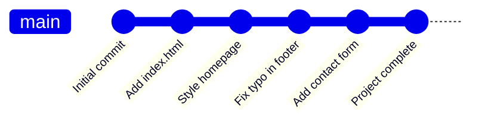
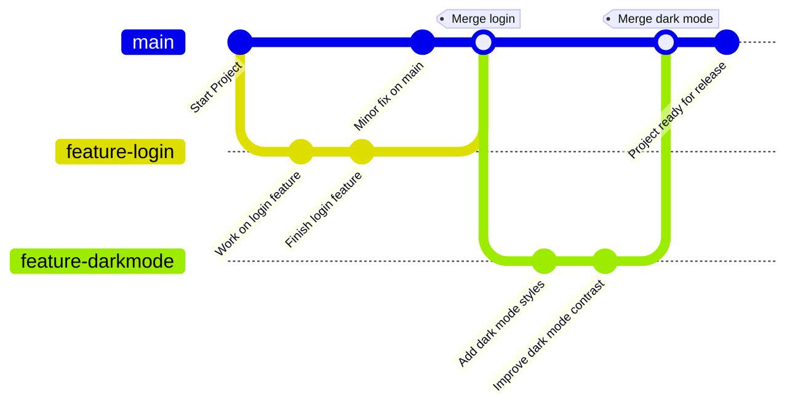
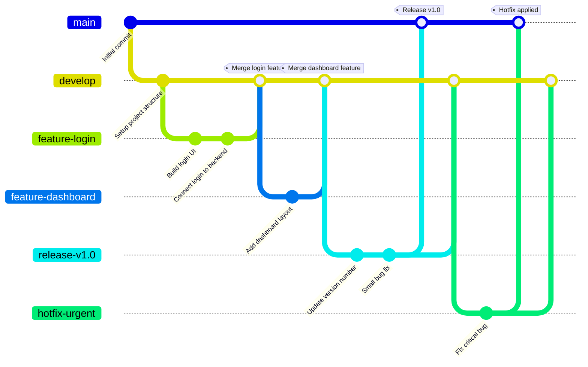

# 🌿 What Is Branching in Git? (And Why You Should Care)

Imagine you're writing a story, and you want to try out a new ending — but you don't want to mess up the original. So, you make a copy of your story, work on the new ending in the copy, and once you're happy with it, you combine it back into the main story.

**That’s exactly what branching is in Git.**

## 🌱 What Is a Branch?

A branch is like a separate line of work in your project. It lets you experiment, add features, fix bugs, or test new ideas without touching the main version (called the main or master branch).

Every Git repository starts with a single branch called main.

When you want to try something new, you create a new branch:
```bash
git branch new-feature
```

Then you switch to it:
```bash
git checkout new-feature
```

Now, any changes you make are only on the `new-feature` branch. When you're done and everything works, you can merge it back into the main branch.

## 🤔 Why Use Branches?

Branches help you:

- Keep your main project stable
- Work on multiple ideas at once
- Collaborate without stepping on each other's toes
- Test things safely without breaking the main code

# 🔀 What Are Branching Strategies?

Branching strategies are rules or methods teams use to organize how they work with branches. Here are a few common ones:

## 1. Main Only (Simple Projects)

Great for small projects or solo work.
- All work is done directly on the main branch.
- Not very safe for big changes or teamwork.


## 2. Feature Branching

Each new idea or change gets its own branch.
- Branches like `feature-login`, `feature-dark-mode`, etc.
- Merged into main when done.
- Keeps work organized and easy to test separately.


## 3. Git Flow (Popular for larger projects)

This strategy uses multiple types of branches:
- `main`: always has production-ready code
- `develop`: where new features are added
- `feature/*`: for each new feature
- `release/*`: for preparing a release
- `hotfix/*`: for urgent bug fixes

A bit more complex, but great for big teams and organized development.


## 4. Trunk-Based Development
- Everyone works in small, quick changes directly off the main branch (or "trunk").
- Encourages fast updates and testing.
- Requires good teamwork and frequent commits.

## 🧠 Which Strategy Should You Use?

- **New to Git?** Start with feature branching — it's simple and safe.
- **Working alone?** You might be okay with just the main branch.
- **In a team?** Learn Git Flow or choose a strategy that fits your workflow.

# 🎉 Final Thought

Branching is like having a "sandbox" to play in — you can try new things without fear of breaking your main work. Once you're confident, you can bring your changes back into the main project. 💪