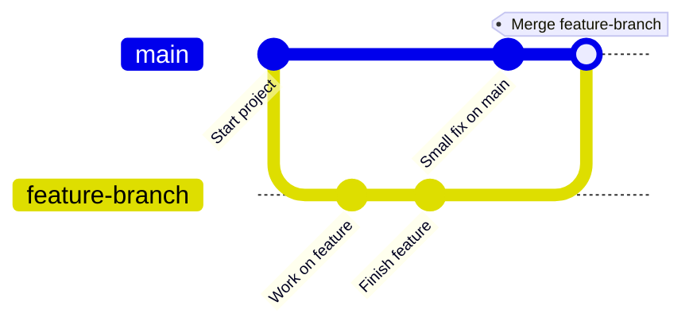
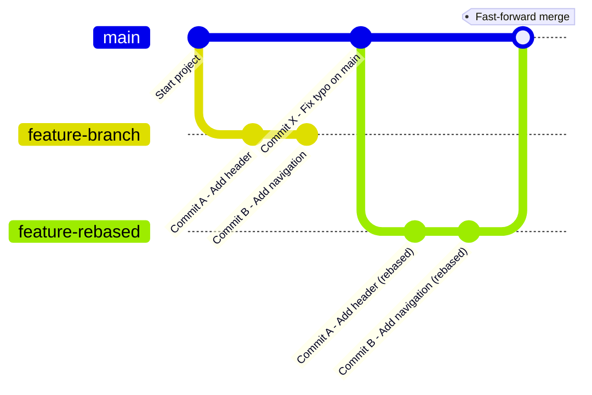
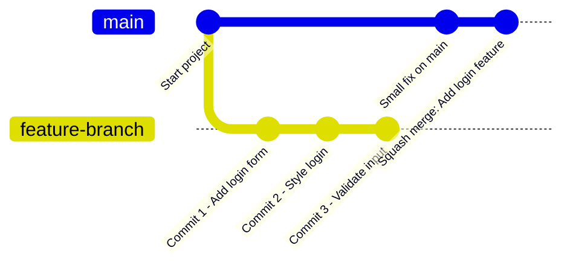

# 🔀 Git Merging Strategies & Pull Requests Explained

When working with Git — especially in a team — you’ll often need to combine changes from one branch (like `feature-login`) into another (like `main` or `develop`).

This process is called a **merge**.

But did you know there are **different ways** to do this? These are called **merging strategies**, and they control how the Git history is written when changes are combined.

Let’s explore the most common ones — and why they matter.

## Short video about the demonstration [here](https://www.youtube.com/shorts/q-i-1wiIArg)

## 💡 Why Do We Have Merging Strategies?

Imagine a team of students writing a group paper. Everyone works on their own section, but when it’s time to assemble the final draft, you have to decide:
- Should we keep everyone's sections separate?
- Should we rewrite and smooth everything into one voice?
- Should we keep a clean summary without individual drafts?

Git merging strategies help answer questions like these — but for **code**.

They shape how the project history looks and how easy it is to understand, review, or roll back changes.

### 🔁 1. Merge (Simple Merge)

##### 🧠 How to Explain It:
- The `main` branch continues with some commits.
- A `feature-branch` is created and worked on separately.
- When the feature is done, it’s merged back into `main`.
- Git adds a **merge commit** that ties the histories together — so both the main and feature changes are preserved.

This is the default strategy when you run:

```bash
git merge feature-branch
```
#### 🟢 What It Does:

- Combines the feature branch into the target branch (like main)
- Creates a merge commit that shows the full history
- Keeps a clear record of who did what and when

#### ✅ Pros:
- Full history
- Easy to track and audit

#### ❌ Cons:
- Can get a bit messy in big teams (many merge commits)

### 🔄 2. Rebase



Run with:
```bash
git rebase main
```
#### 🟢 What It Does:

- "Rewrites" your feature branch so it looks like it was created from the latest version of `main`
- Avoids merge commits — keeps history **linear and clean**

#### ✅ Pros:

- Cleaner history
- Easier to read for small, frequent changes

#### ❌ Cons:
- Changes commit history — risky if used after pushing
- Not ideal for shared/public branches

🧠 **Tip**: Rebasing is like saying: *"Pretend I made my changes after yours."*

### 🧹 3. Squash

##### 🧠 How to Explain It:

- The 3 commits on `feature-branch` are combined into 1 commit when merged into `main`
- The history on `main` stays **clean** — no messy commit logs from WIP (work in progress)

Used when merging via a pull request (PR), or manually like:
```bash
git merge --squash feature-branch
```
#### 🟢 What It Does:

- Takes all the commits in a feature branch and **combines them into one commit**
- That commit is then added to the main branch

#### ✅ Pros:

- Super clean history
- Perfect for small or messy branches

#### ❌ Cons:

- You lose the details of individual commits
- Not good for tracking step-by-step work

🧠 **Tip**: Squash is like saying: *"Just give me the final result, not how you got there."*

## 📥 What Is a PR (Pull Request)?

A **Pull Request** (often called a **PR**) is a **request to merge** one branch into another — usually used in platforms like **GitHub**, **GitLab**, or **Bitbucket**.

### 🛠️ What It Does:
- Lets your team **review code** before it’s merged
- Supports **comments, suggestions, and automated tests**
- Often includes **merge strategy options** (merge, squash, rebase)

### 💡 Why It's Important:

- Encourages code review
- Catches bugs early
- Improves collaboration and learning

# 🧠 Summary Table
| Strategy   | Description                        | Keeps Commit History? | Clean History? | Best For                   |
| ---------- | ---------------------------------- | --------------------- | -------------- | -------------------------- |
| **Merge**  | Adds changes + a merge commit      | ✅ Yes                 | 🟡 Medium       | Most teams, safe and clear |
| **Rebase** | Rewrites commits to be linear      | ❌ No (rewrites)       | ✅ Clean        | Solo work, small teams     |
| **Squash** | Combines all commits into one      | ❌ No                  | ✅ Very clean   | Small features, cleanup    |
| **PR**     | Request to merge (via code review) | N/A                   | N/A            | Team collaboration         |

# 🎓 Final Thoughts
- Use **Merge** if you want full history and transparency.
- Use **Rebase** if you want a tidy history and you understand what you're doing.
- Use **Squash** when the details don’t matter and you want a clean log.
- Use **PRs** to work together, share knowledge, and prevent bugs.

Merging isn’t just about combining code — it’s about **how your team communicates, collaborates**, and **keeps history readable** for the future.