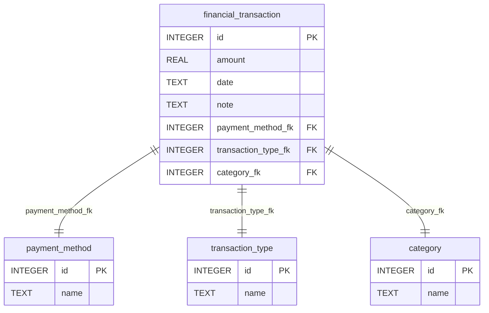

# FinancesDB - Guide

## 1. Prerequisites

- **Install SQLite**:  
  Download and install SQLite from [this link](https://www.sqlite.org/download.html)
- **Install DB Browser for SQLite**:  
    Download and install DB Browser for SQLite from [this link](https://sqlitebrowser.org/)
- **Recommended VS Code Extensions**:  
  - SQLite Viewer (e.g., `alexcvzz.vscode-sqlite`)
  - SQLTools (`mtxr.sqltools`)
  - Python (if you want to use Python for database interaction)

## 2. Folder Contents

| File Name                                          | Description                                                                           |
| -------------------------------------------------- | ------------------------------------------------------------------------------------- |
| `_finances.db`                                     | The SQLite database file with sample financial data. Generated from `01_createDb.sql` |
| `01_createDb.sql`                                  | SQL script to create tables and insert sample data.                                   |
| `02_selectAllData.sql`                             | Query to display all transactions with details.                                       |
| `02_selectAllData_onlyIncomesInSpecifiedMonth.sql` | Query to show only incomes for a specific month.                                      |
| `02_selectAllData_onlySpecifiedYear.sql`           | Query to show all data for a specific year.                                           |
| `03_statisticsForEachMonth.sql`                    | Query to show monthly income, spending, and balance.                                  |
| `03_statisticsForEachMonth_specifiedYear.sql`      | Same as above, but for a specific year.                                               |
| `03_statisticsForEachYear.sql`                     | Query to show yearly statistics.                                                      |
| `04_dropTables.sql`                                | Script to drop all tables (use with caution).                                         |
| `readme.md`                                        | This documentation.                                                                   |

## 3. Database Structure
- **Tables**:
  - `transaction_type`: Types of transactions (Income, Spending)
  - `category`: Categories (Work, Groceries, etc.)
  - `payment_method`: Payment methods (Cash, Card, Transfer)
  - `financial_transaction`: Stores each transaction with amount, date, note, and links to the above tables

- **Sample Data**:  
  The database contains example transactions for various months, with different categories and payment methods.

## 4. How to Use

1. **Open the Database**:  
   Use a _SQLite viewer extension_ in VS Code, the _SQLite command line_ or the _DB Browser for SQLite_ to open `_finances.db`.

2. **Run SQL Scripts**:  
   - You can run the `.sql` files directly in your SQLite tool.
   - For example, to see all transactions, open `02_selectAllData.sql` and execute its contents.

3. **Modify Queries**:  
   - To filter by month or year, edit the `WHERE` clause in the relevant SQL files.
   - Example: Change `'2020-02'` to your desired month in `02_selectAllData_onlyIncomesInSpecifiedMonth.sql`.

4. **Reset or Recreate Database**:  
   - Use `04_dropTables.sql` to drop all tables.
   - Use `01_createDb.sql` to recreate tables and insert sample data.

## 5. Tips

- Always back up your database before running DDL scripts (Data Definition Language, is a subset of SQL used to define and manage the structure of database objects such as tables, indexes, and schemas) (like `04_dropTables.sql`).
- Explore and modify queries to better understand SQL and the data structure.
