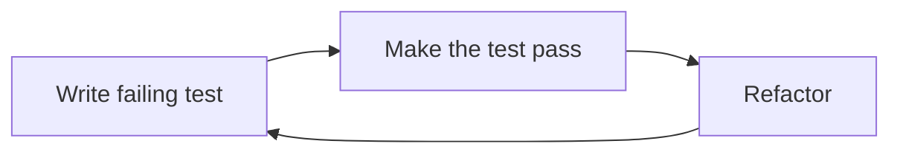

# Unit testing with Python

Here is an article about the topic [link](https://www.geeksforgeeks.org/unit-testing-python-unittest/)

## Test-Driven Development TDD


*Test-Driven Development (TDD)* is a way of writing software where you:
1. write a test that **fails** (because the feature isn't built yet). 
2. write just *enough code* to make that test **pass**. (This helps ensure your code works correctly from the start)
3. **refactor** the code
4. start over again

>**Refactoring** is the process of improving the structure and readability of your code without changing its behavior

In Python we will use the `unittest` library, what we import first. We will separete the production code from the test code: 
- [production code](https://github.com/SpsKnSK/api/Extra/UnitTesting/calculator.py)
- [test code](https://github.com/SpsKnSK/api/Extra/UnitTesting/calculator_test.py)

## Best practices
- Name the test class with a prefix of **Test**: `TestCalculator`
- Make the class inherit from `unittest.TestCase`
- use the `setUp` method to setup the environment (in this case we want to have a property named `target` pointing to an instance of `Calculator` class). This method is called before **every** individual test method
- Every test method has to start with `test_` prefix
- **Assert**ion refers to a set of methods to verify that a certain condition is true during the execution of the test case

### Some of the assert methods
| Method                    | Description                                                                           |
| ------------------------- | ------------------------------------------------------------------------------------- |
| `.assertEqual(a, b)`      | Checks if a is equal to b, similar to the expression a == b.                          |
| `.assertTrue(x)`          | Asserts that the boolean value of x is True, equivalent to bool(x) is True.           |
| `.assertIsInstance(a, b)` | Asserts that a is an instance of class b, similar to the expression isinstance(a, b). |
| `.assertIsNone(x)`        | Ensures that x is None, similar to the expression x is None.                          |
| `.assertFalse(x)`         | Asserts that the boolean value of x is False, similar to bool(x) is False.            |
| `.assertIs(a, b)`         | Verifies if a is identical to b, akin to the expression a is b.                       |
| `.assertIn(a, b)`         | Checks if a is a member of b, akin to the expression a in b.                          |

## Walkthrough
### Create **setup** phase
1. Create the test file as in [01_step](https://github.com/SpsKnSK/api/Extra/UnitTesting/01_step)
2. When you run the test, you will get and error: `ImportError: cannot import name 'Calculator' from 'calculator'` hence there is no class `Calculator` created
### Satisfy the test by creating a `Calculator` class
1. Create the production code file as in [02_step](https://github.com/SpsKnSK/api/Extra/UnitTesting/02_step)
2. When you run it, you will get no error, but no test running: 
```
----------------------------------------------------------------------
Ran 0 tests in 0.000s

OK
```

### Let's create a test case
1. Create a test case with a function as `test_add_positive_numbers` as in [03_step](https://github.com/SpsKnSK/api/Extra/UnitTesting/03_step)
2. It will fail at the beginning as the `add` method does not exist `AttributeError: 'Calculator' object has no attribute 'add'`
3. In the production code of the `Calculator` class define the `add` method that it returns the sum of two numbers
4. Run the test
```
----------------------------------------------------------------------
Ran 1 test in 0.000s

OK
```
# Parametrized

In the [test code](https://github.com/SpsKnSK/api/Extra/UnitTesting/calculator_test.py) you can find, that the `add` method is reused several times in different methods:
- `test_add_positive_numbers`
- `test_add_negative_numbers`
- `test_add_mixed_numbers`

To pervent of creation of so many test methods, you can use the `parametrized` library to insert different values in one method. You can find the file [here](https://github.com/SpsKnSK/api/Extra/UnitTesting/04_step_parametrized/calculator_test.py)

Here we use an attribute `@parameterized.expand` over the function where we can add different types of inputs. In our case it is `('name of the number type', first number, second number, result)`

```py
@parameterized.expand(
        [
            ("positive_integers", 1, 2, 3),
            ("negative_integers", -1, -2, -3),
            ("mixed_integers", -1, 2, 1),
            ("floats", 1.5, 2.5, 4.0),
            ("zero", 0, 0, 0),
            ("large_numbers", 1000000, 2000000, 3000000),
        ]
    )
    def test_add(self, numberType: str, a: float, b: float, expected: float) -> None:
        result: float = self.target.add(a, b)
        self.assertEqual(result, expected, msg=f"Working with: {numberType}")
```

The whole test case has changed to `def test_add(self, numberType: str, a: float, b: float, expected: float) -> None:`

> You can choose your values/input parameters
# Expect fail

Sometimes it is necessary and expected a function to fail (division by zero, not found file, etc.). In these cases we **expect** our tests to fail. You can find the test file [here](https://github.com/SpsKnSK/api/Extra/UnitTesting/05_step_expectFail/calculator_test.py). The following test will fail with `ZeroDivisionError: division by zero`
```py
def test_divideByZero(self):
    self.target.divide(1, 0)
```
We recive:
```
ZeroDivisionError: division by zero

----------------------------------------------------------------------
Ran 1 test in 0.001s

FAILED (errors=1)
```
To tell `Python.unittest`, that we **expect** a failure in that method, we use the `expectedFailure` attribute as following:

```py
@unittest.expectedFailure
def test_divideByZero(self):
    self.target.divide(1, 0)
```

After this run we receive:
```
----------------------------------------------------------------------
Ran 1 test in 0.001s

OK (expected failures=1)
```

Or you can use the `with` statement and the `assertRaises` function as following:
```py
def test_divideByZero_1(self):
        with self.assertRaises(Exception):
            self.target.divide(1, 0)
```

# How to pass value to external methods