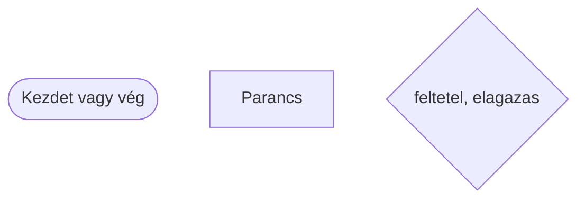
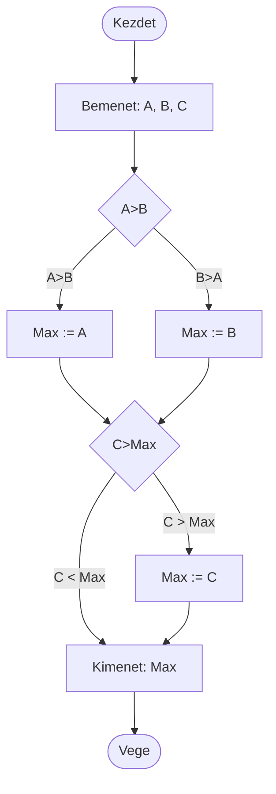

# Algoritmusok és  tulajdonságaik

## Az algoritmus
- Azon instrukciók halmazát, mely egy feladat megoldásához vezetnek, **algoritmusnak** nevezzük, a hétköznapokban is lépten-nyomon találkozunk.
- **Instrukciók** sokféleképpen megadhatók: szóban, rajzban, írásban, magyar nyelven, angol nyelven vagy programozási nyelven.
- Az algoritmus egy út a felvetődött probléma megoldásához. 
    - Legyen a feladat például két darab filctoll szerzése. 

## Fajtái

1. Lehet, hogy az algoritmus néhány elemi tevékenység egymás után végrehajtandó (**szekvenciális**) sorozata, mint például.
    - Menj be a Tanszékre!
    - Keresd meg az adminisztrátort!
    - Kérj tőle két filctollat!
    - Hozd be a filctollat az előadóba!

1. Lehet, hogy a megoldás bizonyos pontokon nem látható előre és **feltételektől függően** más és más megoldást kell választanunk. Ilyen például:
    - Menj be a Tanszékre!
    - Keresd meg az adminisztrátort!
    - <ins>Ha</ins> megtalálod, <ins>akkor</ins>
        - Kérj tőle két filctollat!
    - <ins>különben</ins>
        - Keress máshol filctollat!
    - Gyere vissza az előadóba!

1. Előfordulhat, hogy a megoldás érdekében valamely tevékenységet többször is végre kell hajtani, vagyis ismételni **(iterálni)** kell.
    - Csináld kétszer
        - Kérj tőle egy darab filctollat!
Az iterációt ciklusnak is szokás nevezni. 

## Algoritmus az informatikában

Az algoritmus struktúráját tehát **szekvenciák**, **szelekciók** illetve **iterációk** adják, amelyeket tetszőleges mélységben egymásba lehet ágyazni.

Az algoritmus készítését algoritmizálásnak nevezzük.

Három féle módon írhatjuk le.
- Folyamatábra segítségével
- Szóban
- Struktúrogram segítségével

## Folyamatábra


A legnagyobb szám kiválasztása
> `:=` legyen egyenlő


## Az algoritmus tulajdonságai
### Általánosság
Ahhoz, hogy az algoritmusunk alkalmas legyen több eltérő, de azonos típusú feladat megoldására, általánosan kell megírnunk.
- Például négyzet területének kiszámítása.
### Determinisztikusság
Ugyanazon bemeneti értékek megadása után, az algoritmus kimenetének is ugyanolyan eredményt kell adnia.

## Feladat

- Találjatok ki egy példát a mindennapi életből olyan tevékenységre, ami algoritmussal leírható!
- Ceruzával rajzoljatok hozzá folyamatábrát!

## Feladat
- Diák irányítása filctoll megszerzéséért a teremben egyszerű parancsokkal

# Python

## A Python nyelv szerkezete

```py
# Importálások (modulok és csomagok betöltése)
import modul_nev
from masik_modul import fuggveny_nev

# Globális változók deklarálása (opcionális)
global_valtozo = 10

# Osztályok definiálása
class Person:
    def __init__(self, name, surname):
        self.Name, self.Surname = name, surname

# Függvények definiálása
def fuggveny_nev(param1, param2):
    # Függvény törzse
    eredmeny = param1 + param2
    return eredmeny

# Fő programrész (main)
if __name__ == "__main__":
    # Parancssori argumentumok feldolgozása (opcionális)
    import sys
    argumentumok = sys.argv

    # Lokális változók deklarálása
    lokal_valtozo = "Hello, világ!"

    # Függvény hívás és eredmény kezelése
    eredmeny = fuggveny_nev(5, 3)
    print("Eredmény:", eredmeny)

    # Ciklusok, elágazások és más vezérlési szerkezetek
    if eredmeny > 5:
        print("Az eredmény nagyobb mint 5.")
    else:
        print("Az eredmény nem nagyobb mint 5.")

    for i in range(3):
        print("Ciklus:", i)

    # Bemenet olvasása és kiíratása
    input_text = input("Kérem, írjon be valamit: ")
    print("Bevitel:", input_text)

# Modulhoz tartozó kód (opcionális)
def masik_fuggveny():
    pass
```

## Változók és konstansok
- `int` egész számok
- `str` karakterlánc
- `float` valós számok
- `datetime` dátum
- `list[]` lista, tömb
- `dict[,]` szótár

## Feladat
Írjátok ki a képernyőre a következő üdvözletet `Hello!` a `print()` függvény segítésgével