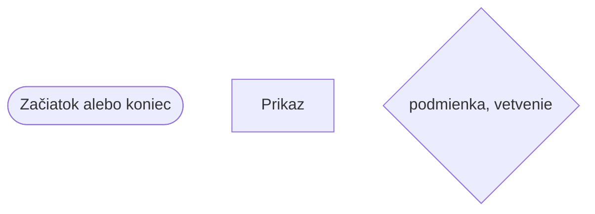
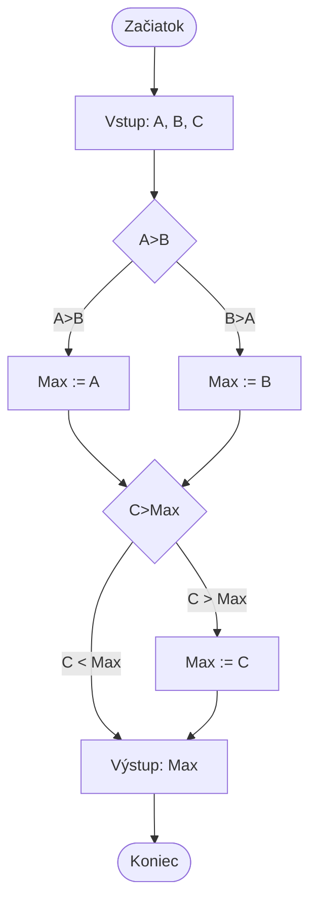

# Algoritmy a ich vlastnosti

## Algoritmus
- Množinu inštrukcií, ktoré vedú k riešeniu úlohy, nazývame **algoritmus**, s nimi sa stretávame každý deň.
- **Inštrukcie** môžu byť udelené rôznymi spôsobmi: ústne, kreslením, písaním, maďarským jazykom, anglickým jazykom alebo programovacím jazykom.
- Algoritmus je cesta k riešeniu nastalého problému.
    - Máme úlohu získať napríklad dva fixy.

## Typy

1. Algoritmus môže byť sekvencia niekoľkých elementárnych činností vykonávaných za sebou (**sekvenčný**) postup, ako napríklad.
    - Choďte na oddelenie!
    - Nájdite správcu!
    - Požiadajte ho o dva fixy!
    - Prineste fixy do prednáškovej miestnosti!

1. Riešenie môže na určitých bodoch nebyť viditeľné dopredu a bude závislé na **podmienkach**, ktoré musíme vybrať iné a iné riešenie. Napríklad:
    - Choďte na oddelenie!
    - Nájdite správcu!
    - <ins>Ak</ins> ho nájdete, <ins>tak</ins>
        - Požiadajte ho o dva fixy!
    - <ins>inak</ins>
        - Nájdite fixy niekde inde!
    - Vráťte sa do prednáškovej miestnosti!

1. Môže sa stať, že pre riešenie bude nutné niektorú činnosť vykonať viac krát, teda opakovať (**iterovať**).
    - Urob to dvakrát
        - Požiadajte ho o jeden fix!
Iteráciu niekedy nazývame cyklus.

## Algoritmus v informatike

Štruktúru algoritmu teda tvoria **sekvencie**, **selekcie** a **iterácie**, ktoré môžu byť ľubovoľne vnorené do seba v ľubovoľnej hĺbke.

Tvorbe algoritmu sa hovorí algoritmizácia.

Má tri spôsoby zápisu.
- Pomocou priebehového diagramu
- Ústne
- Pomocou štruktúrovanej formy

## Priebehový diagram


Výber najväčšieho čísla
> `:=` bude rovné


## Vlastnosti algoritmu
### Univerzalita
Aby bol náš algoritmus vhodný na riešenie rôznych, ale rovnakého typu úloh, musí byť napísaný všeobecne.
- Napríklad výpočet plochy štvorca.

### Determinizmus
Po zadání rovnakých vstupných hodnôt musí algoritmus vrátiť rovnaký výsledok.

## Úloha

- Vymyslite príklad každodenných činností, ktoré je možné popísať algoritmom!
- Nakreslite k tomu priebehový diagram ceruzkou!

# Python

## Štruktúra jazyka Python

```py
# Importy (načítanie modulov a balíkov)
import nazov_modulu
from iny_modul import nazov_funkcie

# Deklarácia globálnych premenných (voliteľné)
globalna premenna = 10

# Definícia tried
class Osoba:
    def __init__(self, meno, priezvisko):
        self.Meno, self.Priezvisko = meno, priezvisko

# Definícia funkcií
def nazov_funkcie(param1, param2):
    # Telo funkcie
    vysledok = param1 + param2
    return vysledok

# Hlavná časť programu (main)
if __name__ == "__main__":
    # Spracovanie príkazového riadku (voliteľné)
    import sys
    argumenty = sys.argv

    # Deklarácia lokálnych premenných
    lokalna premenna = "Ahoj, svet!"

    # Volanie funkcie a spracovanie výsledku
    vysledok = nazov_funkcie(5, 3)
    print("Výsledok:", vysledok)

    # Cykly, vetvenie a iné riadiace štruktúry
    if vysledok > 5:
        print("Výsledok je väčší ako 5.")
    else:
        print("Výsledok nie je väčší ako 5.")

    for i in range(3):
        print("Cyklus:", i

)

    # Čítanie vstupu a výstupu
    vstupny_text = input("Prosím, napíšte niečo: ")
    print("Vstup:", vstupny_text)

# Kód patriaci k modulu (voliteľné)
def ina_funkcia():
    pass
```

## Premenné a konštanty
- `int` celé čísla
- `str` reťazec znakov
- `float` desatinné čísla
- `datetime` dátum
- `list[]` zoznam, pole
- `dict[,]` slovník

## Úloha
Vypíšte na obrazovku pozdrav `Hello!` pomocou funkcie `print()`