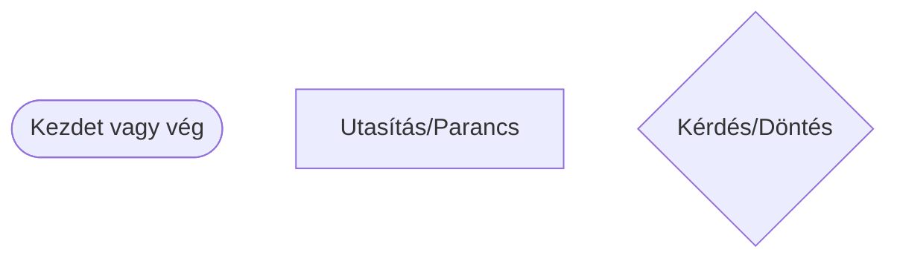
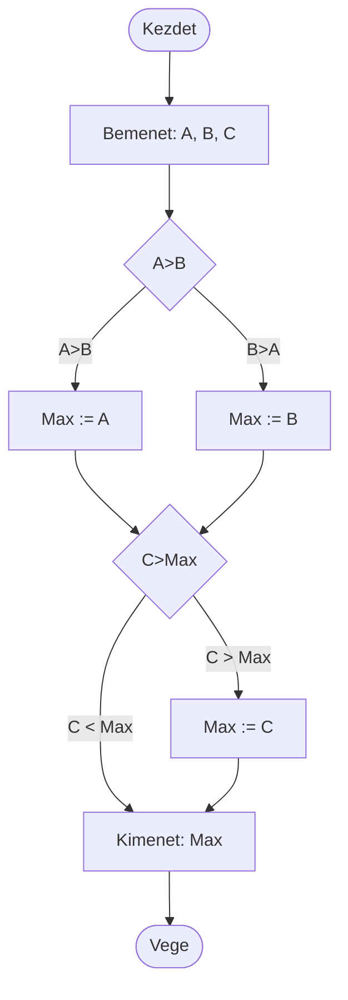

# Algoritmusok és  tulajdonságaik

## Mit jelent az algoritmus?
- Az **algoritmus** egy lépésről-lépésre szóló útmutató, ami segít megoldani egy feladatot. Mindennapi életben is használunk algoritmusokat!
- Ezeket az utasításokat sokféleképpen leírhatjuk: beszélhetünk róla, lerajzolhatjuk, leírhatjuk magyarul vagy akár programozási nyelven is.
- Az algoritmus egyszerűen egy recept a probléma megoldásához.
    - Például: hogyan szerezzünk be két filctollat? 

## Fajtái

1. **Egyszerű lépések egymás után** (**szekvencia**) - mint egy recept:
    - Menj be az irodába!
    - Keresd meg a tanárt!
    - Kérj tőle két filctollat!
    - Hozd vissza a terembe!

2. **Döntés a helyzetnek megfelelően** (**elágazás**) - választanunk kell:
    - Menj be az irodába!
    - Keresd meg a tanárt!
    - <ins>Ha</ins> ott van, <ins>akkor</ins>
        - Kérj tőle két filctollat!
    - <ins>Ha nincs ott</ins>
        - Keress máshol filctollat!
    - Gyere vissza a terembe!

3. **Ismétlés** **(ciklus)** - amikor valamit többször kell csinálni:
    - Csináld kétszer:
        - Kérj egy filctollat!
    
Az ismétlést ciklusnak is hívjuk, mert "körbe-körbe" járunk vele. 

## Algoritmus a programozásban

Tehát minden algoritmus ezekből a részekből áll: **lépések egymás után**, **döntések** és **ismétlések**. Ezeket kombinálhatjuk és egymásba ágyazhatjuk.

Az algoritmus megtervezését algoritmizálásnak hívjuk.

Háromféleképpen írhatjuk le:
- **Folyamatábrával** (rajzzal)
- **Szavakkal** (leírással)
- **Struktúrogrammal** (speciális rajz)

## Folyamatábra

A folyamatábra olyan, mint egy térkép a programnak:



**Példa:** A legnagyobb szám kiválasztása három szám közül
> A `:=` jel azt jelenti: "legyen egyenlő"


# Az algoritmus fontos tulajdonságai

## Általánosság
Az algoritmus legyen használható többféle hasonló feladatra, ne csak egy konkrét esetre.
- Például: bármilyen négyzet területét ki tudjuk számítani, nem csak egy konkrét négyzetét.

## Megbízhatóság
Ha ugyanazokat az adatokat adjuk meg, mindig ugyanazt az eredményt kell kapnunk.
- Például: 5+3 mindig 8, nem egyszer 8, máskor 9.

# Feladatok

## 1. feladat
- Gondoljatok egy mindennapi tevékenységre (pl. kávé főzése, bicikli javítása), amit lépésekre lehet bontani!
- Rajzoljatok hozzá egyszerű folyamatábrát!

## 2. feladat
- Párosával dolgozzatok: az egyik "robot", a másik "programozó"
- A programozó adjon egyszerű parancsokat a robotnak, hogy szerezzen be egy filctollat a teremben

# Python programozás

## Hogyan épül fel egy Python program?

```py
# Könyvtárak betöltése (ha szükséges)
import modul_nev
from masik_modul import fuggveny_nev

# Változók létrehozása (az egész programban használható)
global_valtozo = 10

# Osztályok definiálása
class Person:
    def __init__(self, name, surname):
        self.Name, self.Surname = name, surname

# Függvények definiálása
def fuggveny_nev(param1, param2):
    # Függvény törzse
    eredmeny = param1 + param2
    return eredmeny

# Fő programrész (main)
if __name__ == "__main__":
    # Parancssori argumentumok feldolgozása (opcionális)
    import sys
    argumentumok = sys.argv

    # Lokális változók deklarálása
    lokal_valtozo = "Hello, világ!"

    # Függvény hívás és eredmény kezelése
    eredmeny = fuggveny_nev(5, 3)
    print("Eredmény:", eredmeny)

    # Ciklusok, elágazások és más vezérlési szerkezetek
    if eredmeny > 5:
        print("Az eredmény nagyobb mint 5.")
    else:
        print("Az eredmény nem nagyobb mint 5.")

    for i in range(3):
        print("Ciklus:", i)

    # Bemenet olvasása és kiíratása
    input_text = input("Kérem, írjon be valamit: ")
    print("Bevitel:", input_text)

# Modulhoz tartozó kód (opcionális)
def masik_fuggveny():
    pass
```

## Milyen típusú adatokat tárolhatunk?
- `int` - egész számok (pl. 5, -3, 100)
- `str` - szöveg (pl. "Hello", "Péter")
- `float` - tizedes számok (pl. 3.14, -2.5)
- `list[]` - lista/tömb több adat tárolására (pl. [1, 2, 3])
- `dict{}` - szótár kulcs-érték párokhoz (pl. {"név": "Anna"})

## Feladat
Írjátok ki a képernyőre a következő üdvözletet `Hello!` a `print()` függvény segítésgével

## Hogyan írjunk kódot?

1. **Új fájl létrehozása** - `.py` végződéssel
2. **Gyakori mentés** (Ctrl+S) - ne csak a végén!
   - Mindenki a saját mappájába mentsen!
3. **Program futtatása** (F5 gomb vagy futtatás gomb)

# Miért jó a Python?

## Előnyök

- **Ingyenes** - bárki letöltheti és használhatja
- **Minden gépen működik** - Windows, Mac, Linux
- **Könnyen tanulható** - egyszerű szavakkal írhatunk
- **Sok mindenre használható:**
    - Játékok készítése
    - Weboldalak
    - Adatok elemzése
    - Robotok programozása
    - És még sok más!

## VS Code környezet
- **Szerkesztő** - itt írjuk a kódot
- **Terminal** - itt futtatjuk a programot és látjuk az eredményt
- **Fájlkezelő** - itt látjuk a projektünk fájljait