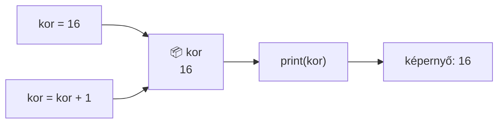
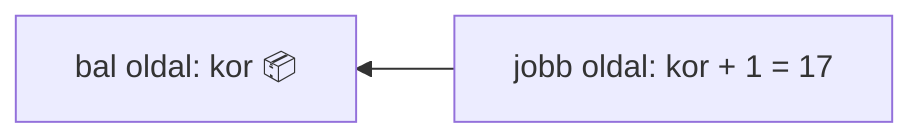

🗺️ [Vissza a térképhez](00_Terkep_hu.md)

# Változók

> ## ✏️ Füzetbe – Változók
>
> **Mi az?** Névvel ellátott doboz a memóriában, amiben egy értéket tárolunk. A neve alapján bármikor előszedhetjük.
>
> **Értékadás:** `nev = ertek` – a `=` **nem** egyenlőség, hanem: "tedd bele!”
> ```py
> kor = 16          # a kor dobozba bekerül a 16
> kor = kor + 1     # kivesszük, hozzáadunk 1-et, visszatesszük -> 17
> ```
>
> | Típus | Jele | Példa |
> |---|---|---|
> | egész szám | `int` | `10`, `-9`, `0` |
> | tizedes szám | `float` | `3.14`, `95.78` |
> | szöveg | `str` | `"alma"`, `'3gomb'`, `'11'`, `"-38"` |
> | logikai | `bool` | `True`, `False` |
>
> **Névadás:** csak betű, szám és `_`; **nem** kezdődhet számmal; nincs benne szóköz és kötőjel; nem lehet foglalt szó (`print`, `input`).
>
> **Fontos műveletek:**
>
> | | | | |
> |-|-|-|-|
> | `+` összeadás | `-` kivonás | `*` szorzás | `/` osztás |
> | `//` egész osztás | `%` maradék | `**` hatvány | `round(a, x)` kerekítés |
>
> **⚠️ A leggyakoribb hiba:** `=` értékadás, `==` összehasonlítás!
> ```py
> x = 5      # betettem az 5-öt
> x == 5     # kérdés: x "dobozban" 5 van? -> True
> ```
>
> **Metafora:** a változó olyan, mint egy **felcímkézett doboz**: a címke a neve, a tartalma az értéke. Ha újat teszünk bele, a régi kiesik — egyszerre csak egy dolog van a dobozban.

- A változók a program azon elemei, amelyek különböző értékeket vehetnek fel, különböző adatok tárolására alkalmasak.
- Névvel ellátott memóriaterület
- Változó nevei lehetnek: x, z, szam, nev, lista

## Képzeljétek el így!
A változó olyan, mint egy **felcímkézett doboz** a polcon:

- a **címke** a változó neve (`kor`),
- a **doboz tartalma** a változó értéke (`16`),
- ha új dolgot teszünk bele, a régi **kiesik** – egy dobozban egyszerre egy érték van,
- a címkét felolvasva bármikor megnézhetjük, mi van benne.

Vagy gondolj a **ruhatárra**: leadod a kabátot, kapsz egy számot. A szám maga nem a kabát, de bármikor visszakérheted vele. A változó neve ez a ruhatári szám.



Az értékadás mindig **jobbról balra** működik: előbb kiszámolja a jobb oldalt, majd beteszi a bal oldali dobozba.



## Típusai 

| Típus | Jele | Mire való | Példa |
|---|---|---|---|
| **Szám** | `int` | egész számok tárolására | `10`, `-9`, `0` |
| **Tizedes szám** | `float` | tizedes számok tárolására (tizedes **pont**tal!) | `95.78`, `3.14`, `79.21` |
| **Karakterlánc** | `str` | szöveg, bármilyen karaktersorozat; `''` vagy `""` közé | `'alma'`, `'3gomb'`, `"Szia"` |
| **Logikai** | `bool` | igaz/hamis érték | `True`, `False` |

- A `float` esetében **pontot** használunk, nem vesszőt: `1.5` és nem `1,5`
- A `bool` két értéke: `True` – igaz, `False` – hamis. Figyelem, nagy kezdőbetűvel!
- A típust a `type()` függvénnyel kérdezhetjük le: `print(type(kor))`
# Műveletek
## Matematikai operátorok
- `5 + 3 = 8`összeg
- `5 – 3 = 2` különbség
- `5 * 3 = 15` szorzat
- `5 / 3 = 1.666` osztás
- `5 // 3 = 1` osztás egész része
- `5 % 3 = 2` osztás maradéka
- `5 ** 3 = 125` hatvány
- `sqrt(5)` négyzetgyökvonás (matematikai modul szükséges hozzá)

## Kerekítés
- `round` függvénnyel
- `round(a, x)`
- `a` – szám
- `x` - tizedes helyek száma

Pl. `round(12.345, 2)` eredménye `12.35`

Ha az `x`-et elhagyjuk, egész számra kerekít: `round(12.345)` eredménye `12`.

A szám helyére változó is írható!

## Feladat
1. A `print()` függvény segítségével írassátok ki a képernyőre a fenti matematikai műveltek eredményei közül legalább 5-öt
1. Írjatok programot, amely bekér két számot, majd kiírja a hányadosukat 3 tizedes helyre.
Ezután írassátok ki az egész részre való osztás eredményét és a maradékot.
Ügyeljetek rá, hogy a program laikus felhasználók számára is használható legyen (a program írjon egy-két szót is, ne csak a konkrét eredményeket).
    > `/` tizedes osztás: `18/7=2.5714285714285716`

    > `//` egészszámú osztás: `18//7=2`

    > `%` osztás utáni maradék: `18 % 7=4`
1. Írjunk programot a kör kerületének és területének kiszámítására.
Adatok, amiket megadunk: kör átmérője, Pí értéke: `3.14159`.
Végeredmény:
`Az X cm átmérőjű körnek Y cm a kerülete és Z négyzetcm a területe.`

## Logikai operátorok
A logikai operátorok lehetséges kimenetei:  `True`, `False`
- egyenlőség `==`, pl. X==5 – megvizsgáljuk `X` egyenlő-e `5`-tel
- kisebb `<`
- kisebb vagy egyenlő `<=`
- nagyobb `>`
- nagyobb vagy egyenlő `>=`
- nem egyenlő `!=`

Az értékadás **nem** logikai operátor: `=`, pl. `X=12` – az `X` változóba elmentjük a `12`-es értéket

# Program írásának szabályai
- Python-ban meg kell különböztetni a nagy és kisbetűt,
- A változók neve lehet betű szám és aláhúzás jel `_` kombinációja.
- A változók neve:
    - Nem kezdődhet számmal,
    - Nem tartalmazhat szóközt, tabulátort ,
    - Nem lehet rezervált szó(parancs, pl. Max, min, print, stb.)

## Korrekt változónév
```py
myvar = "John"  
my_var = "John"  
_my_var = "John"  
myVar = "John"  
MYVAR = "John"  
myvar2 = "John"
```
## Nem korrekt változónév, a program nem fut le
```py
2myvar = "John" #szammal kezdodik
my-var = "John" #kotojelet tartalmaz 
my var = "John" #szokozt tartalmaz
```

## Ajánlom a változók következő megnevezését
```py
my_var = "John"
myVar = "John"  
MyVar = "John"  
```

# Gyakorlat 
1. Hozzatok létre az említett változótípusokból 2-t, és írassátok ki a képernyőre a `print()` függvény segítéségével.
1. A szám adattípusú változóknál próbáljátok ki az összes matematikai operátort!
1. Kérjetek a felhasználótól 2 egész számot, tizedes számot, komplex számot, és írjátok ki az összegüket, szorzatukat a képernyőre
    1. egész szám beolvasása: `int(input())`
    1. tizedes szám beolvasása: `float(input())`
    1. komplex szám beolvasása: `complex(input())`

## Segítség
### Adattípusok
|||
--|--
**Szám** |`int`
**Tizedes szám**|`float`
**Karakterlánc** | `str`
**Logikai** | `bool`

### Műveletek: 

| | | | | | | | |
|-|-|-|-|-|-|-|-|
| `+` | összeadás | `-` | kivonás | `*` | szorzás | `/` | osztás |
| `//` | egész számú osztás | `%` | maradékos osztás | `**` | hatványra emelés | `==` | egyenlőség |
| `<` | kisebb | `<=` | kisebb vagy egyenlő | `>` | nagyobb | `>=` | nagyobb vagy egyenlő |
| `!=` | nem egyenlő | `=` | értékadás | | | | |

> # ❓ Kérdések
> 1. Mi a különbség az `=` és az `==` között. Mikor használod az egyiket, mikor a másikat? 
> 1. Mire szolgál a `round` függvény, írjatok rá példát.
> 1. A felhasználótól kérjétek be a háromszög két befogóját, és a Pitagorasz tételének segítségével határozzátok meg az átfogót.
> 1. Írjatok 2 példát a megengedett változónevekre.
> 1. Írjatok 2 példát a **nem** megengedett változónevekre.
> 1. Hogyan ellenőrizhetjük, hogy `a` szám `b` szám osztója? Melyik műveletet használjátok?
> 1. Mi a különbség a `/` és `//` között?
