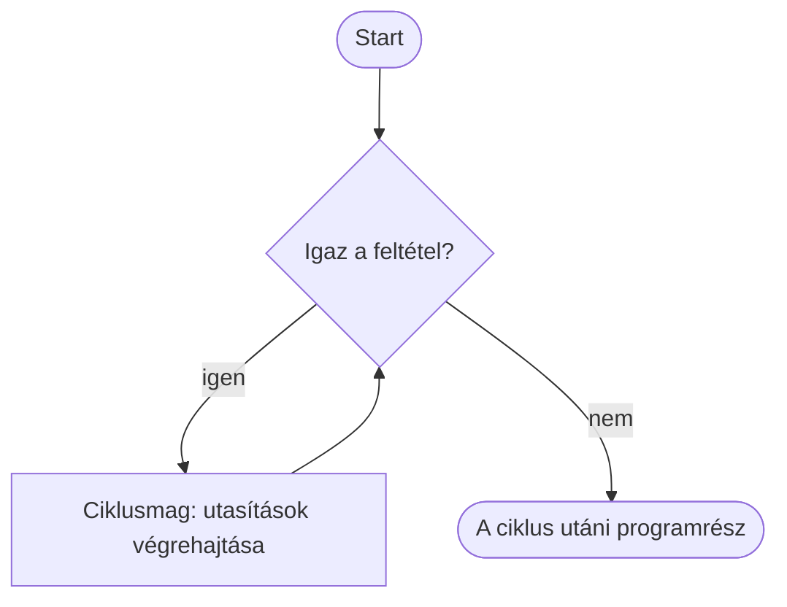

> # ✏️ Ciklusok - `while`
>
> **Ciklus:** ugyanazokat az utasításokat ismételjük.
>
> ```py
> while feltetel:
>     utasitasok    # ez a ciklusmag (blokk)
> ```
>
> A `while` addig ismétli a ciklusmagot, **amíg a feltétel igaz**. Minden kör után újra megvizsgálja a feltételt.
>
> **Ne feledd:**
> 1. a `while feltetel` sor végén kettőspont `:` áll;
> 2. a ciklusmag sorai beljebb kezdődnek;
> 3. a feltételnek egyszer hamissá kell válnia, különben a ciklus végtelen.
>
> ```py
> i = 1
> while i <= 3:
>     print(i)
>     i = i + 1
> ```
> Kimenet: `1`, `2`, `3`
>
> **Metafora:** a `while` olyan, mint egy **társasjáték szabálya**: "amíg van pénzed, lépj egy mezőt". Minden kör után újra megkérdezzük: igaz még a feltétel? Ha igen, jön a következő kör, ha nem, vége.

# Ciklusok és a `while`

Feladat: egy programnak ki kell írnia az 1-től 100-ig terjedő számokat. Mit javasoltok, mit csináljunk?

## Mi a ciklus?

A ciklus olyan programszerkezet, amely utasítások egy **blokkját** ismétli. Olyan, mint egy társasjáték szabálya:

> „Amíg van pénzed, lépj egy mezőt, majd fizess 100 forintot.”

Minden körben ugyanaz történik, aztán újra eldöntjük: **van még pénzed?** Ha igen, jön a következő kör. Ha nem, vége.



## A `while` kapcsolata az `if`-fel

A `while` fejléce ugyanúgy feltételt vizsgál, mint az `if`:

```py
if elet > 0:
    print("A játék folytatódik.")
```

```py
while elet > 0:
    print("Új kör kezdődik.")
```

Az `if` blokkja **egyszer** fut le, ha a feltétel igaz. A `while` blokkja újra és újra lefut, amíg a feltétel igaz marad.

## A `while` szintaxisa

```py
while feltetel:
    utasitas_1
    utasitas_2
```

- A `feltetel` egy logikai érték: igaz vagy hamis.
- A beljebb írt utasítások alkotják a **ciklusmagot**. Ez is blokk: minden sora együtt ismétlődik.
- A ciklusmag végén a program visszatér a `while` sorhoz, és újra ellenőrzi a feltételt.

## Első példa: számlálás

```py
i = 1
while i <= 5:
    print(i)
    i = i + 1
print("Vége")
```

Kimenet:

```text
1
2
3
4
5
Vége
```

Az `i = i + 1` sor nagyon fontos: ettől változik meg a feltétel. Amikor `i` értéke 6 lesz, az `i <= 5` már hamis, ezért a ciklus befejeződik.

## Végtelen ciklus

Ez a program soha nem áll le magától:

```py
i = 1
while i <= 5:
    print(i)
```

Az `i` értéke nem változik, ezért a feltétel mindig igaz. Futó programot a terminálban a `Ctrl + C` billentyűkkel lehet megállítani.

## `break` és `continue`

- A `break` azonnal kilép a ciklusból.
- A `continue` kihagyja az aktuális kör hátralévő részét, majd újra ellenőrzi a feltételt.

```py
i = 0
while i < 5:
    i = i + 1
    if i == 3:
        continue
    print(i)
```

Kimenet: `1`, `2`, `4`, `5`

> # 💥 Rontsátok el!
>
> Futtassátok ezt a programot. Miért nem áll le?
>
> ```py
> i = 0
> while i < 3:
>     print(i)
> ```
>
> Javítsátok úgy, hogy `0`, `1`, `2` jelenjen meg, majd a program leálljon. Utána próbáljátok ki azt is, mi történik, ha az `i = i + 1` sort a `print(i)` elé írjátok.

> # ❓ Kérdések
>
> 1. Milyen hétköznapi helyzetet tudtok mondani, amelyben valamit „amíg” ismétlünk?
> 2. Mi a különbség az `if` és a `while` között?
> 3. Mi a ciklusmag, és hogyan jelöli a Python?
> 4. Miért kell a `while` feltételének egyszer hamissá válnia?
> 5. Mit ír ki ez a program?
>
>    ```py
>    i = 2
>    while i < 8:
>        print(i, end=" ")
>        i = i + 2
>    ```
>
> 6. Mire való a `break`, és mire a `continue`?
>
> További feladatokat a [for gyakorlómappában](../Exercies/06_while/) találtok.
