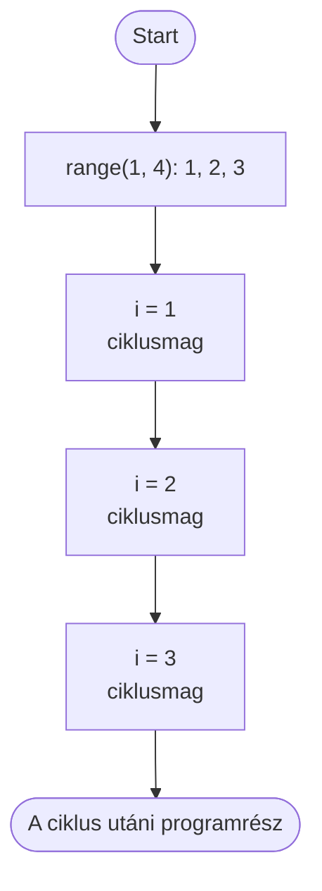

> # ✏️ Ciklusok - `for`
>
> A `for` ciklust akkor használjuk, ha előre tudjuk, milyen értékeken vagy hányszor ismétlünk.
>
> ```py
> for i in range(1, 6):
>     print(i)
> ```
>
> Kimenet: `1`, `2`, `3`, `4`, `5`
>
> **A `range()` legfontosabb alakjai:**
>
> | Kód | Kiírt értékek |
> |---|---|
> | `range(5)` | `0, 1, 2, 3, 4` |
> | `range(2, 5)` | `2, 3, 4` |
> | `range(1, 10, 2)` | `1, 3, 5, 7, 9` |
>
> A felső határ **nem tartozik bele**. A ciklusmag itt is egy behúzott blokk.

# `for` ciklus

A `while` ciklusnál nekünk kellett megváltoztatnunk a számlálót. A `for` ciklus ezt elvégzi helyettünk: sorban megkapja az értékeket egy tartományból.

## Rávezető kérdés

Ki kell írni az 1-től 20-ig terjedő számokat. Hogyan oldanátok meg `while` ciklussal? Mi lenne kényelmesebb, ha előre tudjuk, hogy pontosan melyik számokat szeretnénk?

Erre való a `for`: végigmegy egy előre megadott sorozaton.

## Szintaxis

```py
for ciklusvaltozo in range(kezdet, veg):
    utasitasok
```

- A `ciklusvaltozo` minden körben a következő értéket kapja. Egész számoknál gyakran `i` a neve.
- A `range()` állítja elő a számok sorozatát.
- Az `utasitasok` a ciklusmag: a behúzott blokk minden értékre lefut.



## `range()`: számsorozat

A `range()` felső határa mindig **nyitott**, vagyis nem része a sorozatnak.

```py
for i in range(1, 6):
    print(i)
```

Itt az `i` egymás után az `1`, `2`, `3`, `4`, `5` értéket kapja. A `6` már nem, mert a felső határ.

| Alak | Jelentés | Példa |
|---|---|---|
| `range(veg)` | 0-tól a `veg` előtti számig | `range(4)` → `0, 1, 2, 3` |
| `range(kezdet, veg)` | a `kezdet`-től a `veg` előtti számig | `range(2, 5)` → `2, 3, 4` |
| `range(kezdet, veg, lepes)` | adott lépésközzel | `range(0, 10, 2)` → `0, 2, 4, 6, 8` |

Visszafelé számoláshoz negatív lépés kell:

```py
for i in range(10, 0, -2):
    print(i)
```

Kimenet: `10`, `8`, `6`, `4`, `2`

## Példák

### Szám és négyzete

```py
for i in range(1, 6):
    print(i, i * i)
```

Kimenet:

```text
1 1
2 4
3 9
4 16
5 25
```

### Betűk bejárása

A `for` nemcsak számokon tud végigmenni. Egy szöveg betűi is sorozatot alkotnak:

```py
nev = "Anna"
for betu in nev:
    print(betu)
```

Kimenet:

```text
A
n
n
a
```

## `break` és `continue`

A `break` azonnal kilép a ciklusból:

```py
for i in range(1, 10):
    if i == 5:
        break
    print(i)
```

Kimenet: `1`, `2`, `3`, `4`

A `continue` kihagyja az aktuális kör hátralévő részét:

```py
for i in range(1, 6):
    if i == 3:
        continue
    print(i)
```

Kimenet: `1`, `2`, `4`, `5`

> # 💥 Rontsátok el!
>
> Mit ír ki ez a program? Miért nem szerepel benne az `5`?
>
> ```py
> for i in range(1, 5):
>     print(i)
> ```
>
> Javítsátok úgy, hogy `1`-től `5`-ig írjon ki. Ezután próbáljátok ki a `range(5, 1)` alakot is: miért nem ír ki semmit?

> # 📋 Feladatok
>
> 1. Írjátok ki az 1-től 15-ig terjedő egész számokat és melléjük a négyzetüket.
> 2. Írjátok ki a 3-mal osztható számokat 100-ig.
> 3. Írjátok ki az 50 és 99 közötti, 7-tel osztható számokat.
> 4. Számoljatok vissza 50-től 20-ig négyesével.
> 5. Kérjetek be egy számot, majd írjátok ki a szorzótábláját 1-től 10-ig.
>
> További feladatokat a [for gyakorlómappában](../Exercies/07_for/) találtok.

> # ❓ Kérdések
>
> 1. Mikor választanál `for` ciklust a `while` helyett?
> 2. Mi a ciklusváltozó szerepe?
> 3. Mit jelent az, hogy a `range()` felső határa nyitott?
> 4. Mit ír ki a `range(2, 10, 3)`?
> 5. Mit ír ki az alábbi program?
>
>    ```py
>    for i in range(0, 8, 2):
>        print(i, end=" ")
>    ```
>
> 6. Mi a különbség a `break` és a `continue` között?
> 7. Több mintapéldát a [for gyakorlómappában](../Exercies/07_for/) találtok.
