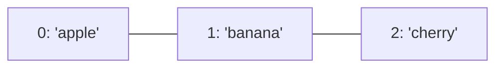

> # ✏️ Listák
>
> A **lista** több érték egyben, egy változóban. A dobozokkal ellentétben ez egy egész **polc**, ahol minden helynek van sorszáma (**index**), 0-tól kezdve.
>
> ```py
> mylist = ["alma", "banán", "cseresznye"]
> print(mylist[0])   # "alma"
> ```
>
> | Művelet | Jelentés |
> |---|---|
> | `mylist[i]` | az `i`. elem (0-tól számolva) |
> | `.append(x)` | `x` hozzáadása a lista **végére** |
> | `.insert(i, x)` | `x` beszúrása az `i`. helyre |
> | `.remove(x)` | az első `x` értékű elem törlése |
> | `.pop()` | az utolsó elem kiemelése és eltávolítása |
> | `len(mylist)` | a lista hossza (elemszám) |
> | `.sort()` | növekvő sorrendbe rendezi (helyben) |
>
> **Metafora:** a lista olyan, mint egy **polc dobozokkal**, minden doboznak van egy száma (0, 1, 2...), és bármikor tehettek bele, vehettek ki, vagy átrendezhetitek a dobozokat.

> ## 📑 Tartalom
> | Rész | Miről szól |
> |---|---|
> | [Elemek a listában](#elemek-a-listában) | index, elérés |
> | [Listaelem értékének megváltoztatása](#listaelem-értékének-megváltoztatása) | `lista[i] = ...` |
> | [`len()`](#len) | hossz lekérdezése |
> | [Elem törlése](#elem-törlése) | `del`, `.remove()` |
> | [Elem kiemelése `.pop()`](#elem-kiemelése-pop) | kivesz + visszaad |
> | [Teljes lista törlése `.clear()`](#teljes-lista-törlése-clear) | üres lista |
> | [Új elem hozzáadása](#új-elem-hozzáadása) | `.append()`, `.insert()`, `.index()`, `.count()`, `.extend()`, `.reverse()` |
> | [Lista két elemének cseréje](#lista-két-elemének-cseréje) | csere indexekkel |
> | [Véletlen számokkal való feltöltés](#véletlen-számokkal-való-feltöltés) | `random` |
> | [Sorba rendezés](#sorba-rendezés) | `.sort()` vs `sorted()` |

<details>
<summary>📖 Teljes tananyag (kattints a kinyitáshoz)</summary>

# Listák

A lista egy olyan adattípus, amely több érték tárolására szolgál egy változóban. 

Tartalmazhat:
- Integer
- String
- Float
- Másik lista
- Stb. típusú adatot.

## Elemek a listában

A listában minden elem egy meghatározott helyet foglal el. Ezt **index**nek nevezzük. Az index sorszám, amelyik 0-tól kezdődik az utolsó elem sorszámáig



```py
mylist = ["apple", "banana", "cherry"]
print(mylist)

print(mylist[0])
print(mylist[1])
print(mylist[2])
```
A `mylist` változó értéke `list`

## Példa
```py
adatok = ['hétfő', 'kedd', 'szerda', 1800]
print(adatok[2])
```
## Listaelem értékének megváltoztatása
```py
adatok = ['hétfő', 'kedd', 'szerda', 1800]
print(adatok)
adatok[3] = adatok[3] + 47
print(adatok)
```
másik példa: 
```py
adatok = ['hétfő', 'kedd', 'szerda', 1800]
print(adatok)
adatok[3] = 'Július'
print(adatok)
```
## `len()`
```py
mylist = ["apple", "banana", "cherry"]
print(len(mylist))
```

## Elem törlése
```py
mylist = ["apple", "banana", "cherry"]
del(mylist[1])
print(mylist)
```
vagy
```py
mylist = ["apple", "banana", "cherry"]
mylist.remove("apple")
print(mylist)
```
## Elem kiemelése `.pop()`
Kiemeli az utolsó elemet, és elmenthetjük egy változóba, a listából kitörli
```py
mylist = ["apple", "banana", "cherry"]
value = mylist.pop()
print(mylist)
print(value)
```

## Teljes lista törlése `.clear()`
```py
mylist = ["apple", "banana", "cherry"]
mylist.clear()
print(mylist)
```
## Új elem hozzáadása 
### `.append(érték)` új elem a lista végére
```py
mylist = ["apple", "banana", "cherry"]
mylist.append('kiwi')
print(mylist)
```
### `.insert(index, érték)` új elem az index helyére
```py
mylist = ["apple", "banana", "cherry"]
mylist.insert(1, 'kiwi')
print(mylist)
```
### `.index(elem)`
Visszaadja egy adott elem indexét. Ha nem találja meg az elemet, akkor `ValueError` kivételt dob.

```py
from random import sample

mylist = sample(range(1, 50), 7)
legkisebbIndex = mylist.index(min(mylist))
print(f"A {mylist} legkisebb eleme a {legkisebbIndex}. indexen van, értéke pedig {mylist[legkisebbIndex]}")
```
### `.count(keresettElem)`
Megszámolja a megadott elem darabszámát a listában. 
```py
mylist = [1, 1, 2, 3, 4, 5, 5, 1, 1]
print(mylist.count(1))
```
### `.extend(masikLista)`
Egyesít két listát
```py
from random import sample

mylist = sample(range(1, 50), 3)
yourList = sample(range(100, 500), 2)
print(mylist)
print(yourList)
mylist.extend(yourList)
print(mylist)
```
### `.reverse()`
Lista elemeinek sorrendjét megfordítja
```py
from random import sample

mylist = sample(range(1, 50), 5)
print(mylist)
mylist.reverse()
print(mylist)
```

## Lista két elemének cseréje
```py
myList = ["apple", "banana", "cherry"]
appleIndex, bananaIndex = myList.index("apple"), myList.index("banana")

print(myList)

myList[bananaIndex], myList[appleIndex] = myList[appleIndex], myList[bananaIndex]

print(myList)
```


## Véletlen számokkal való feltöltés
### variant 1
```py
from random import randint

myList = []
index = 0
while index < listLength:
    myList.append(randint(rangeMinimum, rangeMaximum))
    index += 1
print(myList)
```
### variant 2
```py
from random import sample
mylist = sample(range(legkisebb, legnagyobb), numberOfElements)
print(myList)
```

# Sorba rendezés
A listák elemeit sorba rendezhetjük 2 függvény segítségével:
- `myList.sort()`
- `sorted(myList)`

## `.sort()`
```py
numbers = [1, 2, 3, 4, -5, 98, 565, -3]
numbers.sort()
print(numbers) # [-5, -3, 1, 2, 3, 4, 98, 565]
```
Sorba rendezi az elemeket **növekvő** sorrend szerint.
```py
numbers = [1, 2, 3, 4, -5, 98, 565, -3]
numbers.sort(reverse=True)
print(numbers)  # [565, 98, 4, 3, 2, 1, -3, -5]
```
Sorba rendezi az elemeket **csökkenő** sorrend szerint a `reverse = True` segítségével.


## `sorted()`
```py
numbers = [1, 2, 3, 4, -5, 98, 565, -3]
sorted(numbers)
print(numbers)  # [1, 2, 3, 4, -5, 98, 565, -3]
numbers = sorted(numbers)
print(numbers)  # [-5, -3, 1, 2, 3, 4, 98, 565]
```
Sorba rendezi az elemeket **növekvő** sorrend szerint, viszont ügyelni kell rá, hogy a `sorted` az egy új listát hoz létre, ezért újból értékként kell megadni a `numbers` változónak.
```py
numbers = [1, 2, 3, 4, -5, 98, 565, -3]
sorted(numbers, reverse=True)
print(numbers)  # [1, 2, 3, 4, -5, 98, 565, -3]
numbers = sorted(numbers, reverse=True)
print(numbers)  # [565, 98, 4, 3, 2, 1, -3, -5]
```
Sorba rendezi az elemeket **csökkenő** sorrend szerint a `reverse = True` segítségével.

</details>

> # 💥 Rontsátok el!
>
> Mi a probléma ezzel a programmal? Miért nem `[1, 2, 3]` a kimenet?
>
> ```py
> numbers = [3, 1, 2]
> sorted(numbers)
> print(numbers)
> ```
>
> Javítsátok ki úgy, hogy a `numbers` valóban rendezve legyen. Mi a különbség a `.sort()` és a `sorted()` között?

> # 📋 Feladatok
> - [e01_fillList.md](https://github.com/SpsKnSK/api/blob/main/Exercies/09_lists/e01_fillList.md)
> - [e02_fillListWithinInterval.md](https://github.com/SpsKnSK/api/blob/main/Exercies/09_lists/e02_fillListWithinInterval.md)
> - [e03_maxMin.md](https://github.com/SpsKnSK/api/blob/main/Exercies/09_lists/e03_maxMin.md)
> - [e04_maxMinIndexAverage.md](https://github.com/SpsKnSK/api/blob/main/Exercies/09_lists/e04_maxMinIndexAverage.md)
> - [e05_randomEvenOdd.md](https://github.com/SpsKnSK/api/blob/main/Exercies/09_lists/e05_randomEvenOdd.md)
> - [e06_switchNumbers.md](https://github.com/SpsKnSK/api/blob/main/Exercies/09_lists/e06_switchNumbers.md)
> - [e07_separateTextNumbers.md](https://github.com/SpsKnSK/api/blob/main/Exercies/09_lists/e07_separateTextNumbers.md)

> # ❓ Kérdések
>
> 1. Mire szolgálnak a listák?
> 2. Készítsetek egy üres listát, és írassátok ki a képernyőre.
> 3. Mire szolgál az index?
> 4. Írjátok ki egy tetszőleges lista első és utolsó elemét.
> 5. Töröljétek egy tetszőleges lista összes elemét a `del` paranccsal.
> 6. Egy 4 elemű listához adjatok hozzá egy tetszőleges új elemet az `.insert()` paranccsal.
> 7. Egy tetszőleges elemű listához adjatok hozzá egy tetszőleges új elemet az `.append()` paranccsal.
> 8. Egy számokból álló listában írjátok ki a legkisebb és legnagyobb értéket, és azoknak az indexét.
> 9. Mi a különbség a `.remove()` és a `.pop()` között?
> 10. Mit ír ki ez a program?
>
>     ```py
>     mylist = [10, 20, 30]
>     mylist.append(40)
>     mylist.pop(0)
>     print(mylist)
>     ```