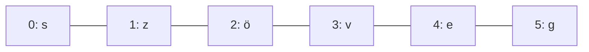

> # ✏️ Stringek (szövegek)
>
> A **string** karakterek sorozata. Minden karakternek van egy **indexe** (sorszáma), ami **0-tól** indul.
>
> ```text
> s  z  ö  v  e  g
> 0  1  2  3  4  5
> ```
>
> | Művelet | Jelentés | Példa (`szoveg = "szöveg"`) |
> |---|---|---|
> | `szoveg[i]` | az `i`. karakter | `szoveg[3]` → `"v"` |
> | `szoveg[a:b]` | `a`-tól `b`-ig (b nélkül) | `szoveg[1:4]` → `"zöv"` |
> | `.lower()` / `.upper()` | kis-/nagybetűssé alakít | |
> | `.replace(x, y)` | `x`-et `y`-ra cseréli | |
> | `.split()` | szétvágja szóközök mentén | |
> | `len(szoveg)` | a string hossza | |
>
> **Metafora:** a string olyan, mint egy **gyöngysor**, ahol minden gyöngy egy karakter, és mindegyiknek van egy cimkéje: 0, 1, 2, 3... A `[a:b]` egy darabot vág ki a gyöngysorból.

> ## 📑 Tartalom
> | Rész | Miről szól |
> |---|---|
> | [Mi az a string?](#mi-az-a-string) | alapfogalom |
> | [`.lower()`](#lower) | kisbetűssé alakítás |
> | [`.upper()`](#upper) | nagybetűssé alakítás |
> | [`.replace(from, to)`](#replacefrom-to) | csere |
> | [`.split()`](#split) | szétvágás szóköz mentén |
> | [`.split()` by character](#split-by-character) | szétvágás adott karakter mentén |
> | [`.index(character)`](#indexcharacter) | karakter helye |
> | [`.count(character)`](#countcharacter) | darabszám |
> | [`len("text")`](#lentext) | hossz |
> | [`.join(stringCollection)`](#joinstringcollection) | összefűzés |
> | [`.join(intCollection)`](#joinintcollection) | számok összefűzése |
> | [`in`](#in) | tartalmazás vizsgálat |
> | [`str` mint kollekció](#str-mint-kollekció) | bejárás, indexelés |


# String, karakterláncok és műveletek

## Mi az a string?

Eddig a stringet (szöveget) egyetlen egésznek kezeltük: `"szia"`. Valójában a string **karakterek sorozata** — mint a gyöngysor, ahol minden gyöngy egy betű, szám vagy jel.



Minden karakternek van egy **indexe**, a sorszáma, ami mindig **0-val kezdődik**. Ez az egyik leggyakoribb hibaforrás kezdőknek: az 1. karakter indexe **nem 1, hanem 0**.

```py
szoveg='szöveg'
print(szoveg[3])   # kiíratjuk a 4. karaktert a stringből
print(szoveg[1:])  # kiíratjuk a stringet 2. karaktertől
print(szoveg[:4])  # kiíratjuk a stringet a 4. karakterig
print(szoveg[1:len(szoveg)]) #kiíratjuk a stringet a 2. karaktertől a végéig.
```

Kimenet:

```text
v
zöveg
szöv
zöveg
```

- `.lower()` - kisbetű
- `.upper()` - nagybetű
- `.replace('s', 'a')` – 's' betűt 'a'-ra cseréli
- `.split()` – szétvágja a stringet valamilyen karakter alapján
- `.index('karakter')` – megadja a karakter pozícióját
- `.count('karakter')` – megadja hány ilyen karakter van a stringben
- `len()` – megadja a karakterlánc hosszát.

## `.lower()`
```py
text: str = "Pista elment a Tescoba."
textWithLower: str = text.lower()
print(f"{text}\n{textWithLower}")
```

## `.upper()`
```py
text: str = "Pista elment a Tescoba."
textWithUpper: str = text.upper()
print(f"{text}\n{textWithUpper}")
```

## `.replace(from, to)`
```py
text: str = "Sps KN"
replacedText: str = text.replace("KN", "BA")
print(f"{text}\n{replacedText}")
```
```
Sps KN
Sps BA
```

## `.split()`
```py
text: str = "The quick brown fox jumped over the lazy fox."
splitText: list[str] = text.split()
print(f"{text}\n{splitText}")
```
```
The quick brown fox jumped over the lazy fox.
['The', 'quick', 'brown', 'fox', 'jumped', 'over', 'the', 'lazy', 'fox.']
```

## `.split()` by character
```py
text: str ="Once upon a time, a prince lived in a grand castle. He met a beautiful princess in a nearby kingdom. They became friends and shared many adventures. One day, the princess was captured by a dragon. The brave prince decided to rescue her. He fought the dragon with courage. The dragon was defeated and fled. The prince freed the princess. They returned to the castle together. They lived happily ever after."
splitText: list[str] = text.split(".")
print(f"{text}\n{splitText}")

```
```
Once upon a time, a prince lived in a grand castle. He met a beautiful princess in a nearby kingdom. They became friends and shared many adventures. One day, the princess was captured by a dragon. The brave prince decided to rescue her. He fought the dragon with courage. The dragon was defeated and fled. The prince freed the princess. They returned to the castle together. They lived happily ever after.
['Once upon a time, a prince lived in a grand castle', ' He met a beautiful princess in a nearby kingdom', ' They became friends and shared many adventures', ' One day, the princess was captured by a dragon', ' The brave prince decided to rescue her', ' He fought the dragon with courage', ' The dragon was defeated and fled', ' The prince freed the princess', ' They returned to the castle together', ' They lived happily ever after', '']
```

## `.index(character)`
```py
text: str = "They lived happily ever after."
searchedText: str = "lived"
indexExisting: int = text.index(searchedText)
# Raises ValueError when the substring is not found.
# searchedTextNotExisting: str = "King"
# indexNonExisting: int = text.index(searchedTextNotExisting)
print(f"{text}\nIndex of {searchedText} {indexExisting}")
```
```
They lived happily ever after.
Index of lived 5
```

## `.count(character)`
```py
text: str = "They lived happily ever after."
searchedText: str = "e"
countOfSearchedText: int = text.count(searchedText)
print(f"{text}\nCount of {searchedText} {countOfSearchedText}")

searchedText: str = "x"
countOfSearchedText: int = text.count(searchedText)
print(f"{text}\nCount of {searchedText} {countOfSearchedText}")
```
```
They lived happily ever after.
Count of e 5
They lived happily ever after.
Count of x 0
```

## `len("text")`
```py
text: str = "They lived happily ever after."
lengthOfText = len(text)
print(f"{text}\nNumber of characters: {lengthOfText}")
```
```
They lived happily ever after.
Number of characters: 30
```

## `.join(stringCollection)`
```py
text: str = "They lived happily ever after."
collection: list[str] = text.split()
joinedString: str = "000".join(collection)
print(f"{text}\n{joinedString}")
```
```
They lived happily ever after.
They000lived000happily000ever000after.
```

## `.join(intCollection)`
```py
from random import randint

numbers: list[int] = [randint(-100, 100) for _ in range(10)]
numbersString: str = ":".join([str(n) for n in numbers])
print(f"{numbers}\n{numbersString}")

numbersString: str = "abc".join([f"{n}" for n in numbers])
print(numbersString)

numbersString: str = " ".join([f"({n})" for n in numbers])
print(numbersString)
```
```
[-81, 2, -10, 12, -68, 92, -90, 40, -15, 4]
-81:2:-10:12:-68:92:-90:40:-15:4
-81abc2abc-10abc12abc-68abc92abc-90abc40abc-15abc4
(-81) (2) (-10) (12) (-68) (92) (-90) (40) (-15) (4)
```

## `in`
A `in` kulcsszóval megvizsgálhatjuk, hogy egy karakter (vagy résszöveg) benne van-e egy stringben:
```py
betu = input("Adj meg egy betűt")
maganhangzok = "aeiouAEIOU"
if betu in maganhangzok:
    print(betu, "magánhangzó")
else:
    print(betu, "mássalhangzó")
```

##  Példa
A `<` és `>` jelekkel stringeket is összehasonlíthatunk: Python az ábécésorrendet nézi (kisbetű/nagybetű számít!).
```py
limonade = "limonade"
szo = input("Írjon be egy tetszőleges szót : ")
if szo < limonade:
    place = "megelőzi"
elif szo > limonade :
    place = "követi"
else:
    place = "fedi"
print(f"A '{szo}' szó {place} a '{limonade}' szót a névsorban")
```

## `str` mint kollekció

A Pythonban a szöveg (string) egy kollekció, ami azt jelenti, hogy feldarabolható karakterekre, és használható `for` ciklusban:

```py
text = "test"
for c in text:
    print(c)
```
```
t
e
s
t
```

vagy egyszerűen listává alakíthatjuk:

```py
text = "test"
karakterLista = list(text)
print(karakterLista)
```
```
['t', 'e', 's', 't']
```


> # 💥 Rontsátok el!
>
> Mit ír ki ez a program? Miért csak `"veg"` jelenik meg, nem `"öveg"`?
>
> ```py
> szoveg = "szöveg"
> print(szoveg[3:6])
> ```
>
> Javítsátok ki úgy, hogy tényleg `"öveg"` legyen a kimenet (nézzétek meg, hányadik indexen van az `ö` betű). Utána próbáljátok ki: mi történik, ha `szoveg[10]`-et kértek le egy 6 karakteres stringből?

> # 📋 Feladatok
> - [Mondatelemzés](https://github.com/SpsKnSK/api/blob/main/Exercies/10_string/e01_workWithCharacters.md#hu)
> - [Kacsák](https://github.com/SpsKnSK/api/blob/main/Exercies/10_string/e02_ducks.md#hu)
> - [Mondatelemzés 2](https://github.com/SpsKnSK/api/blob/main/Exercies/10_string/e03_workingWithSentence.md#hu)
> - [Betűcsere](https://github.com/SpsKnSK/api/blob/main/Exercies/10_string/e04_replace.md#hu)
> - [Szókiírás](https://github.com/SpsKnSK/api/blob/main/Exercies/10_string/e05_printWord.md#hu)
> - [Mondategyesítés](https://github.com/SpsKnSK/api/blob/main/Exercies/10_string/e06_assemblyASentence.md#hu)

> # ❓ Kérdések
>
> 1. Melyik indexe van egy string első karakterének?
> 2. Mit ad vissza a `szoveg[2:5]`?
> 3. Mi a különbség a `.lower()` és `.upper()` között?
> 4. Hogyan tudjátok megszámolni, hányszor fordul elő egy karakter egy stringben?
> 5. Mit csinál a `.split()`, és mit ad vissza?
> 6. Miért lehet egy stringen `for` ciklussal végigmenni?
> 7. Mit ír ki ez a program?
>
>    ```py
>    szo = "python"
>    print(szo[1:4])
>    ```
