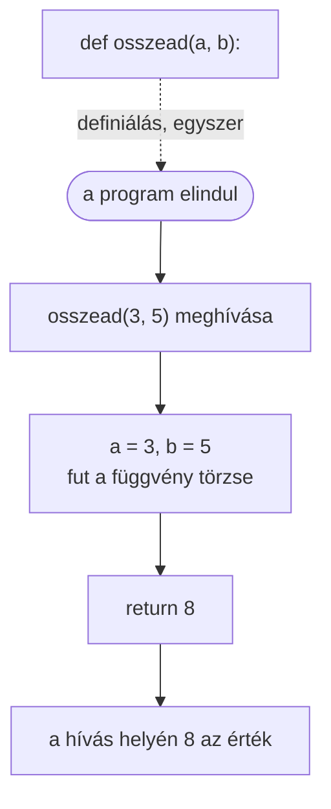

> # ✏️ Függvények
>
> A **függvény** egy elnevezett kódrészlet, amit bárhonnan meg lehet **hívni**. Bemenete lehet (paraméterek), és lehet visszatérési értéke (`return`).
>
> ```py
> def fuggvenyNeve(parameter1, parameter2) -> visszaadottTipus:
>     return valami
> ```
>
> ```py
> def osszead(a, b) -> int:
>     return a + b
>
> eredmeny = osszead(3, 5)
> print(eredmeny)   # 8
> ```
>
> **Ne feledd:**
> 1. `def` + név + zárójelben a paraméterek + kettőspont;
> 2. a `return` adja vissza az eredményt, és **kilép** a függvényből;
> 3. **eljárás**: nincs `return` érték, csak csinál valamit (pl. kiír).
>
> **Metafora:** a függvény olyan, mint egy **konyhai gép** (pl. turmixgép): bedobod a paramétereket (gyümölcsök), lenyomod a gombot (meghívod), és kijön az eredmény (`return`). A gépet **egyszer** kell megépíteni (`def`), utána akárhányszor **használhatod**.

# Eljárások vagy Alprogramok

- Az **eljárás** olyan programkódrészlet, amely **adattranszformációt** hajt végre, vagy **tevékenységet** végez. 
- Használatának igazi előnye akkor jelentkezik, amikor nagyobb programokban egy-egy utasítássorozatot **többször meg kell hívni**. 
- Az eljárások használata **áttekinthetőbbé** teszi a programot, és az esetleges hibák javítása is egyetlen helyen elvégezhető. 

# Függvények
- Függvénynek nevezünk egy olyan **alprogramot(eljárást)**, aminek eredménye egyetlen jól körülhatárolt érték vagy objektum. 
- Ezt az értéket vagy objektumot a függvény **visszatérési értékének nevezzük**.
##  Operátorok és függvények
- Matematikai operátorok: `+`, `-`, `*`, `/`, 
- Beláthatjuk azonban, hogy számtalan olyan műveletet fogunk - végrehajtani, amire nincsenek megfelelő operátorok. 
- Ekkor jönnek a képbe a **függvények**. 
- Tegyük fel, hogy néhány szám közül szeretnénk kiválasztani a - legkisebbet. Erre nem létezik semmiféle műveleti jel. 
- A Python rendelkezik úgynevezett beépített vagy előredefiniált függvényekkel, melyeknek a segítségével könnyedén végrehajthatunk bonyolultabb műveleteket is, illetve  készíthetünk sajátokat is. 
- A legkisebb elem kiválasztására használt függvény a `min` függvény lesz.

## Saját függvények létrehozása
Kulcsszavak: 
- `def` – ezzel a paranccsal hozunk létre **függvényt**. Ezután beírjuk a függvény Nevét és a szükséges paramétereket(nem mindig kell!). Ezután következik a kettőspont, majd a következő sorba írhatjuk a parancsokat.
- `return` – megadja a függvény visszatérési értékét, majd kilép a függvényből. (nem kötelező használni).

## Szintaxis
```py
def függvényNeve(parameter1, parameter2)->VisszaadottÁdattípus:
    return visszaadottÉrték
```



### Példa
függvény, ami 2 érték összegét adja vissza
```py
def Osszead(a, b)->int:
    return a + b
```
### Példa
függvény, ami eldönti, hogy egy adott szám prímszám-e
```py
def IsPrime(number) -> bool:
    for i in range(2, int(number**0.5) + 1):
        if number % i == 0:
            return False
    return True

number = 20
if(IsPrime(number)):
    print(f"{number} is prime number")
else:
    print(f"{number} is not prime number")
```

## Függvények (functions), eljárások (methods)
- **Függvény** van visszaadó értéke `return`, kapunk végeredményt az elvégzés után `def függvényNeve (paraméterek)->visszaadottÁdatTípus:`
- **Eljárások** nincs visszaadó érték, valamit elvégez, de nem érdekes a végeredmény  `def függvényNeve (paraméterek)->None:`

## Feladatok
[e01_areaOfTriangle.md](https://github.com/SpsKnSK/api/blob/main/Exercies/11_functions/e01_areaOfTriangle.md)

[e02_perimeterOfTriangle.md](https://github.com/SpsKnSK/api/blob/main/Exercies/11_functions/e02_perimeterOfTriangle.md)

[e03_workerPosition.md](https://github.com/SpsKnSK/api/blob/main/Exercies/11_functions/e03_workerPosition.md)

[e04_workerPosition_2.md](https://github.com/SpsKnSK/api/blob/main/Exercies/11_functions/e04_workerPosition_2.md)

[e05_averageConsumption.md](https://github.com/SpsKnSK/api/blob/main/Exercies/11_functions/e05_averageConsumption.md)

## Egy függvényben meghívhatunk másik függvény(eke)t is
```py
def Add(a: int, b: int) -> int:
    return a + b

maximum = max(Add(10, 5), Add(-9, 13), Add(9, 0))
print(maximum)
```

> # 💥 Rontsátok el!
>
> Miért nem ír ki semmit ez a program?
>
> ```py
> def negyzet(szam):
>     szam ** 2
>
> print(negyzet(4))
> ```
>
> Javítsátok ki, hogy `16`-ot írjon ki. Mit felejtettünk el a függvényből?

> # 📋 Feladatok
> - [e01_areaOfTriangle.md](https://github.com/SpsKnSK/api/blob/main/Exercies/11_functions/e01_areaOfTriangle.md)
> - [e02_perimeterOfTriangle.md](https://github.com/SpsKnSK/api/blob/main/Exercies/11_functions/e02_perimeterOfTriangle.md)
> - [e03_workerPosition.md](https://github.com/SpsKnSK/api/blob/main/Exercies/11_functions/e03_workerPosition.md)
> - [e04_workerPosition_2.md](https://github.com/SpsKnSK/api/blob/main/Exercies/11_functions/e04_workerPosition_2.md)
> - [e05_averageConsumption.md](https://github.com/SpsKnSK/api/blob/main/Exercies/11_functions/e05_averageConsumption.md)
>
> További feladatokat a [gyakorlómappában](../Exercies/11_functions/) találtok.

> # ❓ Kérdések
>
> 1. Hogyan definiálunk függvényt? Írjátok le a szintaxist.
> 2. Mire szolgál a `return` parancs? Mutassátok be példán.
> 3. Kell-e mindig `return` parancs? Mutassátok be példán.
> 4. Mondjatok példát függvényre, amelynek nincs bemenő paramétere, és visszaad egy `int` értéket: `def függvényNeve()->int:`
> 5. Mondjatok példát függvényre, amely két egész szám típusú bemenő paraméterrel rendelkezik, és visszaad egy `bool` értéket: `def függvényNeve(a:int, b:int)->bool:`
> 6. Mondjatok példát függvényre, amely egy `str` bemenő paraméterrel rendelkezik, `int` értéket ad vissza: `def függvényNeve(a:str)->int:`
> 7. Írjatok függvényt, amelynek bemenő paramétere egy lista, és visszaadja egy olyan listát, amely az eredeti lista páratlan indexű elemeit tartalmazza. `[1,2,3,4] -> [2,4]`
> 8. Mi a különbség a függvény és az eljárás között?