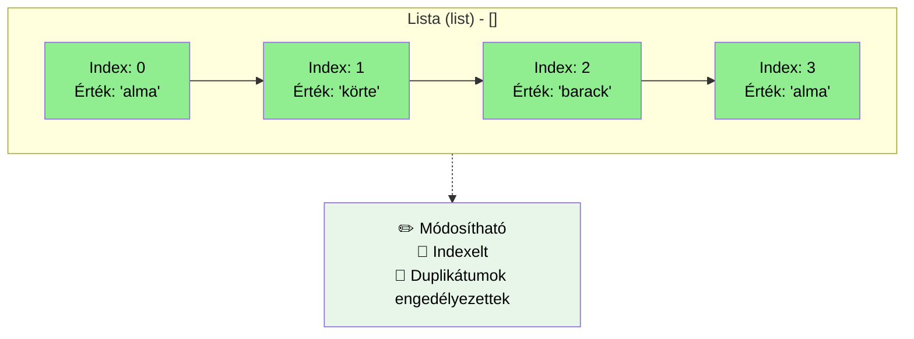
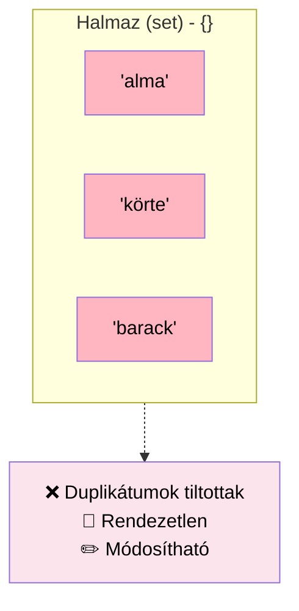
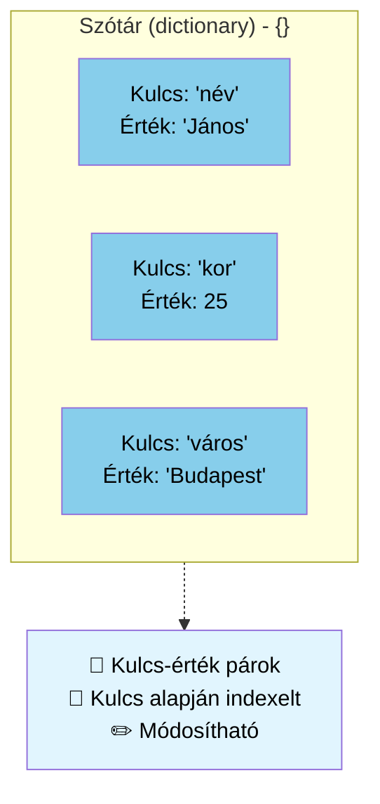
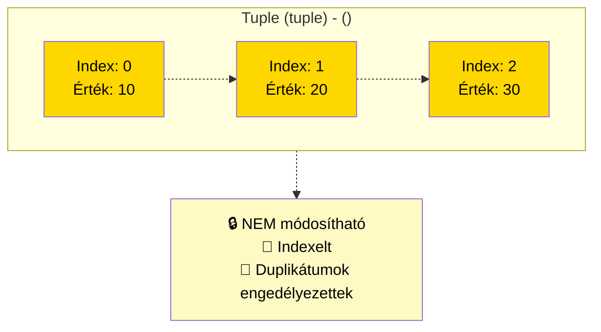

# Lista `list`: `[]`

```python
# Lista - indexelt, módosítható, duplikátumok engedélyezettek
gyumolcsok_lista = ['alma', 'körte', 'barack', 'alma']
print(f"Lista: {gyumolcsok_lista}")
print(f"Első elem: {gyumolcsok_lista[0]}")
gyumolcsok_lista[1] = 'szilva'  # Módosítható
print(f"Módosított lista: {gyumolcsok_lista}")
```
## Tulajdonságok
- `[]` szögeletes zárójeleket használjuk
- bármilyen adattípust tartalmazhat, akár keverve is
  - `[1,2.3,"alma", True]` kevert
  - `[1,2,3]` csak számok
- index-szel jutunk hozzá az értékhez, `0`val kezdődik 
  - ha az egyenlőségjel "jobb" oldalán van az érték `ertek = listam[i]`, vagy nincs egyenlőségjel `print(listam[i])`, akkor **visszakapjuk** az értéket
  ```py
  lista = ['alma', 'korte', 'cseresznye']
  print(lista[1]) #kiirja korte
  alma = lista[0]
  print(alma)
  ```
  - ha az egyenlőségjel "bal" oldalán van az érték, akkor **hozzárendelünk** értéket
  ```py
  lista = ['alma', 'korte', 'cseresznye']
  print(lista[1]) #kiirja korte
  lista[1] = "kiwi"
  print(lista[1]) #kiirja kiwi
  ```
- `.append(érték)` - új értéket adunk a lista **végére**
- `.index(érték)` - visszaadja az `érték` **helyét**, sorszámát, indexét. Ha nem találja az értéket, akkor `ValueError` kivételt dob.

# Halmaz `set`: `{}`

```python
# Halmaz - rendezetlen, egyedi elemek, duplikátumok automatikusan törlődnek
gyumolcsok_halmaz = {'alma', 'körte', 'barack', 'alma'}
print(f"\nHalmaz: {gyumolcsok_halmaz}")  # 'alma' csak egyszer jelenik meg
```
A Python a `set` adattípust is alaptípusként definiálja. a `set`: elemek rendezetlen halmaza, amelyben minden elem **csak egyszer** fordulhat elő.

Alapvető használata: 
- megadott elem meglétének ellenőrzése
- elemek kettőzésének kiszűrése. 

## Tulajdonságok
- `{}` kapcsos zárójeleket használjuk, vagy a listából, stringből a `set()` paranccsal csinálunk halmazt `halmaz = set([1,1,1,2,3,5,4,4,4,8])`
- bármilyen adattípust tartalmazhat, akár keverve is
- minden eleme egyedi, csak egyszer fordul elő
## Példa
Hány számot találtam el a lottón:
```py
nyeroSzamok = {1, 2, 3, 4, 5, 6}
enSzamaim = {1, 2, 7, 8, 9, 0}

print("Ezeket eltalaltam: ", nyeroSzamok & enSzamaim)
```

## Listából halmaz
```py
kosar = ["alma", "narancs", "alma", "korte", "narancs", "banan"]
print("narancs" in kosar)
kosarHalmaz = set(kosar)
print(kosarHalmaz)
```

## Halmazok műveletei
A `set` objektumok támogatják az olyan matematikai műveleteket, mint az: 
- egyesítés (union), `a | b`
- közös metszet (intersection), `a & b`
- különbség (difference),  `a - b`
- és a szimmetrikus eltérés (symmetric difference). `a ^ b`

```py
abrakadabra = set('abracadabra')
alhambra = set('alhambra')
print(f'abrakadabra egyedi elemei {abrakadabra}')
print(f'alhambra egyedi elemei {alhambra}')
print(f'abrakadabra-ban benne van alhambra-bol hianyzik: {abrakadabra-alhambra}')
print(f'abrakadabra-ban vagy alhambra-ban megvan: {abrakadabra|alhambra}')
print(f'abrakadabra-ban es alhambra-ban megvan egyszerre: {abrakadabra&alhambra}')
print(f'abrakadabra-ban vagy alhambra-ban megvan, de egyszerre mindkettoben nem: {abrakadabra^alhambra}')
```

# Szótár `dictionary`: `{}`

```python
# Szótár - kulcs-érték párok
szemely = {'név': 'János', 'kor': 25, 'város': 'Budapest'}
print(f"\nSzótár: {szemely}")
print(f"Név: {szemely['név']}")
szemely['kor'] = 26  # Módosítható
print(f"Módosított szótár: {szemely}")
```
A szótár adatípus arra szolgál, hogy kulcs:érték párosokat mentsen el. A szótár olyan gyűjtemény, amely: 
- {kulcs:érték}, ahol a kulcs és az érték bármilyen adattípus lehet, egy szótáron belül akár keveredhet is 
- ha egy értékhez akarunk hozzáférni, akkor a `[]` zárójeleket használjuk, mint a listáknál, éppenséggel itt a kulcsot adjuk meg: `print(myDict["key"])`
- sorba rendezett (Python >3.7)
- megváltoztatható
- nem tartalmaz kettőzött kulcsokat
## Példa kiírni az egész szótárat
```py
carDictionary = {
  "brand": "Ford",
  "model": "Mustang",
  "year": 1964,
}
print(carDictionary)
```
## Példa kiírni a kulcshoz tartozó értéket
```py
carDictionary = {
  "brand": "Ford",
  "model": "Mustang",
  "year": 1964
}
print(carDictionary["brand"])
```
esetleg
```py
brandKey = "brand"
carDictionary = {
  "brand": "Ford",
  "model": "Mustang",
  "year": 1964
}
print(carDictionary[brandKey])
```
## Példa megváltoztatni egy adott kulcshoz az értéket
```py
brandKey = "brand"
carDictionary = {
  "brand": "Ford",
  "model": "Mustang",
  "year": 1964
}
print(carDictionary[brandKey])
carDictionary[brandKey] = "Hyundai"
print(carDictionary[brandKey])
```

## Kettőzött kulcsok nem engedélyezettek
Hibát nem jelez ugyan, de mindig felülírja az értéket
```py
carDictionary = {
  "brand": "Ford",
  "model": "Mustang",
  "year": 1964,
  "year": 2020
}
print(carDictionary)
```
## Frissítés, `.update`
```py
carDictionary = {
  "brand": "Ford",
  "model": "Mustang",
  "year": 1964,
}
# ha létezik `model` kulcs, felülírja az értéket
carDictionary.update({"model":"Mondeo"})

# ha nem létezik `isElectric` kulcs, hozzácsatolja
carDictionary.update({"isElectric":False})

print(carDictionary)
```

## `.get`

Ha a szótár nem létező kulcsához akarunk hozzáférni, hibát jelez futtatásnál, a program leáll:
```py
carDictionary = {
  "brand": "Ford",
  "model": "Mustang",
  "year": 1964,
}
print(carDictionary["isElectric"])
```
Ezt megelőzendő használhatjuk a `.get` függvényt:

```py
carDictionary = {
  "brand": "Ford",
  "model": "Mustang",
  "year": 1964,
}
print(carDictionary.get("isElectric"))
print(carDictionary.get("isElectric", "nem tartalmazza"))
```

# Tuple `tuple`: `()`



```python
# Tuple - indexelt, NEM módosítható
koordinatak = (10, 20, 30)
print(f"\nTuple: {koordinatak}")
print(f"Első elem: {koordinatak[0]}")
# koordinatak[0] = 15  # Ez hibát okozna! Tuple nem módosítható
```

A **tuple** nem megváltoztatható adattípus, az elemei lehetnek megváltoztatható elemei. A kimeneten a tuple-k mindig zárójelezve vannak, így azok egymásba ágyazva is helyesen értelmezhetők; megadhatjuk zárójelekkel és anélkül is, néha azonban feltétlenül szükségesek a zárójelek (amikor az egy nagyobb kifejezés része).

Ilyen pl, ha egy **listát** teszünk a tuple-ba:
```py
megtanulni = ['matek', 'fizika']
orarendem = (megtanulni, 'tesi')

print(orarendem[0][1]) # fizika
orarendem[0][1] = 'szlovak' 
print(orarendem[0][1]) # szlovak
```
A következő kód hibát jelez:
```py
gyumolcsok = ('alma', 'korte', 'cseresznye')
gyumolcsok[0] = 'kiwi'
```

## Tulajdonságok
- `()` zárójeleket használjuk
- a tömb elemei nem változtathatók
- bármilyen adattípust használhatunk
- karakterláncokhoz hasonlóan megváltoztathatatlanok, nem adhatunk értéket egyetlen elemének (`myTuple[0] = 10` hibát jelez)
- létrehozható olyan tuple, amely megváltoztatható elemeket - például tömböket/listákat - tartalmaz (`myTuple = ([1,2,3],4)`, itt tudjuk a `myTuple[0]` értékeit változtatni, hiszen az egy lista )

## Mire jó? 

Függvény csak egy értéket adhat vissza, de ha az az egy érték olyan típus, ami több értéket tartalmaz, akkor épp a **tuple** lehet a megoldás. Szabályosan leírva:
```py
def Add10(a:int, b:int)->tuple[int,int]:
    return (a+10, b+10) 

result = Add10(40,50)
print(result)
```
Vagy egy kicsit egyszerűsítve, és felbontva a tuple-t két (vagy több) változóra
```py
def Add10(a:int, b:int)->tuple[int,int]:
    return a+10, b+10 # ilyenkor elmaradhat a zárójel

x, y = Add10(40,50)
print(x,y)
```
`(x, y)` koordinátapár tárolása, dolgozók rekordjai egy adatbázisban

# Kérdések
1. Mik a `set` fő tulajdonságai, hogyan jelöljük?
1. Mik a `dict` fő tulajdonságai, hogyan jelöljük?
1. Mik a `list` fő tulajdonságai, hogyan jelöljük?
1. Mik a `tuple` fő tulajdonságai, hogyan jelöljük?
1. Hogyan határozzuk meg 2 halmaz metszetét, írjatok rá példát.
1. Készítsetek egy listát, amelyben 3 szótár típusú érték van, amelyek személyeket takarnak a következő kulcsokkal: név, vezetéknév, születési év.
1. A következő listából csináljatok halmazt: `myList = [5,10,30,28,-99,5,0,0,65,124,214,25,5]`
1. Mikor használhatjuk a `.get` függvényt a szótáraknál, írjatok rá példát!
1. Készítsetek egy 3 kulcs-érték párossal rendelkező szótárat és frissítsétek az egyik kulcsot, majd adjatok hozzá egy újabb kulcs-érték párost
