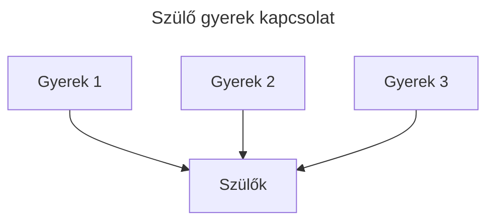
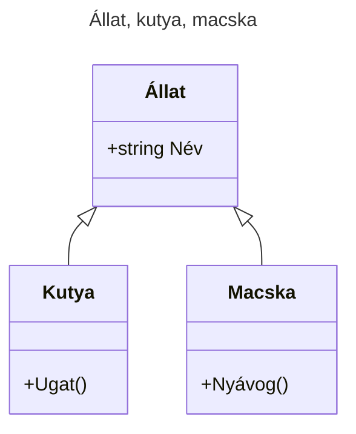
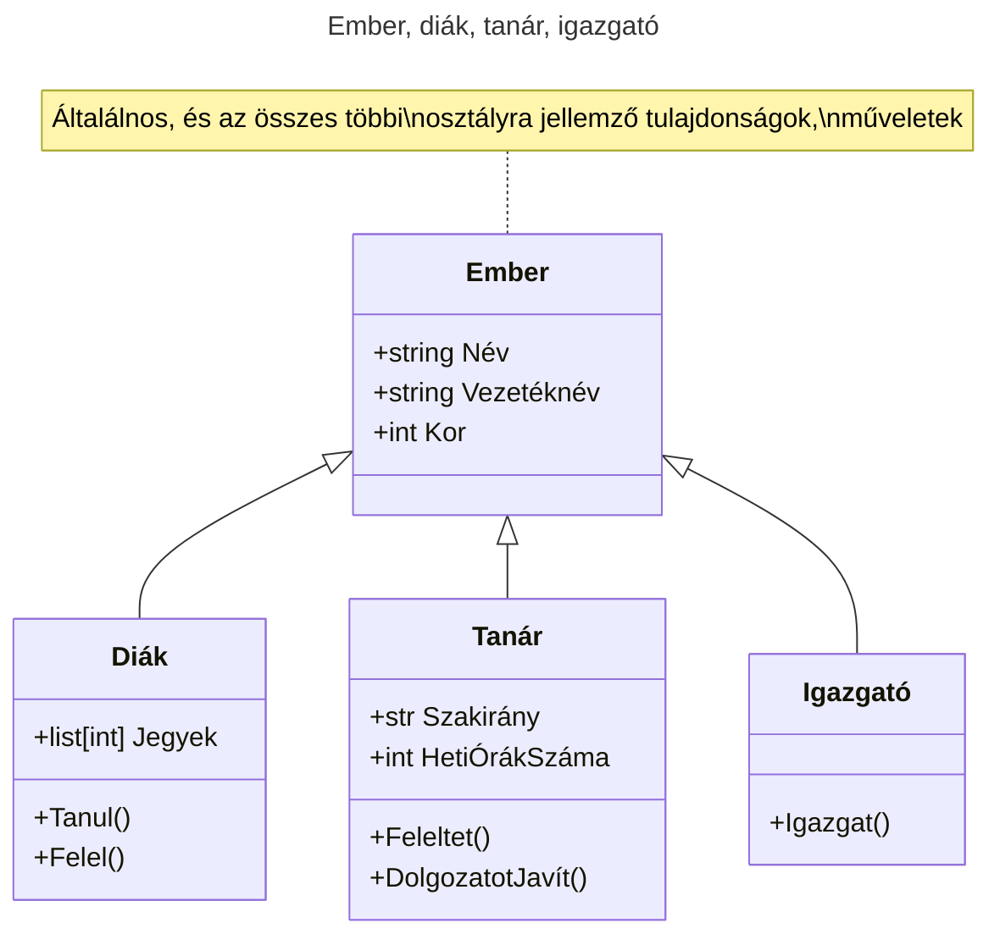

# Öröklődés
## Bevezető
Az **objektumorientált** programozáshoz leggyakrabban társított nyelvi mechanizmus az öröklődés. Az öröklődés lehetővé teszi, hogy olyan új osztályokat definiáljunk, amelyek valamely létező osztály módosított változatai, ergo kevesebbet kell gépelnünk. 
## Alapfogalmak
A folyamatot azért nevezik öröklődésnek, mert az új osztály a létező osztály összes metódusát, atribútumját "örökli", megkapja, használhatja. A metaforát kiterjesztve a már létező osztályt gyakran **szülő**, az új osztályt pedig gyakran **gyermek** vagy **(le)származott** osztálynak, esetleg **alosztálynak** nevezik.
- **öröklődés** (inheritance) _egy olyan mechanizmus, amely lehetővé teszi, hogy egy osztályt egy korábban definiált osztály módosított változataként definiáljunk._
- **szülő osztály** (parent class) _egy olyan osztály, amelyből gyermek osztályt származtunk._
- **gyerek, származtatott** osztály (child class) _egy új osztály, amelyet egy már létező osztályból származtattunk. Alosztálynak is nevezzük._

## Elmélet

Az öröklődés hatékony nyelvi eszköz, amely a kód újrahasznosítást is elősegíti, hiszen átszabhatjuk a szülő osztály viselkedését az osztály módosítása nélkül a származtatott osztályban. Bizonyos esetekben az öröklődési hierarchia a probléma természetes szerkezetét is tükrözi, ami egyszerűbbé teszi a program megértését.

Másrészről az öröklődés használata megnehezítheti a kód olvasását. A metódus hívásoknál nem mindig egyértelmű, hogy **hol** kell keresni a hívott metódus definícióját, a kód lényegi része több modulba lehet szétszórva. Számos olyan öröklődéssel megoldható probléma van, amely öröklődés használta nélkül is éppen olyan elegánsan (vagy még elegánsabban) megoldható. Ha a probléma természete nem illeszkedik az öröklődéshez, akkor ez a programozási stílus több kárt okozhat, mint hasznot.

## Szemléltető


## Állat, kutya, macska
[Class diagramok, vagy UML diagramok](https://mermaid.js.org/syntax/classDiagram.html)

[e01_animal.py](https://github.com/SpsKnSK/api/blob/main/Exercies/14_inheritance_polymorphism/e01_animal.py)
## Ember, diák, tanár, igazgató
[Class diagramok, vagy UML diagramok](https://mermaid.js.org/syntax/classDiagram.html)


[e02_man.py](https://github.com/SpsKnSK/api/blob/main/Exercies/14_inheritance_polymorphism/e02_man.py)  

# Polimorfizmus
Angol szóból ered, aminek a jelentése "many forms", sok forma. Programozásban azt jelenti, hogy ugyanazon nevű függvény/metódus/operáció több fajta objektumon, osztályon is elvégezhető. 

## `len()`
Ha a len parancsot **karakterláncon**, `str` használjuk, visszaadja a karakterek számát.
### Példa:
```py
x = "Hello World!"
print(len(x))
```

Ha a len parancsot **listán**, `list` használjuk, visszaadja a listában levő elemek számát.
### Példa:
```py
myList = ["apple", "banana", "cherry"]
print(len(myList))
```

Ha a len parancsot **szótáron**, `dict` használjuk, visszaadja a szótárban levő kulcs-értékpárok számát.
### Példa:
```py
myDictionary = {
  "brand": "Ford",
  "model": "Mustang",
  "year": 1964
}

print(len(myDictionary))
```
## Függvények polimorfizmusa
A fenti példában azt vesszük észre, hogy egy adott függvény hasonló bemenő paraméterekkel (karakterlánc, lista, szótár, mindegyiket lehet `for` ciklusban használni) a hosszukat adja meg. 
## Osztályok polimorfizmusa
A polimorfizmus általában osztályokban találhatóis often used in Class methods, where we can have multiple classes with the same method name.

For example, say we have three classes: Car, Boat, and Plane, and they all have a method called move():


```py
class Car:
  def __init__(self, brand, model):
    self.brand = brand
    self.model = model

  def move(self):
    print("Drive!")

class Boat:
  def __init__(self, brand, model):
    self.brand = brand
    self.model = model

  def move(self):
    print("Sail!")

class Plane:
  def __init__(self, brand, model):
    self.brand = brand
    self.model = model

  def move(self):
    print("Fly!")

car1 = Car("Ford", "Mustang")       #Create a Car class
boat1 = Boat("Ibiza", "Touring 20") #Create a Boat class
plane1 = Plane("Boeing", "747")     #Create a Plane class

for x in (car1, boat1, plane1):
  x.move()
```
Inheritance Class Polymorphism
What about classes with child classes with the same name? Can we use polymorphism there?

Yes. If we use the example above and make a parent class called Vehicle, and make Car, Boat, Plane child classes of Vehicle, the child classes inherits the Vehicle methods, but can override them:
Példa:
```py
class Vehicle:
  def __init__(self, brand, model):
    self.brand = brand
    self.model = model

  def move(self):
    print("Move!")

class Car(Vehicle):
  pass

class Boat(Vehicle):
  def move(self):
    print("Sail!")

class Plane(Vehicle):
  def move(self):
    print("Fly!")

car1 = Car("Ford", "Mustang") #Create a Car object
boat1 = Boat("Ibiza", "Touring 20") #Create a Boat object
plane1 = Plane("Boeing", "747") #Create a Plane object

for x in (car1, boat1, plane1):
  print(x.brand)
  print(x.model)
  x.move()
```