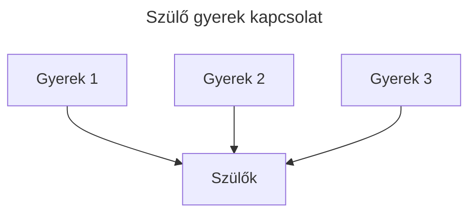
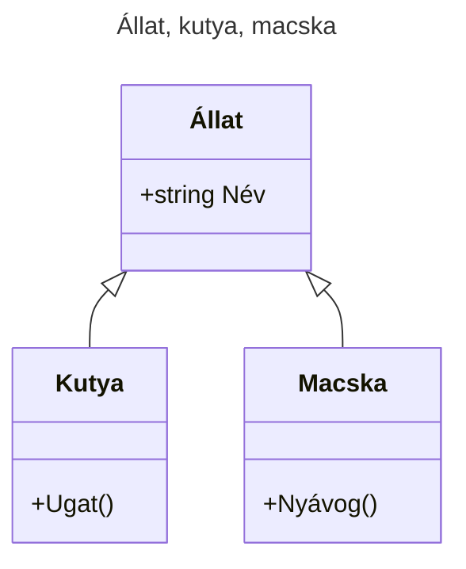
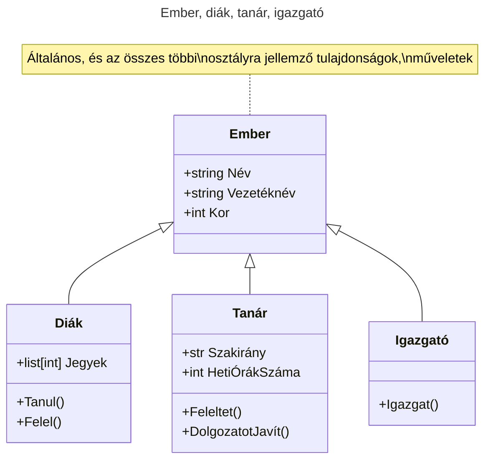
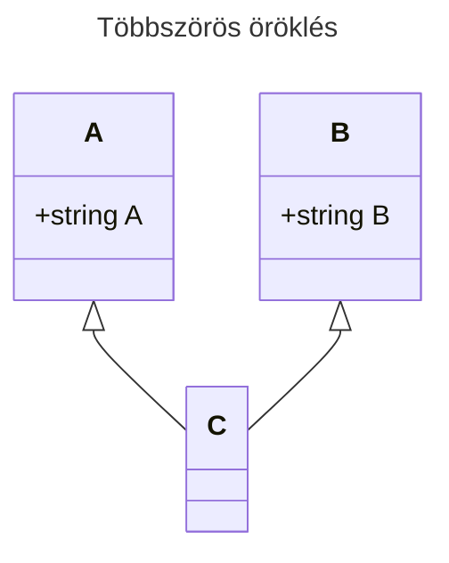
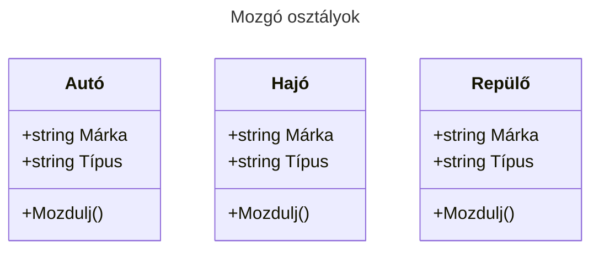
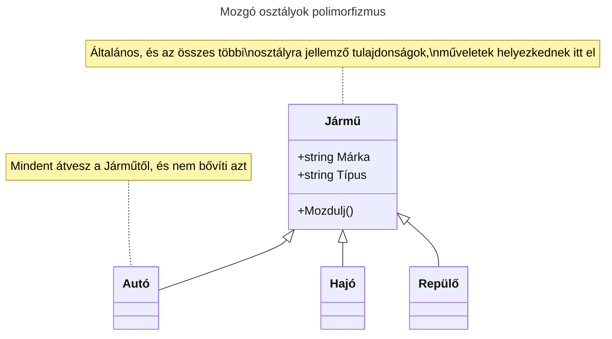

# Öröklődés
## Bevezető
Az **objektumorientált** programozáshoz leggyakrabban társított nyelvi mechanizmus az öröklődés. Az öröklődés lehetővé teszi, hogy olyan új osztályokat definiáljunk, amelyek valamely létező osztály módosított változatai, ergo kevesebbet kell gépelnünk. 
## Alapfogalmak
A folyamatot azért nevezik öröklődésnek, mert az új osztály a létező osztály összes metódusát, atribútumját "örökli", megkapja, használhatja. A metaforát kiterjesztve a már létező osztályt gyakran **szülő**, az új osztályt pedig gyakran **gyermek** vagy **(le)származott** osztálynak, esetleg **alosztálynak** nevezik.
- **öröklődés** (inheritance) _egy olyan mechanizmus, amely lehetővé teszi, hogy egy osztályt egy korábban definiált osztály módosított változataként definiáljunk._
- **szülő osztály** (parent class) _egy olyan osztály, amelyből gyermek osztályt származtunk._
- **gyerek, származtatott** osztály (child class) _egy új osztály, amelyet egy már létező osztályból származtattunk. Alosztálynak is nevezzük._

## Elmélet

Az öröklődés hatékony nyelvi eszköz, amely a kód újrahasznosítást is elősegíti, hiszen átszabhatjuk a szülő osztály viselkedését annak módosítása nélkül a származtatott osztályban. Bizonyos esetekben az öröklődési hierarchia a probléma természetes szerkezetét is tükrözi, ami egyszerűbbé teszi a program megértését.

Másrészről az öröklődés használata megnehízítheti a kód olvasását. A metódus hívásoknál nem mindig egyértelmű, hogy **hol** kell keresni a hívott metódus definícióját, a kód lényegi része több modulba lehet szétszórva. Számos olyan öröklődéssel megoldható probléma van, amely öröklődés használata nélkül is éppen olyan elegánsan (vagy még elegánsabban) megoldható. Ha a probléma természete nem illeszkedik az öröklődéshez, akkor ez a programozási stílus több kárt okozhat, mint hasznot.

## Szintaxis
Amikor azt szeretnénk, hogy `B` osztály örököljön az `A` osztálytól, a `B` osztály után zárójelbe tesszük annak az osztálynak a nevét, `A`, amelyiktől származtatjuk:
```py
class A:
    pass

class B(A):
    pass
```
> `pass` parancs olyan parancs, ami nem csinál semmit, mivel a python nyelvnek kell legalább egy parancs egy blokkban (ebben az esetben a `class A`), ezt használjuk "töltésnek"
## Szemléltető


## Állat, kutya, macska
[Class diagramok, vagy UML diagramok](https://mermaid.js.org/syntax/classDiagram.html)

[01_animal.py](https://github.com/SpsKnSK/api/blob/main/Exercies/14_inheritance_polymorphism/01_animal.py)
## Ember, diák, tanár, igazgató
[Class diagramok, vagy UML diagramok](https://mermaid.js.org/syntax/classDiagram.html)

> Mivel a `Diák`, a `Tanár` és az `Igazgató` örökölnek az `Ember`től, ezért tartalmazzák az `Ember` osztály mindegyik attribútumát

> A `Diák` kibővíti az `Ember` osztályt egy attribútummal és két függvénnyel

> A `Tanár` kibővíti az `Ember` osztályt két attribútummal és két függvénnyel

> Az `Igazgató` kibővíti az `Ember` osztályt egy függvénnyel

### `super()`
A `Student` osztályban láthattok olyat, hogy `super()`, ez azt jelenti, hogy a szülő osztály függvényeihez jutunk hozzá. Ebben az esetben a `Man` osztály `__init__` függvényével "meg vagyunk elégedve", újrahasználjuk, és közben még a `Notes` attribútumát inicializáljuk: `super().__init__(name, surname, age)`
```py
class Man:
    Name:str
    Surname:str
    Age:int

    def __init__(self, name:str, surname:str, age:int) -> None:
        self.Name, self.Surname, self.Age = name, surname, age

class Student(Man):
    Notes:list[int]

    def __init__(self, name: str, surname: str, age: int) -> None:
        super().__init__(name, surname, age)
        self.Notes = []
```
 - [01_animal2_super.py](https://github.com/SpsKnSK/api/blob/main/Exercies/14_inheritance_polymorphism/01_animal2_super.py) 
 - [02_man_super.py](https://github.com/SpsKnSK/api/blob/main/Exercies/14_inheritance_polymorphism/02_man_super.py)  
## Többszörös öröklés
Pythonban lehetséges, hogy egy osztály több osztálytól is örököljön, gyakorlatban nehéz elképzelni, hogy egy adott dolog egyszerre két különböző szülővel rendelkezzen (például a repülő örököljön a járműtől és az állattól egyaránt). (*Megjegyzés: így oldották meg az interface-ek lehetőségét*)

### Példa:
```py
class A:
    A: str

class B:
    B: str


class C(A, B):
    def __init__(self, a, b) -> None:
        super().__init__()
        self.A, self.B = a, b

    def __str__(self) -> str:
        return f"A = {self.A}, B = {self.B}"

c = C(10, 11)
print(c)
```
# Polimorfizmus
Angol szóból ered, aminek a jelentése "many forms", sok forma. Programozásban azt jelenti, hogy ugyanazon nevű függvény/metódus/operáció több fajta objektumon, osztályon is elvégezhető. 

## `len()`
Ha a len parancsot **karakterláncon**, `str` használjuk, visszaadja a karakterek számát.
### Példa:
```py
x = "Hello World!"
print(len(x))
```

Ha a len parancsot **listán**, `list` használjuk, visszaadja a listában levő elemek számát.
### Példa:
```py
myList = ["apple", "banana", "cherry"]
print(len(myList))
```

Ha a len parancsot **szótáron**, `dict` használjuk, visszaadja a szótárban levő kulcs-értékpárok számát.
### Példa:
```py
myDictionary = {
  "brand": "Ford",
  "model": "Mustang",
  "year": 1964
}

print(len(myDictionary))
```
>A fenti példában azt vesszük észre, hogy egy adott függvény hasonló bemenő paraméterekkel (karakterlánc, lista, szótár, mindegyiket lehet `for` ciklusban használni) a hosszukat adja meg. 

## Osztályok polimorfizmusa
A polimorfizmus általában osztályokban található, amikoris több osztályban ugyanaz a függvény található. Például van 3 osztályunk: `Autó`, `Hajó`, `Repülő`, és mindegyik képes `mozdulni()`. Mind a három ugyanazokkal a tulajdonságokkal és függvényekkel rendelkezik




```py
class Car:
  def __init__(self, brand, model):
    self.Brand = brand
    self.Model = model

  def Move(self):
    print("Drive!")

class Boat:
  def __init__(self, brand, model):
    self.Brand = brand
    self.Model = model

  def Move(self):
    print("Sail!")

class Plane:
  def __init__(self, brand, model):
    self.Brand = brand
    self.Model = model

  def Move(self):
    print("Fly!")

car1 = Car("Ford", "Mustang")       #Új Autó példány
boat1 = Boat("Ibiza", "Touring 20") #Új Hajó példány
plane1 = Plane("Boeing", "747")     #Új Repülő példány

for v in (car1, boat1, plane1):
  v.move()
```
Ebben az esetben készíthetünk egy szülő osztályt `Jármű` névvel, amelyik már tartalmazza az előre meghatározott attribútumokat és függvényeket. Az öröklő osztályok "megkapják" a szülő osztálytól a függvényeket, s ha szükséges, felül tudják azokat írni.


### Példa:
```py
class Vehicle:
  def __init__(self, brand, model):
    self.Brand = brand
    self.Model = model

  def Move(self):
    print("Move!")

class Car(Vehicle):
  pass

class Boat(Vehicle):
  def Move(self):
    print("Sail!")

class Plane(Vehicle):
  def Move(self):
    print("Fly!")

car1 = Car("Ford", "Mustang")       #Új Autó példány
boat1 = Boat("Ibiza", "Touring 20") #Új Hajó példány
plane1 = Plane("Boeing", "747")     #Új Repülő példány

for v in (car1, boat1, plane1):
  print(v.Brand)
  print(v.Model)
  v.Move()
```
> `pass` parancs olyan parancs, ami nem csinál semmit, mivel a python nyelvnek kell legalább egy parancs a bekezdésben (ebben az esetben a `class Car(Vehicle)`)

> Mivel az `Autó` osztály nem bővíti, és nem is változtatja az adott értékeket, "jó neki úgy, ahogy kapta".

> A `Hajó` és a `Repülő` osztályok a `Mozdulj` függvényt "másítják meg"

# Kérdések
1. Hogyan jelöljük pythonban az örökést, mutassatok rá példát.
2. Mire jó a polimorfizmus?
3. Hány osztálytól örökölhet a származtatott osztály?
4. Írjatok példát a következőre: 
   1. Készítsetek egy `Közrendőr` osztályt (`Nev`:`str`, `BirsagokSzama`: `int`) attribútumokkal és egy `Birsagol` függvénnyel, amely kiírja a nevét és a bírságok számát
   2. Származtassatok egy `Rendorfokapitany` osztályt a `Közrendőr`ből, akinek lesz még egy attribútuma (`RendorokSzama`:`int`) és átírja a  `Birsagol` függvényt, amely kiírja ugyanazt, mint a `Közrendőr`, plusz, hogy ő a főkapitány, és hány közrendőr tartozik alája