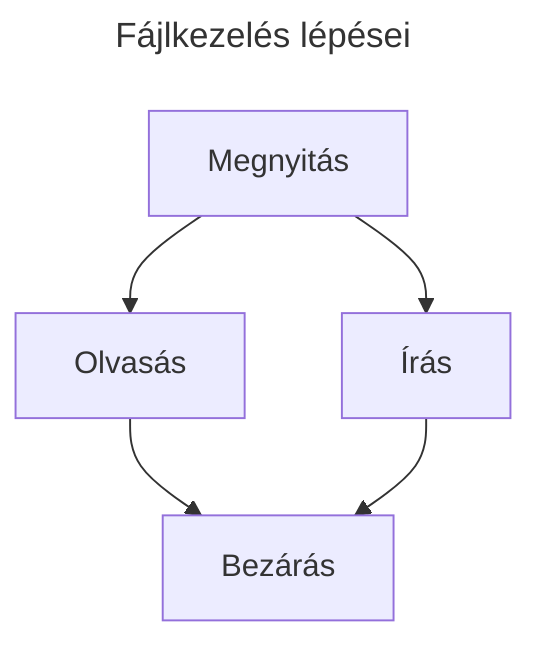

> # ✏️ Fájlkezelés
>
> ```py
> with open("munkafajl.txt", "w") as f:
>     f.write("Ez egy tesztsor 12345")
>
> with open("munkafajl.txt", "r") as f:
>     tartalom = f.read()
>     print(tartalom)
> ```
>
> | Mód | Jelentés |
> |---|---|
> | `r` | csak olvasás |
> | `w` | csak írás (felülírja a fájlt!) |
> | `a` | hozzáfűzés a fájl végéhez |
> | `r+` | írás és olvasás egyszerre |
>
> - `f.read()` — teljes tartalom
> - `f.readline()` — egy sor
> - `f.readlines()` — lista, minden sor egy elem
> - `f.write(szoveg)` — csak `str`-t fogad el! (`str(szam)`-mal alakítsd át)
> - `with open(...) as f:` — a fájl **automatikusan bezárul** a blokk végén, nem kell `f.close()`
>
> **Metafora:** a fájl olyan, mint egy **közös jegyzetfüzet**: ha kinyitod (`open`), írhatsz vagy olvashatsz belőle, de ha elfelejted becsukni (`close`), más program esetleg nem tud hozzáférni. A `with` olyan, mint egy **automata ajtó**: magától becsukódik, amikor kilépsz.

# Fájlkezelés
Az eddigi programjaink csak nagyon kevés adatot kezeltek, kétféleképpen vittünk be adatokat:
- billentyűzetről az `input` függvény segítségével
- véletlenszerűen generáltuk őket a `random` osztállyal

Amikor nagymennyiségű adatot akarunk kezelni, akkor jönnek kapóra a fájlok (adatbázisok).

## Fájlkezelés

```mermaid
---
title: Fájlkezelés lépései
---
flowchart 
	Megnyitás --> Olvasás
	Megnyitás --> Írás
    Olvasás --> Bezárás
    Írás --> Bezárás
```
## Fájl megnyitása `open()`
A fájl teljes tartalmát az `f` változóba töltjük be, csak ezután tudunk belőle olvasni, vagy éppen beleírni

```py
f = open('munkafajl.txt', 'w')
```

## Fájl megnyitásának módjai

módosító| tulajdonság
-|-
`r`|a fájlt csak olvasására nyitjuk meg, hibát jelez, ha beleírunk
`w`|a fájlt csak írásra nyitjuk meg, hibát jelez, ha olvasunk belőle
`a`|hozzáfűzés céljából nyitjuk meg a fájlt
`r+`|egyszerre nyitja meg a fájlt írásra és olvasásra

további lehetőségek

módosító| tulajdonság
-|-
`t`|a fájlt szövegként nyissa meg, alapméretezett
`b`|a fájlt binárisan nyissa meg

> Ha egy fájlt binárisan akarunk megnyitni: `f = open('munkafajl.txt', 'rb')` akkor **read binary** módosítót használunk

## Fájl olvasása
- `f.read(size)`
  - `size` hosszúságú karakterlánccal tér vissza
  - a `size` elhagyása, vagy negatív értéke esetén a **teljes** tartalmat visszaadja
- `f.readline()`
  - egy sort olvas ki a fájlból.
  - a sor végét az újsor karakter `\n` jelenti. 
  - itt is megadhatjuk, mennyi karaktert akarunk kiolvasni a sorból.
- `f.readlines()`
  - egy listával tér vissza, amely a fájl **minden** sorát tartalmazza
  
### Kurzor mozgatás
`f.seek(léptetés, innen_kezdve)`
- `innen_kezdve` ponttól léptetés mennyiséggel mozgatjuk a kurzort
- Innen kezdve: 
    - `0` – fájl eleje
    - `1` – aktuális pozíció
    - `2` – fájl vége
- Egy paraméter esetén az aktuális indexű pozícióra állítja a kurzort.

## Írás a fájlba
`f.write("szöveg")` a zárójelbe írt szöveg kerül bele a fájlba.
> A fájlba csak `str` adattípust tudunk írni, ha más típusú értékünk van, akkor azt `string`-gé kell alakítani `str(1)`

## Fájl bezárása
`f.close()` A fájlokat minden használat után be **kell** zárni
## Példa

- Hozzunk létre egy `munkafajl.txt` állományt.
- Nyissuk meg, majd írjuk bele a következő szöveget: `"Ez egy tesztsor 12345"`
- Majd olvassuk ki az állományba írt szöveget.

```py
f = open("munkafajl.txt", "w")
f.write("Ez egy tesztsor 12345")
f.close()
f = open("munkafajl.txt", "r")
a = f.read()
f.close()
print(a)
```

## A `.write()` függvény **csak** `str`-t fogad el bemenő paraméterként
Ha számot, vagy egyéb más adattípust akarunk a fájlba írni, akkor azt előbb át kell alakítani `str`-gé: például: `str(10)`

## `os.path` függvény használata
> Ügyelni kell arra, hogy jó könyvtárba helyezze a fájlt, ajánlom használni az `os.path` osztályt, ezzel meg lehet határozni a könyvtár nevét a fájl nevéből

```py
from os import path
fileName = "munkafajl.txt"
full_path = f"{path.dirname(__file__)}\\{fileName}"
```
- az `os` könyvtárból a `path` osztályt importáljuk
- `fileName` a fájl neve (egyértelműen)
- `__file__` ez pythonban visszaadja az éppen futtatott fájl **teljes** elérését `C:\Users\XY\Documents\GitHub\api\Exercies\01\test.py`
- `path.dirname` függvény visszaadja a fájl teljes eléréséből a könyvtár elérését `C:\Users\XY\Documents\GitHub\api\Exercies\01`

```py
from os import path

fileName = "munkafajl.txt"
full_path = f"{path.dirname(__file__)}\\{fileName}"

f = open(full_path, "w")
f.write("Ez egy tesztsor 12345")
f.close()
f = open(full_path, "r")
szoveg = f.read()
f.close()
print(szoveg)
```
Ezzel a függvénnyel a `*.py` fájlunk mellett keresi, hozza létre a fájlokat, nem a megnyitott munkalapon (workspace)

### Feladat
Változtassátok meg a programot úgy, hogy a felhasználó írhasson be a fájlba tetszőleges szöveget! (Akár egyszeri beírás, akár addig, míg egy bizonyos karaktert nem üt be)

## Fájl olvasása soronként

```py
from os import path

fileName = "munkafajl.txt"
print(__file__)
full_path = f"{path.dirname(__file__)}\\{fileName}"

fajl = open(full_path,"r")
for sor in fajl.readlines():
   print(sor)
fajl.close()
```

## `with` parancs
A `with` parancs arra szolgál, hogy egyes bezárható objektumokat (mint a fájl is) a blokk elhagyása után automatikusan bezár, és nem kell meghívni a `.close()` függvényt.

```py
from os import path

fileName = "munkafajl.txt"
print(__file__)
full_path = f"{path.dirname(__file__)}\\{fileName}"

with open(full_path, "r") as f:
   for sor in f.readlines():
      print(sor)
```

> # 💥 Rontsátok el!
>
> Mi a hiba ebben a programban?
>
> ```py
> f = open("munkafajl.txt", "w")
> f.write(12345)
> f.close()
> ```
>
> Milyen hibaüzenetet kaptok? Miért? Hogyan kell kijavítani, hogy a `12345` számot mégis bele tudjuk írni a fájlba?

> # 📋 Feladatok
> - [01_saveNumbers.py](../Exercies/16_files/01_saveNumbers.py) — szemléltető: egész számok mentése
> - [01_saveClass.py](../Exercies/16_files/02_saveClass.py) — szemléltető: saját adattípus mentése
> - [e01_saveRandomNumbers.md](../Exercies/16_files/e01_saveRandomNumbers.md)
> - [e02_sortRandomNumbers.md](../Exercies/16_files/e02_sortRandomNumbers.md)
> - [e03_longestLine.md](../Exercies/16_files/e03_longestLine.md)
> - [e04_loadStudents.md](../Exercies/16_files/e04_loadStudents.md)
> - [e05_creditCard.md](../Exercies/16_files/e05_creditCard.md)
> - [e06_longestWordInFile.md](../Exercies/16_files/e06_longestWordInFile.md)
> - [e07_characterCount.md](../Exercies/16_files/e07_characterCount.md)

> # ❓ Kérdések
>
> 1. Mi a különbség az `r`, `w` és `a` fájlmegnyitási módok között?
> 2. Miért érdemes a `with` parancsot használni fájlok megnyitásához?
> 3. Milyen adattípust fogad el a `.write()` függvény, és mit kell tenni, ha számot szeretnénk kiírni?
> 4. Mire jó az `os.path.dirname(__file__)`?
> 5. Mi a különbség a `.read()`, `.readline()` és `.readlines()` függvények között?