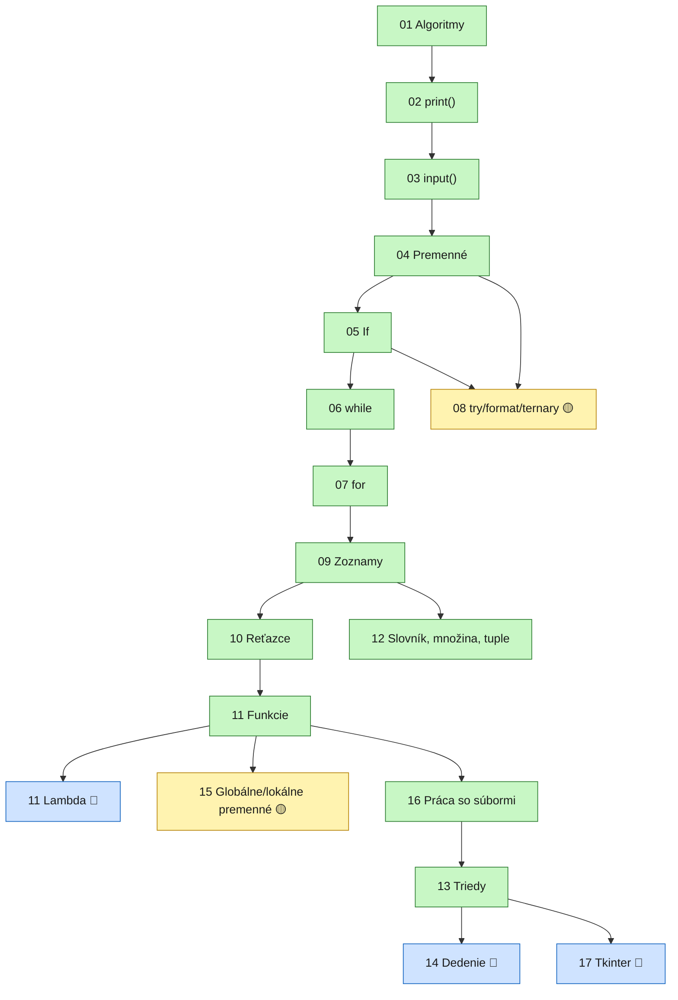

# 🗺️ Mapa — kde sme a čo je kde?

Táto stránka pomáha zorientovať sa v učive: čo je **povinný základ**, o čom stačí **len vedieť, že existuje**, a čo je **voliteľné navyše**. Ak sa stratíš, vráť sa sem a pozri sa, kde presne si.

> 🧰 **Predstav si to ako skrinku s náradím!** Každá lekcia je nový nástroj. Cieľom nie je poznať naspamäť názvy všetkých nástrojov, ale vedieť, **v ktorej zásuvke ho hľadať**, keď narazíš na úlohu.

🤖 [Používanie AI pri učení](00_AI_sk.md) — ako sa pýtať a pracovať s AI správne.

🔧 [Používanie VS Code](00_VsCode_sk.md) — jednoduché kroky pre vývojové prostredie.

🟢 zelená = základ, ideš postupne po poradí · 🟡 žltá = užitočný doplnok, ak je čas · 🔵 modrá = stačí vedieť, že existuje

---
## Štruktúra lekcií

| Ikona | Popis
-|-
✏️|zhrnutie učiva, odpísať do zošita
💥|hľadanie a oprava chyby
📋|zoznam úloh
❓|otázky
---

## 🟢 Základ — toto musí vedieť každý

Bez tohto sa žiadny Python program nedá pochopiť. Ak si tu neistý, vráť sa sem trénovať, skôr než pôjdeš ďalej.

| # | Lekcia | Prečo je to potrebné? | Nástroj, ktorý dostaneš |
|---|---|---|---|
| 01 | [Algoritmy](01_Algorithms_sk.md) | Skôr než napíšeš kód, musíš vedieť rozmýšľať **v krokoch**. | Vývojový diagram, sekvencia/výber/opakovanie |
| 02 | [`print()`](02_Terminal_print_sk.md) | Bez toho ti program nič neukáže. | Výpis na obrazovku |
| 03 | [`input()`](03_Terminal_input_sk.md) | Bez toho sa program nevie opýtať. | Načítanie údajov |
| 04 | [Premenné](04_Variables_sk.md) | Údaje treba niekde uložiť. | Krabice s nálepkou: `int`, `float`, `str`, `bool` |
| 05 | [If, vetvenie](05_if_sk.md) | Tu sa program učí **rozhodovať**. | `if` / `elif` / `else`, blok, odsadenie, dvojbodka |
| 06 | [Cyklus `while`](06_while_sk.md) | Keď vopred nevieš, koľkokrát treba opakovať. | `while podmienka:` |
| 07 | [Cyklus `for`](07_for_sk.md) | Keď vopred vieš, cez čo/koľkokrát prejsť. | `for i in range(...):` |
| 09 | [Zoznamy](09_lists_sk.md) | Veľa hodnôt v jednej premennej. | `[]`, index, `.append()`, `.sort()` |
| 10 | [Reťazce (string)](10_string_sk.md) | Aj text sa dá "rozobrať" na znaky. | `[a:b]`, `.split()`, `.join()` |
| 11 | [Funkcie](11_functions_sk.md) | Opakujúci sa kód dáme na jedno miesto a pomenujeme. | `def`, `return`, parametre |

### **Na čo si dávaj pozor vo všetkých?**
- **Blok** (kód odsadený pod niečím, `tab`, `tabulátor`)
- dvojbodka `:` na konci riadku
- a to, že Python **rozlišuje malé a veľké písmená**

Tieto 3 veci spôsobujú väčšinu chýb začiatočníkov — ak toto pochopíš, čítanie kódu bude oveľa jednoduchšie.

---

## 🟡 Užitočné doplnky — dobré je im rozumieť, často sa objavia

Nie je to úplný základ ako vyššie, ale v praxi to budeš často potrebovať.

| # | Lekcia | Na čo slúži? |
|---|---|---|
| 08 | [try, format, ternary](08_try_format_ternary_sk.md) *(voliteľné)* | Ošetrenie chýb, pekný výpis (f-string), skrátený if na jednom riadku |
| 12 | [Slovník a množina](12_list_set_dictionary_tuple_sk_1.md) | Keď chceš pristupovať k údaju nie podľa indexu, ale podľa **kľúča** (`dict`), alebo keď ťa duplicity nezaujímajú (`set`) |
| 15 | [Globálne a lokálne premenné](15_localAndGlobalVariables_sk.md) | Prečo jedna funkcia "nevidí" premennú z inej — vysvetľuje veľa záhadných chýb |
| 16 | [Práca so súbormi](16_files_sk.md) | Údaje treba vedieť nielen vypísať, ale aj **uložiť** |

---

## 🔵 "Stačí vedieť, že to existuje" — netreba do hĺbky

O týchto stačí vedieť: **čo to je a kedy to použiť** — netreba naspamäť vedieť napísať zložitú hierarchiu tried alebo grafické rozhranie, ale je užitočné to spoznať, keď sa s tým niekde stretneš (napr. v kóde v inom jazyku, alebo v dokumentácii knižnice).

| # | Lekcia | Stačí vedieť toto |
|---|---|---|
| 11 | [Lambda funkcie](11_lambda_functions_sk.md) *(voliteľné)* | Existuje aj "jednoriadková, anonymná funkcia" — vo vlastnom kóde ju budeš potrebovať zriedka |
| 13 | [Triedy (`class`)](13_classes_1_sk.md) | Trieda je ako **plán vlastného, zloženého dátového typu** — ak treba spolu spravovať veľa súvisiacich údajov a operácií, toto je ten nástroj |
| 14 | [Dedenie a polymorfizmus](14_inheritance_polymorphism_sk.md) | Triedy môžu "dediť" jedna od druhej — stačí poznať pojem |
| 17 | [Tkinter — grafické rozhranie](17_tkinter_sk.md) | Existuje spôsob, ako v Pythone písať aj okenné programy — stačí vedieť, že sa to tak volá a približne ako to vyzerá |

> Lekcie `13_classes_2` a `13_classes_3` idú ešte hlbšie (ukladanie do JSON, `@property`, context manager atď.) — toto sú vyslovene **pokročilé, voliteľné** témy, oplatí sa nimi zaoberať iba vtedy, ak sa o to niekto sám zaujíma.

---

## 🧭 Zasekol si sa pri úlohe? Ktorý súbor otvoriť?

| Ak úloha... | ...tak pravdepodobne treba toto |
|---|---|
| ...sa niečo opýta a podľa toho rozhodne | `if` / `elif` / `else` ([05](05_if_sk.md)) |
| ...opakuje niečo, kým je niečo pravda | `while` ([06](06_while_sk.md)) |
| ...prechádza zoznamom alebo daným počtom krokov | `for` ([07](07_for_sk.md)) |
| ...má uchovávať veľa podobných údajov | zoznam ([09](09_lists_sk.md)) alebo slovník ([12](12_list_set_dictionary_tuple_sk_1.md)) |
| ...treba rozobrať text, hľadať v ňom | operácie s reťazcami ([10](10_string_sk.md)) |
| ...ten istý kód sa v nej opakuje viackrát | urob z neho funkciu ([11](11_functions_sk.md)) |
| ...má uchovať údaje aj po ukončení programu | práca so súbormi ([16](16_files_sk.md)) |
| ...hádže čudnú chybu a nevieš prečo | skontroluj odsadenie, dvojbodku a malé/veľké písmená ([05](05_if_sk.md)) |