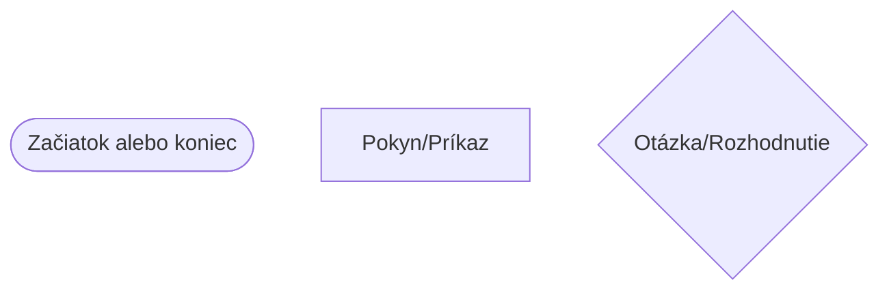
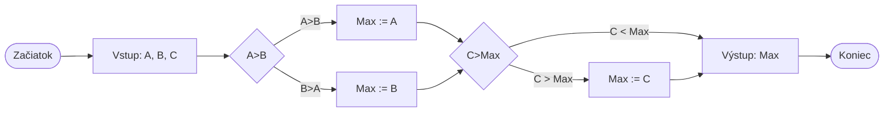

# Algoritmy a ich vlastnosti

## Čo je algoritmus?
- **Algoritmus** je návod## Dôležité vlastnosti algoritmu

### Univerzalita
Algoritmus by mal byť použiteľný pre viacerok podobných úloh, # Prečo je Python dobrý?

## VS Code prostredie
- **Editor** - tu píšeme kód
- **Terminál** - tu spúšťame program a vidíme výsledky
- **Správca súborov** - tu vidíme súbory našho projektukonkrétny prípad.
- Napríklad: dokážeme vypočítať plochu hoci akého štvorca, nie len jedného konkrétneho.

### Spolählivosť
Ak zadáme rovnaké údaje, vždy musíme dostať rovnaký výsledok.
- Napríklad: 5+3 je vždy 8, nie raz 8 a inokedy 9.a## Úlohy

### 1. úloha
- Premyslite si nejakú každodennú činnosť (napr. varenie čaju, opravu bicykla), ktorú možno rozdeliť na kroky!
- Nakreslite k nej jednoduchý vývojový diagram!

### 2. úloha
- Pracujte v pároch: jeden bude "robot", druhý "programátor"
- Programátor nech dáva jednoduché príkazy robotovi, aby získal fix v triedek# Python programovanie

## Ako vyzerá Python program?

```py
# Načítanie knižníc (ak ich potrebujeme)
import nazov_modulu
from iny_modul import nazov_funkcie
# Vytvorenie premenných (použiteľných v celom programe)
globalna_premenna = 10ám pomôže vyriešiť nejakú úlohu. Používame ich každý deň!
- Tieto pokyny môžeme zapísať rôzne: môžeme o nich hovoriť, nakresliť ich, napísať slovami alebo aj programovacím jazykom.
- Algoritmus je jednoducho recept na riešenie problému.
    - Napríklad: ako získať dva fixy?

## Typy

1. **Jednoduché kroky za sebou** (**sekvencia**) - ako recept na varenie:
    - Choď do kancelárie!
    - Nájdi učiteľa!
    - Požiadaj ho o dva fixy!
    - Vráť sa do triedy!

2. **Rozhodovanie podľa situácie** (**vetvenie**) - musíme sa rozhodnúť:
    - Choď do kancelárie!
    - Nájdi učiteľa!
    - <ins>Ak</ins> je tam, <ins>tak</ins>
        - Požiadaj ho o dva fixy!
    - <ins>Ak tam nie je</ins>
        - Nájdi fixy niekde inde!
    - Vráť sa do triedy!

3. **Opakovanie** **(cyklus)** - keď musíme niečo robiť viackrát:
    - Urob to dvakrát:
        - Požiadaj o jeden fix!
    
Opakovanie nazývame aj cyklus, lebo "chodíme dokola".

## Algoritmus v programovaní

Teda každý algoritmus sa skladá z týchto častí: **kroky za sebou**, **rozhodnutia** a **opakovania**. Môžeme ich kombinovať a vkladať do seba.

Návrh algoritmu sa nazýva algoritmizácia.

Môžeme ho zapísať tromi spôsobmi:
- **Vývojovým diagramom** (obrázkom)
- **Slovami** (opisom)
- **Štruktúrovanou formou** (špeciálny diagram)

## Vývojový diagram

Vývojový diagram je ako mapa pre náš program:



**Príklad:** Výber najväčšieho čísla z troch čísel
> Znak `:=` znamená: "nech sa rovná"


## Vlastnosti algoritmu
### Univerzalita
Aby bol náš algoritmus vhodný na riešenie rôznych, ale rovnakého typu úloh, musí byť napísaný všeobecne.
- Napríklad výpočet plochy štvorca.

### Determinizmus
Po zadání rovnakých vstupných hodnôt musí algoritmus vrátiť rovnaký výsledok.

## Úloha

- Vymyslite príklad každodenných činností, ktoré je možné popísať algoritmom!
- Nakreslite k tomu priebehový diagram ceruzkou!

# Python

## Štruktúra jazyka Python

```py
# Importy (načítanie modulov a balíkov)
import nazov_modulu
from iny_modul import nazov_funkcie

# Deklarácia globálnych premenných (voliteľné)
globalna premenna = 10

# Definícia tried
class Osoba:
    def __init__(self, meno, priezvisko):
        self.Meno, self.Priezvisko = meno, priezvisko

# Definícia funkcií
def nazov_funkcie(param1, param2):
    # Telo funkcie
    vysledok = param1 + param2
    return vysledok

# Hlavná časť programu (main)
if __name__ == "__main__":
    # Spracovanie príkazového riadku (voliteľné)
    import sys
    argumenty = sys.argv

    # Deklarácia lokálnych premenných
    lokalna premenna = "Ahoj, svet!"

    # Volanie funkcie a spracovanie výsledku
    vysledok = nazov_funkcie(5, 3)
    print("Výsledok:", vysledok)

    # Cykly, vetvenie a iné riadiace štruktúry
    if vysledok > 5:
        print("Výsledok je väčší ako 5.")
    else:
        print("Výsledok nie je väčší ako 5.")

    for i in range(3):
        print("Cyklus:", i

)

    # Čítanie vstupu a výstupu
    vstupny_text = input("Prosím, napíšte niečo: ")
    print("Vstup:", vstupny_text)

# Kód patriaci k modulu (voliteľné)
def ina_funkcia():
    pass
```

## Aké typy údajov môžeme ukladať?
- `int` - celé čísla (napr. 5, -3, 100)
- `str` - text (napr. "Ahoj", "Peter")
- `float` - desatinné čísla (napr. 3.14, -2.5)
- `list[]` - zoznam pre viac údajov (napr. [1, 2, 3])
- `dict{}` - slovník pre páry kľúč-hodnota (napr. {"meno": "Anna"})

## Prvá úloha
Vypíšte na obrazovku: `Hello!`

Použite príkaz `print()`! Takto:
```python
print("Hello!")
```

## Ako píšeme kód?

1. **Vytvorenie nového súboru** - s koncovkou `.py`
2. **Časté ukladanie** (Ctrl+S) - nie len na konci!
   - Každý nech si ukláda do svojho priečinka!
3. **Spustenie programu** (tlačidlo F5 alebo gombík pre spustenie)

# Python programovacie prostredie

## Výhody

- **Zadarmo** - každý si ho môže stiahnuť a používať
- **Funguje na všetkých počítačoch** - Windows, Mac, Linux
- **Ľahko sa učí** - môžeme písať jednoduchými slovami
- **Dá sa použiť na veľa vecí:**
    - Tvorba hier
    - Webové stránky
    - Analýza údajov
    - Programovanie robotov
    - A ešte veľa iného!

## Podrobne o prostredí
- Z hľadiska syntaxe a pokročilosti sa podobá jazyku C.
- Pracujeme s dvoma hlavnými oknami.
    - **Príkazový riadok** – tu spúšťame napísaný program
    - **Editor skriptov** – tu píšeme programy