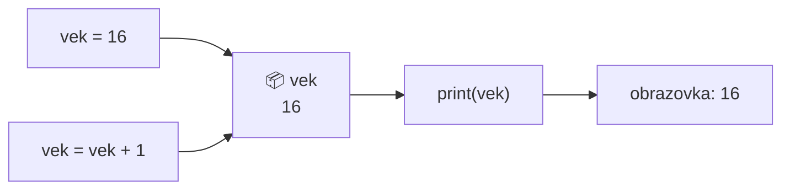
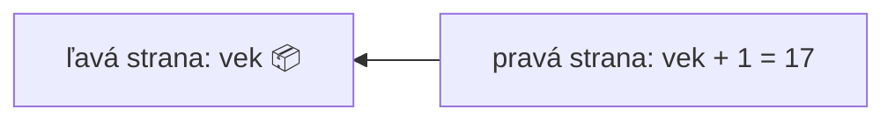

> # ✏️ Premenné
>
> **Čo to je?** Menom označená krabica v pamäti, do ktorej uložíme jednu hodnotu. Podľa mena ju vieme kedykoľvek vybrať.
>
> **Priradenie:** `meno = hodnota` – `=` **nie je** rovnosť, ale: „vlož do toho!”
> ```py
> vek = 16          # do krabice vek sa vloží 16
> vek = vek + 1     # vyberieme, pripočítame 1, vložíme späť -> 17
> ```
>
> | Typ | Značka | Príklad |
> |---|---|---|
> | celé číslo | `int` | `10`, `-9`, `0` |
> | desatinné číslo | `float` | `3.14`, `95.78` |
> | text | `str` | `"jablko"`, `'3tlacitko'` |
> | logická hodnota | `bool` | `True`, `False` |
>
> **Názvy:** iba písmená, číslice a `_`; **nesmie** začínať číslom; bez medzier a spojovníkov; nesmie to byť rezervované slovo (`print`, `input`).
>
> **Dôležité operácie:**
>
> | | | | |
> |-|-|-|-|
> | `+` súčet | `-` rozdiel | `*` súčin | `/` delenie |
> | `//` celočíselné delenie | `%` zvyšok | `**` umocňovanie | `round(a, x)` zaokrúhlenie |
>
> **⚠️ Najčastejšia chyba:** `=` je priradenie, `==` je porovnanie!
> ```py
> x = 5      # vložil som 5
> x == 5     # otázka: je vnútri 5? -> True
> ```
# Premenné
- Premenné sú prvky programu, ktoré môžu nadobúdať rôzne hodnoty a slúžia na uchovávanie rôznych údajov.
- Menom označené miesto v pamäti
- Názov premennej môže byť: x, z, cislo, meno, zoznam

## Predstavte si to takto!
Premenná je ako **krabica s nálepkou** na polici:

- **nálepka** je názov premennej (`vek`),
- **obsah krabice** je hodnota premennej (`16`),
- keď doň vložíme niečo nové, staré **vypadne** – v jednej krabici je naraz jedna hodnota,
- prečítaním nálepky sa kedykoľvek pozrieme, čo je vnútri.

Alebo si spomeňte na **šatňu**: odovzdáte kabát a dostanete číslo. To číslo nie je kabát, ale kedykoľvek si ho podľa neho vypýtate. Názov premennej je toto šatňové číslo.



Priradenie funguje vždy **sprava doľava**: najprv sa vypočíta pravá strana, potom sa výsledok vloží do krabice na ľavej strane.



## Typy 

| Typ | Značka | Na čo slúži | Príklad |
|---|---|---|---|
| **Číslo** | `int` | na ukladanie celých čísel | `10`, `-9`, `0` |
| **Desatinné číslo** | `float` | na ukladanie desatinných čísel (s desatinnou **bodkou**!) | `95.78`, `3.14`, `79.21` |
| **Reťazec** | `str` | text, ľubovoľná postupnosť znakov; medzi `''` alebo `""` | `'jablko'`, `'3tlacitko'`, `"hram futbal"` |
| **Logická hodnota** | `bool` | pravda/nepravda | `True`, `False` |

- Pri type `float` používame desatinnú **bodku**, nie čiarku: `1.5` a nie `1,5`
- `bool` má dve hodnoty: `True` – pravda, `False` – nepravda. Pozor, s veľkým začiatočným písmenom!
- Typ zistíme funkciou `type()`: `print(type(vek))`

# Operácie
## Matematické operátory
- `5 + 3 = 8` súčet
- `5 - 3 = 2` rozdiel
- `5 * 3 = 15` súčin
- `5 / 3 = 1.6666666666666667` delenie
- `5 // 3 = 1` celočíselné delenie
- `5 % 3 = 2` zvyšok po delení
- `5 ** 3 = 125` umocňovanie
- `sqrt(5)` odmocnina (na to je potrebný matematický modul)

## Zaokrúhlenie
- pomocou funkcie `round`
- `round(a, x)`
- `a` – číslo
- `x` - počet desatinných miest

Napr. `round(12.345, 2)` dáva výsledok `12.35`

Ak `x` vynecháme, zaokrúhli na celé číslo: `round(12.345)` dáva `12`.

Do miesta čísla môže ísť aj premenná!

## Úloha
1. Pomocou funkcie `print()` vypíšte na obrazovku výsledky aspoň 5 vyššie uvedených matematických operácií.
1. Napíšte program, ktorý načíta dve čísla, a potom vypíše ich podiel na 3 desatinné miesta.
Potom vypíšte celočíselný výsledok delenia a zvyšok po delení.
Dávajte pozor, aby bol program použiteľný aj pre laických používateľov (nech program napíše aj jedno-dve slová, nie len konkrétne výsledky).
    > `/` delenie na desatinné čísla: `18/7=2.5714285714285716`

    > `//` celočíselné delenie: `18//7=2`

    > `%` zvyšok po delení: `18 % 7=4`
1. Napíšte program na výpočet obvodu a plochy kruhu.
Zadané údaje: priemer kruhu, hodnota Pí: `3.14159`.
Výsledok:
`Kruh s priemerom X cm má obvod Y cm a plochu Z cm².`

## Logické operátory
možné výstupy logických operátorov: `True`, `False`
- rovnosť `==`, napr. X==5 – skontrolujeme, či sa X rovná 5
- menšie `<`
- menšie alebo rovné `<=`
- väčšie `>`
- väčšie alebo rovné `>=`
- nerovnosť `!=`

Priradenie **nie je** logický operátor `=` napr. `X=12` – premenná X sa nastaví na hodnotu 12

# Pravidlá písania programu
- V Pythone musíme rozlišovať medzi malými a veľkými písmenami,
- Názvy premenných môžu obsahovať písmená, číslice a podčiarkovník `_`.
- Názvy premenných:
    - Nesmú sa začínať číslom,
    - Nesmú obsahovať medzery, tabulátory,
    - Nesmú byť rezervované slová (príkazy), napr. `max`, `min`, `print`, atď.

## Správny názov pre premennú
```py
mojapremenna = "Janko"  
moja_premenna = "Janko"  
_moja_premenna = "Janko"  
mojaPremenna = "Janko"   
MojaPremenna = "Janko"  
MOJAPREMENNA = "Janko"  
mojaPremenna2 = "Janko"
```
## Nesprávny názov pre premennú, program sa nepustí
```py
2moja_premenna = "Janko" #zacina sa cislom  
moja-premenna = "Janko"  #obsahuje -
moja premenna = "Janko" #obsahuje medzeru
```

## Odporúčam používať
```py
moja_premenna = "Janko"
mojaPremenna = "Janko"  
MojaPremenna = "Janko"  
```

# Cvičenie 
1. Vytvorte 2 premenné pre každý spomenutý dátový typ a pomocou funkcie `print()` ich vypíšte na obrazovku.
1. Pri premenných typu číslo vyskúšajte všetky matematické operátory!
1. Vypýtajte si od používateľa 2 celé čísla, potom 2 desatinné čísla a nakoniec 2 komplexné čísla a vypíšte na obrazovku ich súčet a súčin:
    1. načítanie celého čísla: `int(input())`
    1. načítanie desatinného čísla: `float(input())`
    1. načítanie komplexného čísla: `complex(input())`

## Pomoc

### Dátové typy

|||
|--|--|
| **Číslo** | `int` 
| **Desatinné číslo** | `float` 
| **Reťazec** | `str` 
| **Logická hodnota** | `bool` 

### Operácie: 

| | | | | | | | |
|-|-|-|-|-|-|-|-|
| `+` | súčet | `-` | rozdiel | `*` | súčin | `/` | delenie |
| `//` | celočíselné delenie | `%` | zvyšok po delení | `**` | umocňovanie | `==` | rovnosť |
| `<` | menšie | `<=` | menšie alebo rovné | `>` | väčšie | `>=` | väčšie alebo rovné |
| `!=` | nerovnosť | `=` | priradenie | | | | |

> # ❓ Otázky
> 1. Aký je rozdiel medzi `=` a `==`? Kedy použijete jeden a kedy druhý operátor?
> 1. Na čo slúži funkcia `round`, uveďte príklad.
> 1. Požiadajte používateľa, aby zadal dĺžky obidvoch odvesien trojuholníka a použitím Pytagorovej vety vypočítajte dĺžku prepony.
> 1. Uveďte 2 príklady povolených názvov premenných.
> 1. Uveďte 2 príklady **nepovolených** názvov premenných.
> 1. Ako môžeme overiť, či je číslo `a` deliteľné číslom `b`? Ktorú operáciu použijete?
> 1. Aký je rozdiel medzi `/` a `//`?
