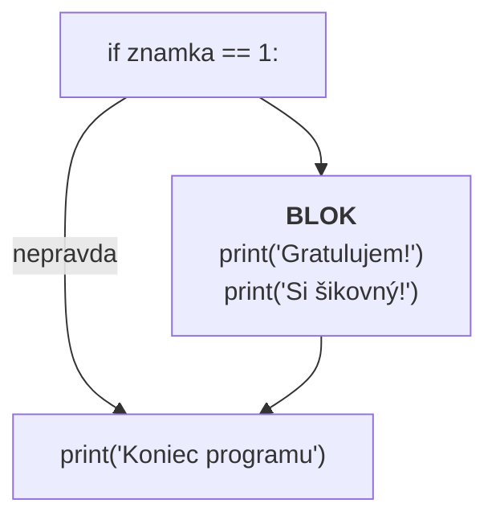
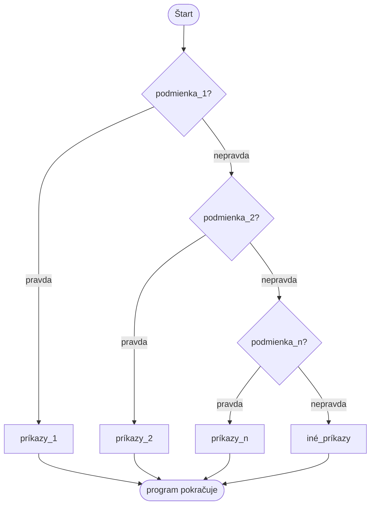
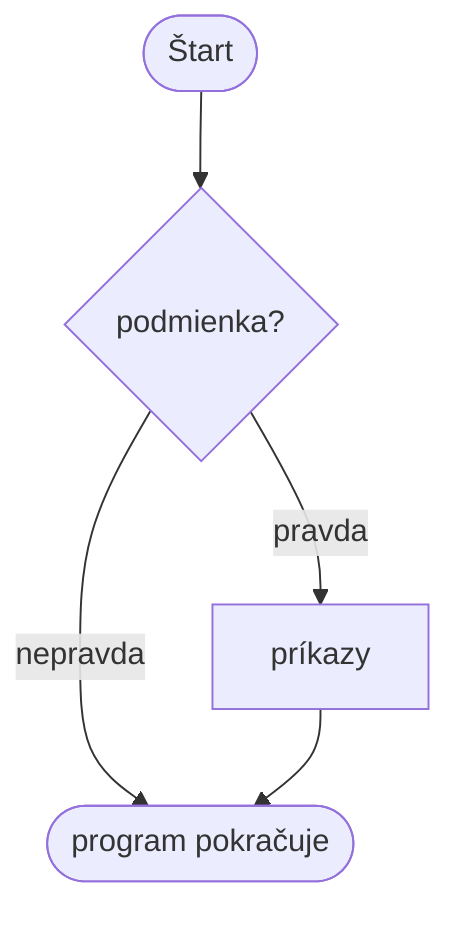
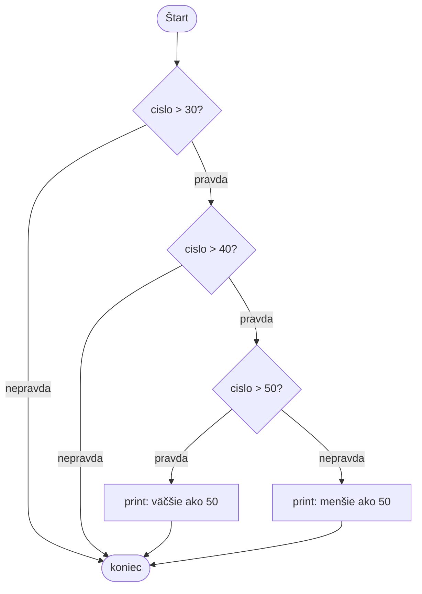

> # ✏️ If, vetvenie
>
> **Na čo slúži?** Program sa **rozvetví**: časť kódu sa vykoná iba vtedy, ak je podmienka pravdivá.
>
> ```py
> if podmienka1:
>     prikazy1
> elif podmienka2:
>     prikazy2
> else:
>     ine_prikazy
> ```
>
> | Časť | Povinná? | Kedy sa vykoná |
> |---|---|---|
> | `if` | **vždy** | ak je jeho podmienka pravdivá |
> | `elif` | nie | ak sú predošlé nepravdivé, ale táto je pravdivá (môže ich byť viac) |
> | `else` | nie | ak **žiadna** podmienka nebola pravdivá |
>
> **⚠️ 3 veci, na ktoré nesmieš zabudnúť:**
> 1. na konci riadku **dvojbodka** `:`
> 2. riadky pod ním **odsadené** (odsadenie, Tab)
> 3. `==` je porovnanie, `=` je iba priradenie
>
> **Blok:** skupina príkazov odsadených pod `if`. Vykonajú sa spolu, alebo spolu vypadnú. **Odsadenie** určuje, dokiaľ blok siaha.
> ```py
> if znamka == 1:
>     print("Gratulujem!")   # \_ blok: patrí k if
>     print("Si šikovný!")   # /
> print("Koniec")            # toto sa vykoná vždy
> ```
>
> **Vykoná sa iba prvá pravdivá vetva!** Ak `znamka = 2`, vykoná sa vetva pre 2, ostatné sa ani nepozrú.
>
> **Podmienky:**
>
> | | | | |
> |-|-|-|-|
> | `==` rovné | `!=` nerovné | `<` menšie | `>` väčšie |
> | `<=` menšie-rovné | `>=` väčšie-rovné | | |
>
> **Spojenie:** `and` = obe pravdivé · `or` = aspoň jedna pravdivá · `not` = obráti
> ```py
> if (vek > 12) and (vek < 20):
>     print("tínedžer")
> ```
>
> **Metafora:** `if` je ako **rázcestie**: program tam dorazí, pozrie sa na tabuľu (podmienku) a podľa nej pôjde ďalej jednou alebo druhou cestou — vydať sa môže iba **jednou**.

# If – Elif - Else
## Krátka teória

- Ako program beží, aký je jeho "smer"?
- Čo môže ovplyvniť tento smer?

> Spustenie programu: obvykle krok za krokom - sekvenčné.

**Smer programu môžeme zmeniť nasledujúcimi príkazmi:**
- Podmienený príkaz `if`
- Cykly `while`, `for`

## Čo je to blok?
Doteraz sa všetky naše príkazy vykonávali **jeden po druhom**. `if` však nezapína a nevypína jediný príkaz, ale **celú skupinu**.

> **Blok** = skupina príkazov, ktoré patria k sebe a vykonajú sa **spolu** (alebo spolu vypadnú).

Python podľa **odsadenia** (indentácie) vie, čo patrí do bloku: čo je odsadené, je súčasťou bloku. Iné jazyky na to používajú zložené zátvorky, v Pythone blok vyznačuje samotné odsadenie.

```py
if znamka == 1:
    print("Gratulujem!")      # \
    print("Si šikovný!")      #  |-- toto je blok, obe patria k if
print("Koniec programu")      # toto UŽ NIE je súčasť bloku, vykoná sa vždy
```

- Riadok, ktorý blok otvára, vždy končí **dvojbodkou** `:`
- Všetky riadky bloku sú odsadené **rovnako** (jeden Tab alebo 4 medzery)
- Blok končí tam, kde sa odsadenie vráti späť
- V bloku môže byť 1 príkaz, ale pokojne aj 20
- V bloku môže byť **ďalší** blok (pozri: vnorené podmienky)



> To isté pravidlo bude platiť aj pri cykloch (`while`, `for`) a funkciách – pojem blok nás bude sprevádzať celým programovaním.

## Podmienený príkaz
```py
if podmienka_1:
    príkazy_1
elif podmienka_2:
    príkazy_2
...
elif podmienka_n:
    príkazy_n
else:
    iné_príkazy
```

# Ako to funguje

- Slovo `if` je povinné.
- Ak je **podmienka_1** pravdivá, vykonajú sa **príkazy_1**.
- Ak **nie**, nasleduje príkaz `elif`.
- **elif == else if**
- Ak žiadna podmienka nie je pravdivá, vykonajú sa príkazy po príkaze `else`.

## Čo sa stane, keď je podmienka pravdivá?
Python postupuje **zhora nadol** a kontroluje podmienky jednu po druhej. Pri **prvej pravdivej** sa zastaví: vykoná príkazy tejto vetvy, ostatné dokonca **preskočí**. Potom program pokračuje za celou konštrukciou `if`.



> Dôležité: vykoná sa **najviac jedna vetva**! Aj keby bolo pravdivých viac podmienok, splní sa iba tá **úplne prvá**.

Ak `else` chýba a žiadna podmienka nie je pravdivá, jednoducho sa **nestane nič**:



## Ilustračný program

```py
znamka = int(input('Napíš, akú známku si dnes dostal: '))
if znamka == 1:
    print('Gratulujem, si šikovný')
    print('Dúfam, že takúto známku získaš aj z tohto predmetu')
elif znamka == 2:
    print('Gratulujem, to je tiež pekná známka')
elif znamka == 3:
    print('Nie je to zlé, ale nabudúce si to prečítaj ešte raz')
elif znamka == 4:
    print('Chýbalo málo. Uč sa viac!')
else:
    print('Prosím, veľa sa uč a premýšľaj o svojej budúcnosti!')
```

### Prejdime si predchádzajúci program
> Čo si všimneme v kóde programu:
**Ak chceme vykonať viac príkazov, jednoducho ich napíšeme za sebou** – podstatné je, aby mali **rovnaké odsadenie**, veď tak tvoria jeden blok (pozri dva `print` vo vetve pre 1).

### Úloha
Vytvorte program, ktorý určí pH hodnotu prostredia.

Ak je pH menšie ako 7, prostredie je kyslé. Ak je pH 7, je neutrálne, a ak je väčšie ako 7, je zásadité.

### Úloha
Vytvorte mini kalkulačku s riadiacim menu.
Vykonať základné matematické operácie (+-/*) s dvoma zadanými číslami.
Používateľa požiadajte o zadané hodnoty `a`, `b` a (`operácia`). Na základe operácie vypíšte výsledok na obrazovku.

### Úloha
Zadajte 3 čísla a zistite, ktoré z nich je najväčšie, potom ho vypíšte slovami na obrazovku.

Príklad
```
Zadajte 3 čísla.
2
5
1
Najväčšie číslo je: 5
```

Modifikujte predchádzajúcu úlohu tak, že: 
1. Program vypíše **najmenšie** číslo.
2. Program vypíše **stredné** číslo.
> Upozornenie, Python umožňuje porovnať viac hodnôt súčasne `a<b<c`.
### Úloha
- Zadajte veľkosti 3 strán trojuholníka.
- Určte, či sa trojuholník dá zostrojiť.
- Ak áno, vypíšte obvod trojuholníka.
### Úloha
Vytvorte program na zobrazenie názvov elektrických jednotiek:
- Volt
- Ohm
- Amper
- Farad
- Henry

Napr.
Ak zadáte Volt, program vypíše, že je to jednotka napätia.
```
Zadajte jednotku: Volt
Napätie, [V]
```
Ak program nepozná jednotku, informuje používateľa.
### Úloha
Vytvorte program, ktorý zo zadaného roku zistí, v akom štádiu života sa nachádzate.

- Detstvo - 0-11
- Tínedžer - 12-18
- Dospelosť - 19-60
- Staroba - nad 60

> Pozor: hranice treba určiť presne! Premyslite si, kam má patriť ten, kto má práve 11 alebo práve 18 rokov.

# Vnorené podmienky
Vždy je hlavný `if`, v ktorom môže byť viac `if` príkazov. Vnútorný `if` príde na rad **iba vtedy**, ak bola vonkajšia podmienka pravdivá.



## Ilustračný príklad

```py
print("myslím na číslo")
cislo = 55
if cislo > 30:
    if cislo > 40:
        if cislo > 50:
            print("číslo je väčšie ako 50")
        else:
            print("číslo je menšie ako 50")
```

> Vyskúšajte to aj s hodnotou `cislo = 35`! Čo vypíše? Prečo nevypíše nič?

### Úloha
Zadajte číslo a zistite, či je párne alebo nepárne.

- Ak je **párne**, overte či:
    - Je deliteľné 6.
    - Je väčšie ako 100.

- Ak je **nepárne**, overte či:
    - Je deliteľné 5.
    - Je väčšie ako 100.

# Logické operátory, spojenie podmienok
## `and` logické a
Je pravdivý, keď **všetky** podmienky sú splnené.

a | b | `a and b` 
-|-|-
0|0|0
0|1|0
1|0|0
1|1|**1**

## `or` logické alebo
Je pravdivý, keď je splnená **aspoň jedna** podmienka.

a | b | `a or b`
-|-|-
0|0|0
0|1|**1**
1|0|**1**
1|1|**1**

## `not` logický zápor
Obráti hodnotu logického výrazu.

a | `not a` 
-|-
0|**1**
1|**0**

```py
cislo = int(input('Zadajte číslo: '))
if (cislo > 3) and (cislo < 10):
    print('Toto číslo je medzi 3 a 10.')
if (cislo == 3) or (cislo == 5):
    print('Toto číslo je buď 3 alebo 5.')
```
> Zátvorky `()` nie sú potrebné pre python, ale pre nás, lepšie si tak oddelíme jednotlivé podmienky

> Pozor! `cislo == 3 or 5` **nefunguje**, vždy vráti pravdu. Na obe strany treba napísať celú podmienku: `cislo == 3 or cislo == 5`
### Úloha

Vytvorte program, ktorý vypočíta hodnotu odporu dvoch odporov, ktoré sú zapojené sériovo alebo paralelne. Od používateľa si vypýtajte `r1`, `r2` a či sú zapojené sériovo alebo paralelne.

- Výpočet odporu v sérii: $$R = R_1 + R_2$$
- Výpočet odporu paralelne: $$R=\frac{R_1*R_2}{R_1+R_2}$$

> Musíme vytvoriť ešte jednu premennú, pomocou ktorej určíme, či sú odpory zapojené sériovo alebo paralelne

> # 💥 Pokazte to!
> Napíšte také konštrukcie `if`, ktoré Python odmietne s chybou, alebo ktoré **nerobia to**, čo by sme čakali. Nápady:
>
> - chýba dvojbodka: `if znamka == 1`
> - žiadne odsadenie v riadku pod `if`
> - riadky bloku s **rozdielnym** odsadením: jeden 4 medzery, druhý 8
> - napíšete `=` namiesto `==`: `if znamka = 1:`
> - za `else` napíšete aj podmienku: `else znamka == 5:`
> - `elif` dáte **pred** `if`
> - podmienka je vždy pravdivá: `if znamka == 1 or znamka == 2 or True:`
>
> Prečítajte si chybovú správu: ako sa chyba volá a na ktorý riadok ukazuje? Ktorá chyba je tá, ktorú Python **nenahlási**, a predsa dá zlý výsledok?

> # ❓ Otázky
> 1. Opíšte syntax jednoduchého vetvenia, ako správne písať podmienky v Pythone. Prezraďte všetky vetvy.
> 1. Je vždy potrebné použiť príkaz `if`? Kedy použijeme?
> 1. Je vždy potrebné použiť príkaz `elif`? Kedy použijeme?
> 1. Je vždy potrebné použiť príkaz `else`? Kedy použijeme?
> 1. Čo nazývame blokom? Podľa čoho Python vie, dokiaľ blok siaha?
> 1. Koľko príkazov `print` sa vykoná v nasledujúcom kóde, ak `cislo = 3`? A ak `cislo = 20`?
>     ```py
>     if cislo > 10:
>         print("velke")
>         print("velmi velke")
>     print("hotovo")
>     ```
> 1. Kedy vráti operátor `and` hodnotu `False`?
> 1. Kedy vráti operátor `or` hodnotu `False`?
> 1. Kedy vráti operátor `not` hodnotu `True`?
> 1. Kedy bude nasledovný výrok `True`: `(a > b) and (c < b) or (c == 1)` uveďte 2 príklady.
>
> Ďalšie úlohy nájdete v [priečinku s cvičeniami k if](../Exercies/05_if/).
