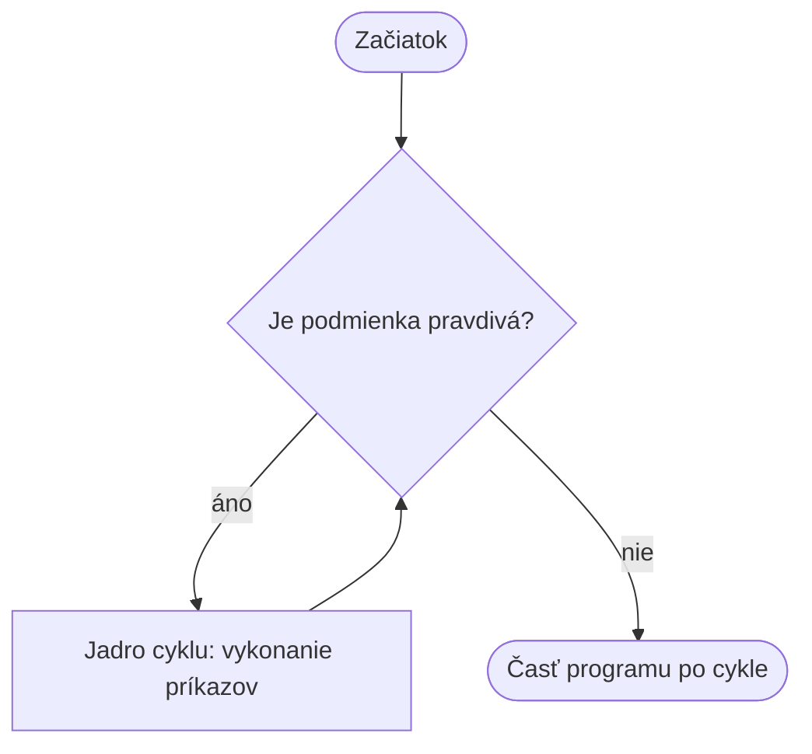

> # ✏️ Cykly - `while`
>
> **Cyklus:** opakujeme tie isté príkazy.
>
> ```py
> while podmienka:
>     prikazy    # toto je jadro cyklu (blok)
> ```
>
> `while` opakuje jadro cyklu **dovtedy, kým je podmienka pravdivá**. Po každom kole znovu preverí podmienku.
>
> **Nezabudni:**
> 1. na konci riadka `while podmienka` je dvojbodka `:`;
> 2. riadky jadra cyklu sú odsadené;
> 3. podmienka sa musí raz stať nepravdivou, inak je cyklus nekonečný.
>
> ```py
> i = 1
> while i <= 3:
>     print(i)
>     i = i + 1
> ```
> Výstup: `1`, `2`, `3`
>
> **Metafora:** `while` je ako **pravidlo spoločenskej hry**: "kým máš peniaze, posuň sa o jedno políčko". Po každom kole sa znova pýtame: platí ešte podmienka? Ak áno, nasleduje ďalšie kolo, ak nie, je koniec.

# Cykly a `while`

## Úvodná otázka

Predstavte si: program má vypísať čísla od 1 do 100. Napíšeme príkaz `print()` stokrát, alebo nájdeme kratšie riešenie?

Keď treba ten istý krok vykonať viackrát, použijeme **cyklus**.

## Čo je cyklus?

Cyklus je programová konštrukcia, ktorá opakuje **blok** príkazov. Je to podobné pravidlu spoločenskej hry:

> „Kým máš peniaze, posuň sa o jedno políčko a zaplať 100 forintov.“

V každom kole sa stane to isté a potom sa znova rozhodne: **máš ešte peniaze?** Ak áno, nasleduje ďalšie kolo. Ak nie, je koniec.



## Súvislosť `while` s `if`

Hlavička `while` skúma podmienku rovnako ako `if`:

```py
if zivot > 0:
    print("Hra pokračuje.")
```

```py
while zivot > 0:
    print("Začína nové kolo.")
```

Blok `if` sa vykoná **raz**, ak je podmienka pravdivá. Blok `while` sa vykonáva opakovane, kým podmienka ostáva pravdivá.

## Syntax `while`

```py
while podmienka:
    prikaz_1
    prikaz_2
```

- `podmienka` má logickú hodnotu: pravda alebo nepravda.
- Odsadené príkazy tvoria **jadro cyklu**. Je to blok: všetky jeho riadky sa opakujú spolu.
- Po vykonaní jadra sa program vráti na riadok `while` a znova preverí podmienku.

## Prvý príklad: počítanie

```py
i = 1
while i <= 5:
    print(i)
    i = i + 1
print("Koniec")
```

Výstup:

```text
1
2
3
4
5
Koniec
```

Riadok `i = i + 1` je veľmi dôležitý: mení podmienku. Keď má `i` hodnotu 6, `i <= 5` už nie je pravda, preto sa cyklus skončí.

## Nekonečný cyklus

Tento program sa sám nikdy neskončí:

```py
i = 1
while i <= 5:
    print(i)
```

Hodnota `i` sa nemení, preto je podmienka vždy pravdivá. Bežiaci program zastavíme v termináli klávesmi `Ctrl + C`.

## `break` a `continue`

- `break` okamžite ukončí cyklus.
- `continue` preskočí zvyšok aktuálneho kola a potom znovu preverí podmienku.

```py
i = 0
while i < 5:
    i = i + 1
    if i == 3:
        continue
    print(i)
```

Výstup: `1`, `2`, `4`, `5`

> # 💥 Pokazte to!
>
> Spustite tento program. Prečo sa nezastaví?
>
> ```py
> i = 0
> while i < 3:
>     print(i)
> ```
>
> Opravte ho tak, aby vypísal `0`, `1`, `2` a potom sa zastavil. Potom skúste, čo sa stane, keď riadok `i = i + 1` umiestnite pred `print(i)`.

> # 📋 Úlohy
>
> 1. Vypýtajte si od používateľa číslo, potom pomocou cyklu `while` vypíšte všetky celé čísla od 1 po dané číslo.
> 2. Napíšte program, ktorý odpočítava od 100 do 0 a potom vypíše: „Šťastný nový rok!“
> 3. Vypýtajte si od používateľa čísla postupne, kým nezadá `0`, potom vypíšte súčet doteraz zadaných čísel.
> 4. Pomocou cyklu `while` vypíšte čísla deliteľné 3 do 50.
>
> Ďalšie úlohy nájdete v [priečinku s úlohami pre while](../Exercies/06_while/).

> # ❓ Otázky
>
> 1. Akú bežnú situáciu poznáte, v ktorej niečo opakujeme „kým“?
> 2. Aký je rozdiel medzi `if` a `while`?
> 3. Čo je jadro cyklu a ako ho Python označuje?
> 4. Prečo sa musí podmienka `while` raz stať nepravdivou?
> 5. Čo vypíše tento program?
>
>    ```py
>    i = 2
>    while i < 8:
>        print(i, end=" ")
>        i = i + 2
>    ```
>
> 6. Na čo slúži `break` a na čo `continue`?
