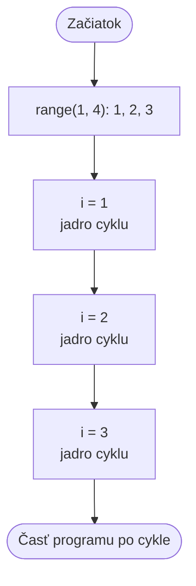

> # ✏️ Cykly - `for`
>
> Cyklus `for` používame vtedy, keď vopred vieme, na akých hodnotách alebo koľkokrát opakujeme.
>
> ```py
> for i in range(1, 6):
>     print(i)
> ```
>
> Výstup: `1`, `2`, `3`, `4`, `5`
>
> **Najdôležitejšie tvary `range()`:**
>
> | Kód | Vypísané hodnoty |
> |---|---|
> | `range(5)` | `0, 1, 2, 3, 4` |
> | `range(2, 5)` | `2, 3, 4` |
> | `range(1, 10, 2)` | `1, 3, 5, 7, 9` |
>
> Horná hranica **nepatrí** do intervalu. Jadro cyklu je aj tu odsadený blok.
>
> **Metafora:** `for` je ako **čítanie zoznamu mien**: vopred vieš, kto je na zozname, a postupne ich všetkých prejdeš — nemusíš si sám počítať, koľkokrát máš opakovať.

# Cyklus `for`

Pri cykle `while` sme sami museli meniť počítadlo. Cyklus `for` to urobí za nás: postupne dostáva hodnoty z rozsahu.

## Úvodná otázka

Treba vypísať čísla od 1 do 20. Ako by ste to riešili cyklom `while`? Čo by bolo pohodlnejšie, ak vopred vieme presne, ktoré čísla chceme?

Práve na to slúži `for`: prejde vopred daný rad hodnôt.

## Syntax

```py
for premenna_cyklu in range(zaciatok, koniec):
    prikazy
```

- `premenna_cyklu` dostáva v každom kole nasledujúcu hodnotu. Pri celých číslach sa často volá `i`.
- `range()` vytvára postupnosť čísel.
- `prikazy` tvoria jadro cyklu: odsadený blok sa vykoná pre každú hodnotu.



## `range()`: postupnosť čísel

Horná hranica `range()` je vždy **otvorená**, teda nie je súčasťou postupnosti.

```py
for i in range(1, 6):
    print(i)
```

Tu `i` postupne dostáva hodnoty `1`, `2`, `3`, `4`, `5`. Číslo `6` už nie, pretože je hornou hranicou.

| Tvar | Význam | Príklad |
|---|---|---|
| `range(koniec)` | od 0 po číslo pred `koniec` | `range(4)` → `0, 1, 2, 3` |
| `range(zaciatok, koniec)` | od `zaciatok` po číslo pred `koniec` | `range(2, 5)` → `2, 3, 4` |
| `range(zaciatok, koniec, krok)` | s daným krokom | `range(0, 10, 2)` → `0, 2, 4, 6, 8` |

Na počítanie odzadu potrebujeme záporný krok:

```py
for i in range(10, 0, -2):
    print(i)
```

Výstup: `10`, `8`, `6`, `4`, `2`

## Príklady

### Číslo a jeho druhá mocnina

```py
for i in range(1, 6):
    print(i, i * i)
```

Výstup:

```text
1 1
2 4
3 9
4 16
5 25
```

### Prechádzanie písmen

`for` nefunguje len s číslami. Aj písmená v texte tvoria postupnosť:

```py
meno = "Anna"
for pismeno in meno:
    print(pismeno)
```

Výstup:

```text
A
n
n
a
```

## `break` a `continue`

`break` okamžite ukončí cyklus:

```py
for i in range(1, 10):
    if i == 5:
        break
    print(i)
```

Výstup: `1`, `2`, `3`, `4`

`continue` preskočí zvyšok aktuálneho kola:

```py
for i in range(1, 6):
    if i == 3:
        continue
    print(i)
```

Výstup: `1`, `2`, `4`, `5`

> # 💥 Pokazte to!
>
> Čo vypíše tento program? Prečo v ňom nie je `5`?
>
> ```py
> for i in range(1, 5):
>     print(i)
> ```
>
> Opravte ho tak, aby vypísal čísla od `1` do `5`. Potom skúste aj tvar `range(5, 1)`: prečo nevypíše nič?

> # 📋 Úlohy
>
> 1. Vypíšte celé čísla od 1 do 15 a k nim ich druhú mocninu.
> 2. Vypíšte čísla deliteľné 3 do 100.
> 3. Vypíšte čísla medzi 50 a 99 deliteľné 7.
> 4. Odpočítajte od 50 do 20 po štyroch.
> 5. Vypýtajte si číslo od používateľa a vypíšte jeho násobkovú tabuľku od 1 do 10.
>
> Ďalšie úlohy nájdete v [priečinku s úlohami pre for](../Exercies/07_for/).

> # ❓ Otázky
>
> 1. Kedy by ste zvolili cyklus `for` namiesto `while`?
> 2. Akú úlohu má premenná cyklu?
> 3. Čo znamená, že horná hranica `range()` je otvorená?
> 4. Čo vypíše `range(2, 10, 3)`?
> 5. Čo vypíše nasledujúci program?
>
>    ```py
>    for i in range(0, 8, 2):
>        print(i, end=" ")
>    ```
>
> 6. Aký je rozdiel medzi `break` a `continue`?
