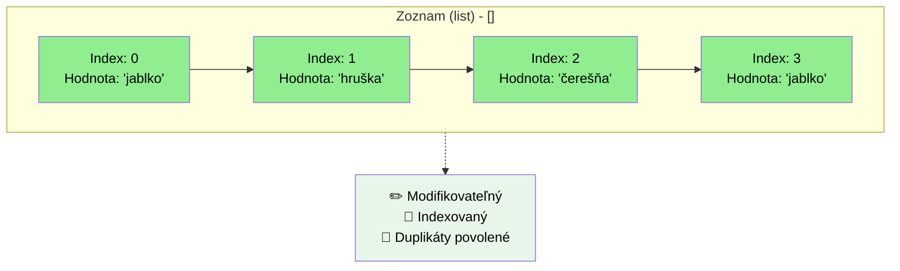
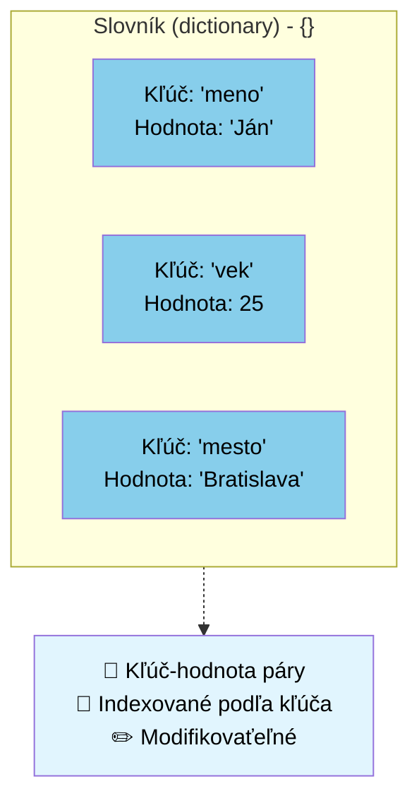

# Zoznam `list`: `[]`

```python
# Zoznam - indexovaný, modifikovateľný, duplikáty povolené
ovocie_zoznam = ['jablko', 'hruška', 'čerešňa', 'jablko']
print(f"Zoznam: {ovocie_zoznam}")
print(f"Prvý prvok: {ovocie_zoznam[0]}")
ovocie_zoznam[1] = 'slivka'  # Modifikovateľný
print(f"Modifikovaný zoznam: {ovocie_zoznam}")
```
## Vlastnosti
- Používame hranaté zátvorky `[]`
- Môže obsahovať ľubovoľný dátový typ, aj zmiešane
  - `[1,2.3,"jablko", True]` zmiešané
  - `[1,2,3]` len čísla
- Prístup k hodnote je indexovaný, začína od `0`
  - Ak je hodnota na "pravej" strane rovná sa `hodnota = zoznam[i]`, alebo len použijeme hodnotu `print(zoznam[i])`, **dostaneme** späť hodnotu prvka
  ```py
  zoznam = ['jablko', 'hruška', 'čerešňa']
  print(zoznam[1]) # vypíše hruška
  jablko = zoznam[0]
  print(jablko)
  ```
  - Ak je hodnota na "ľavej" strane rovnátka, priradíme hodnotu
  ```py
  zoznam = ['jablko', 'hruška', 'čerešňa']
  print(zoznam[1]) # vypíše hruška
  zoznam[1] = "kiwi"
  print(zoznam[1]) # vypíše kiwi
  ```
- `.append(hodnota)` - pridá novú hodnotu na **koniec** zoznamu
- `.index(hodnota)` - vráti **pozíciu** `hodnoty`, ak ju nenájde, vyvolá `ValueError` výnimku

# Množina `set`: `{}`
Python definuje dátový typ množina, `set` ako základný typ. Množina je neusporiadaná kolekcia, kde každý prvok môže byť prítomný **iba raz**.

Základné použitie: 
- kontrola prítomnosti daného prvku
- filtrovanie duplicitných prvkov.

## Vlastnosti
- Používame zložené zátvorky `{}`, alebo zo zoznamu, reťazca použijeme príkaz `set()` na vytvorenie množiny `mnozina = set([1,1,1,2,3,5,4,4,4,8])`
- Môže obsahovať ľubovoľný dátový typ, aj zmiešane
- Každý prvok je jedinečný, vyskytuje sa len raz
## Príklad
Koľko čísel som uhádol v lotérii:
```py
vyherneCisla = {1, 2, 3, 4, 5, 6}
mojeCisla = {1, 2, 7, 8, 9, 0}

print("Tieto som uhádol: ", vyherneCisla & mojeCisla)
```

## Zo zoznamu množina
```py
kosik = ["jablko", "pomaranč", "jablko", "hruška", "pomaranč", "banán"]
print("pomaranč" in kosik)
mnozinaKosik = set(kosik)
print(mnozinaKosik)
```

## Operácie s množinami
Objekty typu `set` podporujú matematické operácie ako:
- zjednotenie (union), `a | b`
- priesečník (intersection), `a & b`
- rozdiel (difference),  `a - b`
- a symetrický rozdiel (symmetric difference). `a ^ b`

```py
abrakadabra = set('abracadabra')
alhambra = set('alhambra')
print(f'Unikátne prvky v abrakadabra {abrakadabra}')
print(f'Unikátne prvky v alhambra {alhambra}')
print(f'Prvky v abrakadabra, ktoré nie sú v alhambra: {abrakadabra-alhambra}')
print(f'Prvky v abrakadabra alebo v alhambra: {abrakadabra|alhambra}')
print(f'Prvky v abrakadabra a v alhambra súčasne: {abrakadabra&alhambra}')
print(f'Prvky v abrakadabra alebo v alhambra, ale nie oboje súčasne: {abrakadabra^alhambra}')
```
# Slovník `dictionary`: `{k:v}`

```python
# Slovník - kľúč-hodnota páry
osoba = {'meno': 'Ján', 'vek': 25, 'mesto': 'Bratislava'}
print(f"\nSlovník: {osoba}")
print(f"Meno: {osoba['meno']}")
osoba['vek'] = 26  # Modifikovaťeľné
print(f"Modifikovaný slovník: {osoba}")
```
Dátový typ slovník slúži na ukladanie párov `kľúč:hodnota`. Slovník je kolekcia, kde:
- `{kľúč:hodnota}`, pričom kľúč a hodnota môžu byť ľubovoľného dátového typu, môžu byť aj zmiešané v rámci jedného slovníka
- na prístup k hodnote používame zátvorky `[]`, rovnako ako pri zoznamoch, pričom tu udávame kľúč: `print(mojSlovnik["kluc"])`
- je zoradený (od Pythonu verzie >3.7)
- je modifikovateľný
- neobsahuje duplicitné kľúče

## Príklad výpisu celého slovníka
```py
autoSlovnik = {
  "znacka": "Ford",
  "model": "Mustang",
  "rok": 1964,
}
print(autoSlovnik)
```
## Príklad výpisu hodnoty pre daný kľúč
```py
autoSlovnik = {
  "znacka": "Ford",
  "model": "Mustang",
  "rok": 1964
}
print(autoSlovnik["znacka"])
```
alebo
```py
znackaKluc = "znacka"
autoSlovnik = {
  "znacka": "Ford",
  "model": "Mustang",
  "rok": 1964
}
print(autoSlovnik[znackaKluc])
```
## Príklad zmeny hodnoty pre daný kľúč
```py
znackaKluc = "znacka"
autoSlovnik = {
  "znacka": "Ford",
  "model": "Mustang",
  "rok": 1964
}
print(autoSlovnik[znackaKluc])
autoSlovnik[znackaKluc] = "Hyundai"
print(autoSlovnik[znackaKluc])
```

## Kľúče s duplicitami nie sú povolené
Neoznámi chybu, ale vždy prepíše hodnotu
```py
autoSlovnik = {
  "znacka": "Ford",
  "model": "Mustang",
  "rok": 1964,
  "rok": 2020
}
print(autoSlovnik)
```
## Aktualizácia, `.update`
```py
autoSlovnik = {
  "znacka": "Ford",
  "model": "Mustang",
  "rok": 1964,
}
# ak existuje kľúč model, prepíše hodnotu
autoSlovnik.update({"model":"Mondeo"})

# ak neexistuje kľúč model, pripojí ho
autoSlovnik.update({"jeElektricke":False})

print(autoSlovnik)
```

## `.get`
Ak chceme pristupovať k neexistujúcemu kľúču v slovníku, program signalizuje chybu a zastaví sa:

```py
autoSlovnik = {
  "znacka": "Ford",
  "model": "Mustang",
  "rok": 1964,
}
print(autoSlovnik["isElectric"])
```

Aby sme tomu predišli, môžeme použiť funkciu `.get`:

```py
autoSlovnik = {
  "znacka": "Ford",
  "model": "Mustang",
  "rok": 1964,
}
print(autoSlovnik.get("isElectric"))
print(autoSlovnik.get("isElectric", "neobsahuje"))
```

# Tuple `tuple`: `()`

**Tuple**, n-tica, je nemodifikovateľný dátový typ s možnosťou obsahovať modifikovateľné prvky. Tuple výstup vždy obsahuje zátvorky, takže môžu byť správne vnorené; môžeme ich zadávať s alebo bez zátvoriek, ale v niektorých prípadoch sú zátvorky nevyhnutné (keď sú súčasťou väčšieho výrazu).

Napríklad, ak vložíme **zoznam** do tuple:

```py
ucitSa = ['matematika', 'fyzika']
rozvrh = (ucitSa, 'technicka')
print(rozvrh[0][1]) # fyzika
rozvrh[0][1] = 'slovenčina' 
print(rozvrh[0][1]) # slovenčina
```

Nasledujúci kód vyvolá chybu:

```py
ovocie = ('jablko', 'hruška', 'čerešňa')
ovocie[0] = 'kiwi'
```

## Vlastnosti
- Používajú sa zátvorky `()`
- Prvky tuple nie sú modifikovateľné
- Môžeme použiť ľubovoľný dátový typ
- Podobne ako reťazce, tuple sú nemodifikovateľné, nemôžeme priradiť hodnotu jednotlivému prvku (`myTuple[0] = 10` vyvolá chybu)
- Môžeme vytvoriť tuple, ktorý obsahuje modifikovateľné prvky, napríklad polia/zoznamy (`myTuple = ([1,2,3],4)`, tu môžeme meniť hodnoty `myTuple[0][1]=10`, pretože ide o zoznam)

## Načo je to dobré?

Funkcia môže vrátiť len jednu hodnotu, ale ak táto hodnota je typu, ktorý obsahuje viac hodnôt, môže byť tuple riešením. Formálne napísané:

```py
def Pripocitaj10(a:int, b:int)->tuple[int,int]:
    return (a+10, b+10) 

vysledok = Pripocitaj10(40,50)
print(vysledok)
```

Alebo trochu jednoduchšie a rozdelenie tuple na dve (alebo viac) premenné:

```py
def Pripocitaj10(a:int, b:int)->tuple[int,int]:
    return a+10, b+10 # v tomto prípade nemusíme používať zátvorky

x, y = Pripocitaj10(40,50)
print(x, y)
```

`(x, y)` uchovávanie súradníc, záznamy o zamestnancoch v databáze

# Otázky
1. Aké sú hlavné vlastnosti množiny (`set`), a ako sa označuje?
2. Aké sú hlavné vlastnosti slovníka (`dict`), a ako sa označuje?
3. Aké sú hlavné vlastnosti zoznamu (`list`), a ako sa označuje?
3. Aké sú hlavné vlastnosti ntíc (`tuple`), a ako sa označuje?
4. Ako určíme prienik dvoch množín, uveďte príklad.
5. Vytvorte zoznam s tromi hodnotami typu slovník, kde kľúče sú: meno, priezvisko, rok narodenia.
6. Vytvorte množinu z tohto zoznamu: `myList = [5,10,30,28,-99,5,0,0,65,124,214,25,5]`
7. Kedy môžeme použiť funkciu `.get` pri slovníkoch, uveďte príklad!
8. Vytvorte slovník s tromi kľúč-hodnota párovmi a aktualizujte hodnotu jedného kľúča, pridajte nový kľúč-hodnota pár.