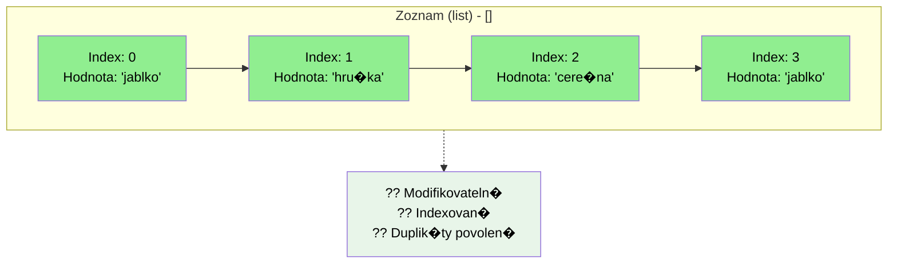
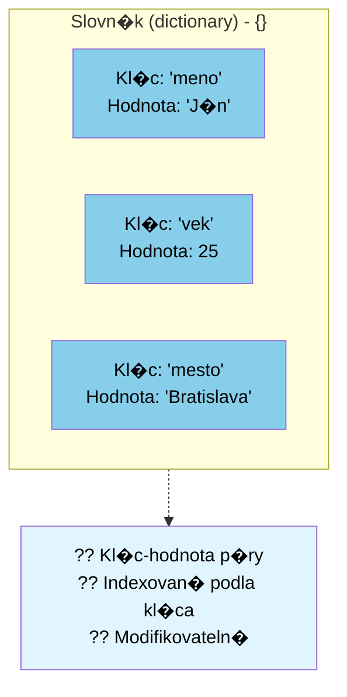

🗺️ [Späť na mapu](00_Mapa_sk.md)

> # ?? Zoznam, mno�ina, slovn�k, n-tica
>
> �tyri typy **kolekci�**, ka�d� m� in� "osobnost":
>
> | Typ | Znak | Poradie? | M�u sa opakovat? | D� sa menit? |
> |---|---|---|---|---|
> | `list` | `[]` | �no (index) | �no | �no |
> | `set` | `{}` | nie | **nie** | �no |
> | `dict` | `{kl�c: hodnota}` | �no (kl�c) | kl�c nie, hodnota �no | �no |
> | `tuple` | `()` | �no (index) | �no | **nie** |
>
> ```py
> zoznam = ['jablko', 'hru�ka']      # m� poradie, d� sa indexovat aj menit
> mnozina = {'jablko', 'hru�ka'}     # nem� poradie, nem� duplicity
> slovnik = {'meno': 'Anna'}         # kl�c -> hodnota
> ntica = (10, 20)                   # ako zoznam, ale ned� sa menit
> ```
>
> **Metafora:**
> - **Zoznam** = **oc�slovan� polica**: m�e� z nej brat, prid�vat aj pres�vat veci.
> - **Mno�ina** = **vrece s jedinecn�mi gul�ckami**: poradie nie je d�le�it� a dve rovnak� tam nezostan�.
> - **Slovn�k** = **telef�nny zoznam**: nehlad� podla poradia, ale podla **mena** (kl�c -> hodnota).
> - **N-tica** = **zapecaten� �katula**: co do nej raz vlo��, to u� nevymen�.

# Zoznam `list`: `[]`

```python
# Zoznam - indexovan�, modifikovateln�, duplik�ty povolen�
ovocie_zoznam = ['jablko', 'hru�ka', 'cere�na', 'jablko']
print(f"Zoznam: {ovocie_zoznam}")
print(f"Prv� prvok: {ovocie_zoznam[0]}")
ovocie_zoznam[1] = 'slivka'  # Modifikovateln�
print(f"Modifikovan� zoznam: {ovocie_zoznam}")
```
## Vlastnosti
- Pou��vame hranat� z�tvorky `[]`
- M�e obsahovat lubovoln� d�tov� typ, aj zmie�ane
  - `[1,2.3,"jablko", True]` zmie�an�
  - `[1,2,3]` len c�sla
- Pr�stup k hodnote je indexovan�, zac�na od `0`
  - Ak je hodnota na "pravej" strane rovn� sa `hodnota = zoznam[i]`, alebo len pou�ijeme hodnotu `print(zoznam[i])`, **dostaneme** sp�t hodnotu prvka
  ```py
  zoznam = ['jablko', 'hru�ka', 'cere�na']
  print(zoznam[1]) # vyp�e hru�ka
  jablko = zoznam[0]
  print(jablko)
  ```
  - Ak je hodnota na "lavej" strane rovn�tka, prirad�me hodnotu
  ```py
  zoznam = ['jablko', 'hru�ka', 'cere�na']
  print(zoznam[1]) # vyp�e hru�ka
  zoznam[1] = "kiwi"
  print(zoznam[1]) # vyp�e kiwi
  ```
- `.append(hodnota)` - prid� nov� hodnotu na **koniec** zoznamu
- `.index(hodnota)` - vr�ti **poz�ciu** `hodnoty`, ak ju nen�jde, vyvol� `ValueError` v�nimku

# Mno�ina `set`: `{}`
Python definuje d�tov� typ mno�ina, `set` ako z�kladn� typ. Mno�ina je neusporiadan� kolekcia, kde ka�d� prvok m�e byt pr�tomn� **iba raz**.

Z�kladn� pou�itie: 
- kontrola pr�tomnosti dan�ho prvku
- filtrovanie duplicitn�ch prvkov.

## Vlastnosti
- Pou��vame zlo�en� z�tvorky `{}`, alebo zo zoznamu, retazca pou�ijeme pr�kaz `set()` na vytvorenie mno�iny `mnozina = set([1,1,1,2,3,5,4,4,4,8])`
- M�e obsahovat lubovoln� d�tov� typ, aj zmie�ane
- Ka�d� prvok je jedinecn�, vyskytuje sa len raz
## Pr�klad
Kolko c�sel som uh�dol v lot�rii:
```py
vyherneCisla = {1, 2, 3, 4, 5, 6}
mojeCisla = {1, 2, 7, 8, 9, 0}

print("Tieto som uh�dol: ", vyherneCisla & mojeCisla)
```

## Zo zoznamu mno�ina
```py
kosik = ["jablko", "pomaranc", "jablko", "hru�ka", "pomaranc", "ban�n"]
print("pomaranc" in kosik)
mnozinaKosik = set(kosik)
print(mnozinaKosik)
```

## Oper�cie s mno�inami
Objekty typu `set` podporuj� matematick� oper�cie ako:
- zjednotenie (union), `a | b`
- priesecn�k (intersection), `a & b`
- rozdiel (difference),  `a - b`
- a symetrick� rozdiel (symmetric difference). `a ^ b`

```py
abrakadabra = set('abracadabra')
alhambra = set('alhambra')
print(f'Unik�tne prvky v abrakadabra {abrakadabra}')
print(f'Unik�tne prvky v alhambra {alhambra}')
print(f'Prvky v abrakadabra, ktor� nie s� v alhambra: {abrakadabra-alhambra}')
print(f'Prvky v abrakadabra alebo v alhambra: {abrakadabra|alhambra}')
print(f'Prvky v abrakadabra a v alhambra s�casne: {abrakadabra&alhambra}')
print(f'Prvky v abrakadabra alebo v alhambra, ale nie oboje s�casne: {abrakadabra^alhambra}')
```
# Slovn�k `dictionary`: `{k:v}`

```python
# Slovn�k - kl�c-hodnota p�ry
osoba = {'meno': 'J�n', 'vek': 25, 'mesto': 'Bratislava'}
print(f"\nSlovn�k: {osoba}")
print(f"Meno: {osoba['meno']}")
osoba['vek'] = 26  # Modifikovateln�
print(f"Modifikovan� slovn�k: {osoba}")
```
D�tov� typ slovn�k sl��i na ukladanie p�rov `kl�c:hodnota`. Slovn�k je kolekcia, kde:
- `{kl�c:hodnota}`, pricom kl�c a hodnota m�u byt lubovoln�ho d�tov�ho typu, m�u byt aj zmie�an� v r�mci jedn�ho slovn�ka
- na pr�stup k hodnote pou��vame z�tvorky `[]`, rovnako ako pri zoznamoch, pricom tu ud�vame kl�c: `print(mojSlovnik["kluc"])`
- je zoraden� (od Pythonu verzie >3.7)
- je modifikovateln�
- neobsahuje duplicitn� kl�ce

## Pr�klad v�pisu cel�ho slovn�ka
```py
autoSlovnik = {
  "znacka": "Ford",
  "model": "Mustang",
  "rok": 1964,
}
print(autoSlovnik)
```
## Pr�klad v�pisu hodnoty pre dan� kl�c
```py
autoSlovnik = {
  "znacka": "Ford",
  "model": "Mustang",
  "rok": 1964
}
print(autoSlovnik["znacka"])
```
alebo
```py
znackaKluc = "znacka"
autoSlovnik = {
  "znacka": "Ford",
  "model": "Mustang",
  "rok": 1964
}
print(autoSlovnik[znackaKluc])
```
## Pr�klad zmeny hodnoty pre dan� kl�c
```py
znackaKluc = "znacka"
autoSlovnik = {
  "znacka": "Ford",
  "model": "Mustang",
  "rok": 1964
}
print(autoSlovnik[znackaKluc])
autoSlovnik[znackaKluc] = "Hyundai"
print(autoSlovnik[znackaKluc])
```

## Kl�ce s duplicitami nie s� povolen�
Neozn�mi chybu, ale v�dy prep�e hodnotu
```py
autoSlovnik = {
  "znacka": "Ford",
  "model": "Mustang",
  "rok": 1964,
  "rok": 2020
}
print(autoSlovnik)
```
## Aktualiz�cia, `.update`
```py
autoSlovnik = {
  "znacka": "Ford",
  "model": "Mustang",
  "rok": 1964,
}
# ak existuje kl�c model, prep�e hodnotu
autoSlovnik.update({"model":"Mondeo"})

# ak neexistuje kl�c model, pripoj� ho
autoSlovnik.update({"jeElektricke":False})

print(autoSlovnik)
```

## `.get`
Ak chceme pristupovat k neexistuj�cemu kl�cu v slovn�ku, program signalizuje chybu a zastav� sa:

```py
autoSlovnik = {
  "znacka": "Ford",
  "model": "Mustang",
  "rok": 1964,
}
print(autoSlovnik["isElectric"])
```

Aby sme tomu predi�li, m�eme pou�it funkciu `.get`:

```py
autoSlovnik = {
  "znacka": "Ford",
  "model": "Mustang",
  "rok": 1964,
}
print(autoSlovnik.get("isElectric"))
print(autoSlovnik.get("isElectric", "neobsahuje"))
```

# Tuple `tuple`: `()`

**Tuple**, n-tica, je nemodifikovateln� d�tov� typ s mo�nostou obsahovat modifikovateln� prvky. Tuple v�stup v�dy obsahuje z�tvorky, tak�e m�u byt spr�vne vnoren�; m�eme ich zad�vat s alebo bez z�tvoriek, ale v niektor�ch pr�padoch s� z�tvorky nevyhnutn� (ked s� s�castou v�c�ieho v�razu).

Napr�klad, ak vlo��me **zoznam** do tuple:

```py
ucitSa = ['matematika', 'fyzika']
rozvrh = (ucitSa, 'technicka')
print(rozvrh[0][1]) # fyzika
rozvrh[0][1] = 'slovencina' 
print(rozvrh[0][1]) # slovencina
```

Nasleduj�ci k�d vyvol� chybu:

```py
ovocie = ('jablko', 'hru�ka', 'cere�na')
ovocie[0] = 'kiwi'
```

## Vlastnosti
- Pou��vaj� sa z�tvorky `()`
- Prvky tuple nie s� modifikovateln�
- M�eme pou�it lubovoln� d�tov� typ
- Podobne ako retazce, tuple s� nemodifikovateln�, nem�eme priradit hodnotu jednotliv�mu prvku (`myTuple[0] = 10` vyvol� chybu)
- M�eme vytvorit tuple, ktor� obsahuje modifikovateln� prvky, napr�klad polia/zoznamy (`myTuple = ([1,2,3],4)`, tu m�eme menit hodnoty `myTuple[0][1]=10`, preto�e ide o zoznam)

## Naco je to dobr�?

Funkcia m�e vr�tit len jednu hodnotu, ale ak t�to hodnota je typu, ktor� obsahuje viac hodn�t, m�e byt tuple rie�en�m. Form�lne nap�san�:

```py
def Pripocitaj10(a:int, b:int)->tuple[int,int]:
    return (a+10, b+10) 

vysledok = Pripocitaj10(40,50)
print(vysledok)
```

Alebo trochu jednoduch�ie a rozdelenie tuple na dve (alebo viac) premenn�:

```py
def Pripocitaj10(a:int, b:int)->tuple[int,int]:
    return a+10, b+10 # v tomto pr�pade nemus�me pou��vat z�tvorky

x, y = Pripocitaj10(40,50)
print(x, y)
```

`(x, y)` uchov�vanie s�radn�c, z�znamy o zamestnancoch v datab�ze

> # ?? Pokazte to!
>
> Ak� je chyba v tomto programe?
>
> ```py
> suradnice = (10, 20, 30)
> suradnice[0] = 15
> print(suradnice)
> ```
>
> Preco nie je mo�n� zmenit prvok n-tice? Upravte k�d tak, aby sa `suradnice` spr�vali ako **zoznam** a zmena u� fungovala.
>
> # ?? �lohy
> - [e01_workerDb.md](../Exercies/12_list_set_dictionary_tuple/e01_workerDb.md)
> - [e02_checkDuplicates.md](../Exercies/12_list_set_dictionary_tuple/e02_checkDuplicates.md)
> - [e03_DistincElementCount.md](../Exercies/12_list_set_dictionary_tuple/e03_DistincElementCount.md)
>
> # ? Ot�zky
>
> 1. Ak� s� hlavn� vlastnosti `set`, ako ho oznacujeme?
> 2. Ak� s� hlavn� vlastnosti `dict`, ako ho oznacujeme?
> 3. Ak� s� hlavn� vlastnosti `list`, ako ho oznacujeme?
> 4. Ak� s� hlavn� vlastnosti `tuple`, ako ho oznacujeme?
> 5. Ako urc�me prienik dvoch mno��n? Uvedte pr�klad.
> 6. Vytvorte zoznam, v ktorom bud� 3 hodnoty typu slovn�k predstavuj�ce osoby s kl�cmi: meno, priezvisko, rok narodenia.
> 7. Z nasleduj�ceho zoznamu vytvorte mno�inu: `myList = [5,10,30,28,-99,5,0,0,65,124,214,25,5]`
> 8. Kedy m�eme pou�it funkciu `.get` pri slovn�koch? Uvedte pr�klad.
> 9. Vytvorte slovn�k s 3 p�rmi kl�c-hodnota, potom aktualizujte jeden kl�c a pridajte nov� p�r kl�c-hodnota.
> 10. Preco nie je mo�n� zmenit prvok n-tice?

