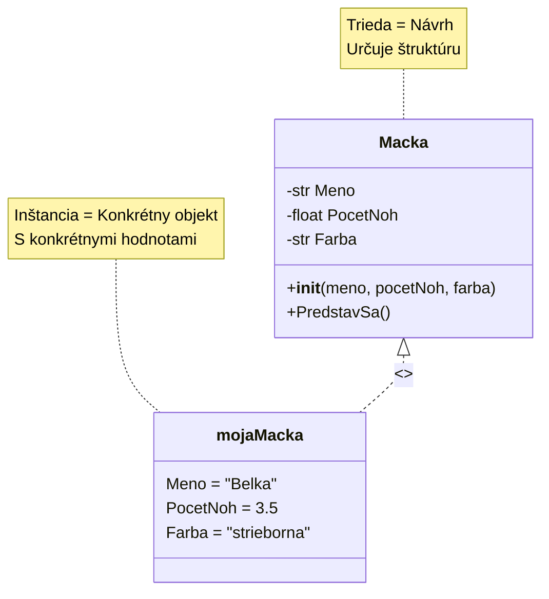
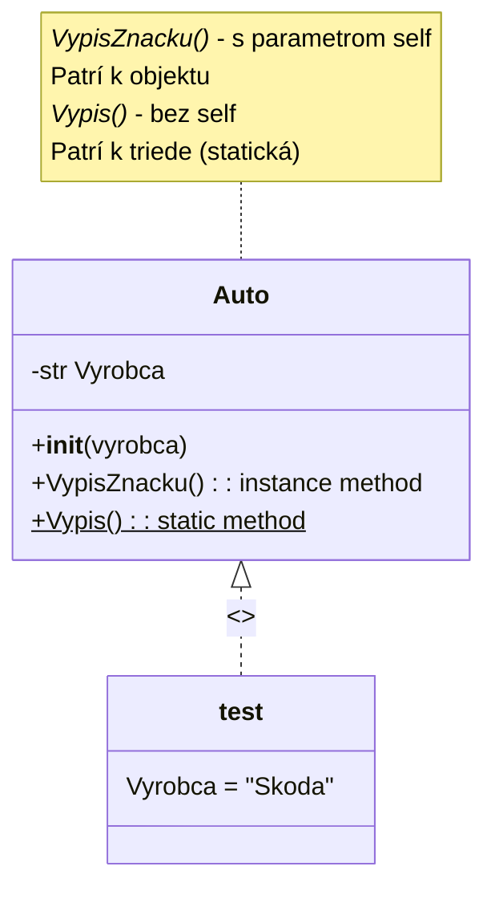
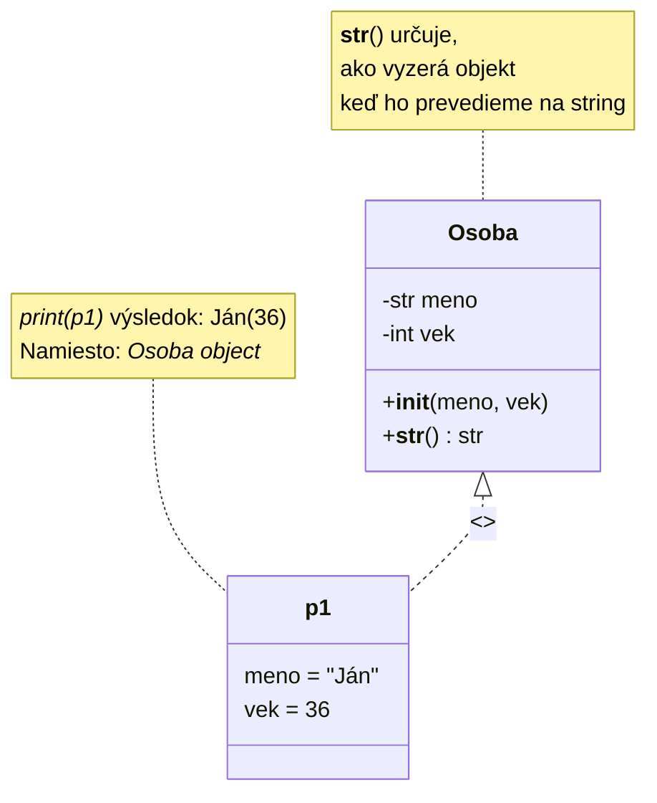

# Triedy, vlastné/zložené dátové typy `class`

Doposiaľ sme sa stretli a pracovali s dátovými typmi ako `int`, `float`, `str`, `random`, `list`, `dict`, ale teraz sme schopní ísť ďalej a definovať si vlastný dátový typ.

S `class` príkazom definujeme, hovoríme Pythonu, ako by sme chceli, aby náš vlastný dátový typ vyzeral:
- s akými vlastnosťami (attributes, property) by mal byť vybavený -> čo **má**
- s akými funkciami by mal byť vybavený -> čo vie **robiť**

`class` je akýsi **návrh**, ako by sme chceli, aby vyzerali **objekty**, **inštancie**, ktoré z neho vytvoríme.

> **Objekt** alebo **inštancia** je súhrn dát, ktorý je reálne uložený v pamäti. Premenná ukazuje na túto konkrétnu adresu a tak určuje alebo mení jej hodnotu.

Definovanie triedy pomocou príkazu `class`. V nasledujúcom príklade vytvárame návrh triedy, ktorá sa volá `MyClass` a má vlastnosť `x`:

```py
class MyClass:
  x = 5
```

Ak chceme z tejto triedy, návrhu, vytvoriť objekt, môžeme to urobiť nasledovne:

```py
p1 = MyClass()
print(p1.x)
```

S triedou ešte nevieme pracovať (okrem niekoľkých výnimiek), z nej musíme vytvoriť objekt, inštanciu.

## Mačka
Môžeme si to predstaviť aj tak, že v prírode je **mačka**, vieme, že je obvykle chlpatá, má 4 nohy, má meno, mňauká, mazná sa, spí, atď. - toto je návrh na "výrobu" mačky. Ale ak už máme konkrétnu mačku u nás doma, alebo v susedstve (Murko, Labka, Belka, Cilka), už pre ňu udeľujeme konkrétne vlastnosti.



```py
class Macka:
    def __init__(self, meno, pocetNoh, farba) -> None:
        self.Meno = meno
        self.PocetNoh = pocetNoh
        self.Farba = farba

    def PredstavSa(self):
        print(f"Som mačka a volam sa {self.Meno}. Mam {self.PocetNoh} noh a moj kozuch je {self.Farba}")

mojaMacka = Macka("Belka", 3, "strieborna")
mojaMacka.PredstavSa()
```

## `__init__()` funkcia
> Počas **inicializácie** vytvárame inštanciu objektu z triedy, to znamená, že v pamäti počítača sa sa alokuje, prideluje oblasť vo veľkosti potrebnej pre vytvorenie danej triedy. Takže z všeobecného opisu (čo je tá trieda) vytvárame konkrétny objekt v pamäti pomocou funkcie `__init__()`.

Táto funkcia nám hovorí, ako by sme chceli, aby vyzeralo vytváranie objektu z našej triedy. Môže to fungovať aj bez nej, v tedy funkcia nemá vstupné parametre, ale v tom prípade by používateľ musel vlastnosti nastaviť "ručne". Funkcia `__init__()` **zabezpečuje**, že z triedy môžeme vytvoriť objekt **len vtedy**, ak mu poskytneme uvedené vlastnosti.
```py
class Macka:

    Meno: str
    PocetNoh: float
    Farba: str

    def PredstavSa(self):
        print(f"Som mačka a volam sa {self.Meno}. Mam {self.PocetNoh} noh a moj kozuch je {self.Farba}")

mojaMacka = Macka()
mojaMacka.Meno = "Belka"
mojaMacka.PocetNoh = 3.5
#mojaMacka.Farba = "strieborna"
mojaMacka.PredstavSa()
```
> Každá trieda má funkciu s názvom `__init__()`, ktorá je vždy vykonaná pri vytváraní objektu, aj keď neposkytneme žiadne vstupné parametre. Ak je funkcia `__init__()` prázdna, nemusíte ju samostatne vytvárať.
```py
class TriedaBezVlastnosti:
    def __init__(self) -> None:
        print("Funkciu init sme zavolali")

test = TriedaBezVlastnosti()
```

## `self`
Parameter `self` je odkaz na aktuálnu inštanciu triedy, a slúži na prístup k funkciám a vlastnostiam tejto inštancie.

```py
class Auto:
    def __init__(self, znacka) -> None:
        self.Znacka = znacka
    
    def VypisVyrobcu(self):
        print(f"Výrobca auta je {self.Znacka}")

    def Vypis():
        print("Jednoducho vypíšem")

test = Auto("Skoda")
test.VypisVyrobcu()
Auto.Vypis()
```
Pomocou `self` môžeme pristupovať k vlastnostiam a funkciám konkrétneho objektu:
- `VypisVyrobcu` funguje len na objekte `test`, to sa nazýva **funkcia objektu** alebo funkcia priradená k objektu
- `test.Vypis()` nebude fungovať, pretože objekt `test` nemá funkciu `Vypis()` (chýba `self`)
- `Auto.Vypis()` funguje, a je to **funkcia triedy**, alebo v iných programovacích jazykoch je to považované za **statickú** funkciu
- `Auto.VypisVyrobcu()` nebude fungovať, pretože to nie je funkcia triedy, ale funkcia inštancie, objektu
### Príklad
```py
class Osoba:
  def __init__(self, meno, vek):
    self.meno = meno
    self.vek = vek

o1 = Osoba("Janko", 36)

print(o1)
print(o1.meno)
print(o1.vek)
```
Výstup by mal byť podobný:
```
<__main__.Osoba object at 0x00000185EC9D75D0>
Janko
36
```
## Funkcia `__str__()`
Pomocou tejto funkcie môžeme ovplyvniť, ako bude naša trieda vyzerať, keď ju premeníme na `str`



```py
class Osoba:
  def __init__(self, meno, vek):
    self.meno = meno
    self.vek = vek

  def __str__(self):
    return f"{self.meno}({self.vek})"

o1 = Osoba("Janko", 36)

print(o1, type(o1))
# prípadne
osobaString = str(o1)
print(osobaString, type(osobaString))
```

## `dict` vs `class`
```py
class Osoba:
	def __init__(self, meno, vek):
		self.Meno, self.Vek = meno, vek
    
	def __str__(self) -> str:
		return f"{self.Meno}({self.Vek})"

osobaSlovnik = {"meno":"Janko", "Vek": 16}
osoba = Osoba("Janko", 17)

print(osobaSlovnik, type(osobaSlovnik))
print(osoba, type(osoba))

# vypísanie individuálnych vlastností:
print("osobaSlovnik['Vek']", osobaSlovnik["Vek"])
print('osoba.Vek', osoba.Vek)

# zmena individuálnych vlastností
osobaSlovnik["Vek"] = 98
osoba.Vek = 10

print("osobaSlovnik['Vek']", osobaSlovnik["Vek"])
print('osoba.Vek', osoba.Vek)
```
Kľúče slovníka môžeme považovať vlastnosťami triedy, pri slovníku musíme dávať pozor, aby sme **vždy** správne zadali kľúč, pri triede nám Python editor sám ponúkne názov vlastnosti Trieda môže byť rozšírená o rôzne funkcie.

# Otázky
1. Vytvorte triedu `Pes`, ktorá bude mať meno a farbu. Tieto hodnoty zadajte počas inicializácie pomocou funkcie `__init__`. Vytvorte 2 príklady:
   1. meno nech je Cezar, farbu si zvoľte sami
   1. farba nech je biela, meno si zvoľte sami
   - Vypíšte ich vlastnosti na obrazovku
1. Vytvorte triedu `Auto` s nasledujúcimi vlastnosťami: farba, značka, model, rok výroby. Môžete použiť funkciu `__init__`, ale nie je to nevyhnutné. Definujte nasledujúce 2 funkcie:
   1. `Start` - vypíše na obrazovku: "Auto farby [farba] z roku [rok výroby] značky [značka] [model] sa rozbehlo"
   1. `Stop` - vypíše na obrazovku: "Auto sa zastavilo"
	- vytvorte 3 inštancie áut
	- vložte ich do zoznamu 
	- a zavolajte obe ich funkcie
1. Vytvorte triedu `Pracovnik` s nasledujúcimi vlastnosťami: id, plat, pohlavie, vek. Funkciu `__str__` upravte tak, aby vrátila nasledujúci reťazec: "Zamestnanec s id [id] je [pohlavie], zarába [plat] eurá a má [vek] rokov." Pomocou knižnice `random`:
   - vygenerujte náhodný počet zamestnancov v rozmedzí <75;120>
      - `id` nech je z rozsahu <10000;100000>
      - `plat` nech je z rozsahu <1000;5000>
      - `pohlavie`: muž alebo žena
      - `vek` nech je z rozsahu <20;99>
	- vygenerované inštancie Pracovnik vložte do zoznamu a vypíšte ich hodnoty na obrazovku

