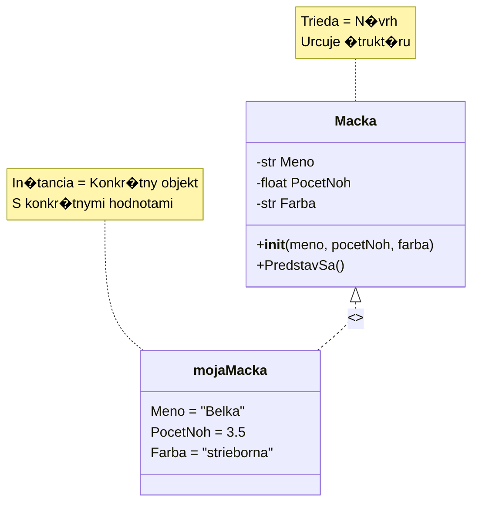
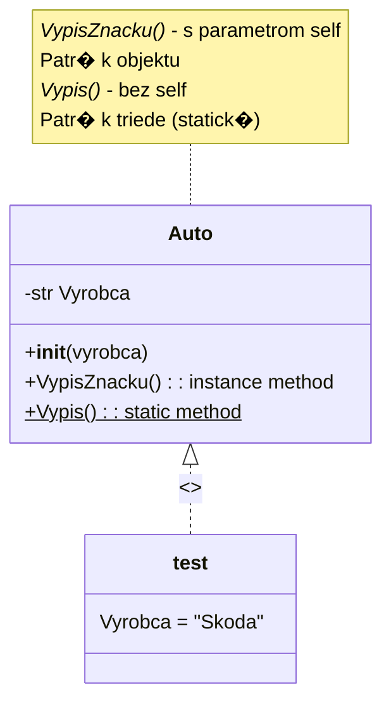
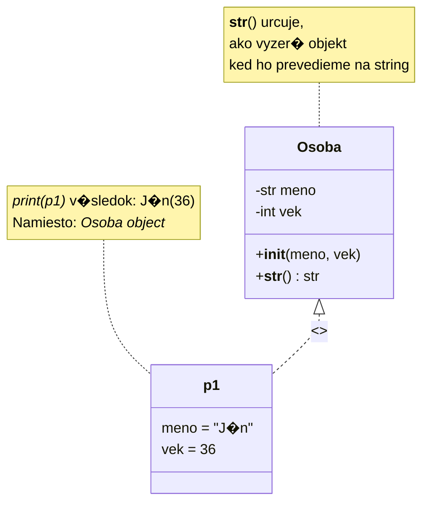

🗺️ [Späť na mapu](00_Mapa_sk.md)

> # ?? Triedy (`class`)
>
> Trieda je **pl�n**, in�tancia (objekt) je z nej vytvoren� **konkr�tna vec**.
>
> ```py
> class Macka:
>     def __init__(self, meno, farba) -> None:
>         self.Meno = meno
>         self.Farba = farba
>
>     def Predie(self):
>         print(f"{self.Meno} je {self.Farba} macka a pradie")
>
> cica = Macka("Cilka", "strieborn�")   # vytvorenie in�tancie - konkr�tny objekt
> cica.Predie()
> ```
>
> - `class Nazov:` - vytvorenie triedy (pl�nu)
> - `__init__(self, ...)` - spust� sa pri ka�dom vytvoren� in�tancie, nastav� pociatocn� vlastnosti
> - `self` - "t�to konkr�tna in�tancia", cez nu pristupujeme k vlastn�m vlastnostiam a funkci�m
> - `self.Vlastnost = hodnota` - nastavenie vlastnosti
> - `__str__(self)` - urcuje, ako bude objekt vyzerat po preveden� na text (`str`) alebo pri v�pise
>
> **Metafora:** trieda je ako **forma na su�ienky**: samotn� forma nie je su�ienka, ale ka�d� su�ienka z nej dostane rovnak� z�kladn� tvar (a pritom ju m�eme ozdobit inak).

# Triedy, vlastn�/zlo�en� d�tov� typy `class`

Doposial sme sa stretli a pracovali s d�tov�mi typmi ako `int`, `float`, `str`, `random`, `list`, `dict`, ale teraz sme schopn� �st dalej a definovat si vlastn� d�tov� typ.

S `class` pr�kazom definujeme, hovor�me Pythonu, ako by sme chceli, aby n� vlastn� d�tov� typ vyzeral:
- s ak�mi vlastnostami (attributes, property) by mal byt vybaven� -> co **m�**
- s ak�mi funkciami by mal byt vybaven� -> co vie **robit**

`class` je ak�si **n�vrh**, ako by sme chceli, aby vyzerali **objekty**, **in�tancie**, ktor� z neho vytvor�me.

> **Objekt** alebo **in�tancia** je s�hrn d�t, ktor� je re�lne ulo�en� v pam�ti. Premenn� ukazuje na t�to konkr�tnu adresu a tak urcuje alebo men� jej hodnotu.

Definovanie triedy pomocou pr�kazu `class`. V nasleduj�com pr�klade vytv�rame n�vrh triedy, ktor� sa vol� `MyClass` a m� vlastnost `x`:

```py
class MyClass:
  x = 5
```

Ak chceme z tejto triedy, n�vrhu, vytvorit objekt, m�eme to urobit nasledovne:

```py
p1 = MyClass()
print(p1.x)
```

S triedou e�te nevieme pracovat (okrem niekolk�ch v�nimiek), z nej mus�me vytvorit objekt, in�tanciu.

## Macka
M�eme si to predstavit aj tak, �e v pr�rode je **macka**, vieme, �e je obvykle chlpat�, m� 4 nohy, m� meno, mnauk�, mazn� sa, sp�, atd. - toto je n�vrh na "v�robu" macky. Ale ak u� m�me konkr�tnu macku u n�s doma, alebo v susedstve (Murko, Labka, Belka, Cilka), u� pre nu udelujeme konkr�tne vlastnosti.


```mermaid
classDiagram
    class Macka {
        -str Meno
        -float PocetNoh
        -str Farba
        +__init__(meno, pocetNoh, farba)
        +PredstavSa()
    }
    
    class mojaMacka {
        Meno = "Belka"
        PocetNoh = 3.5
        Farba = "strieborna"
    }
    
    Macka <|.. mojaMacka : <<instance>>
    
    note for Macka "Trieda = N�vrh</br>Urcuje �trukt�ru"
    note for mojaMacka "In�tancia = Konkr�tny objekt</br>S konkr�tnymi hodnotami"
```

```py
class Macka:
    def __init__(self, meno, pocetNoh, farba) -> None:
        self.Meno = meno
        self.PocetNoh = pocetNoh
        self.Farba = farba

    def PredstavSa(self):
        print(f"Som macka a volam sa {self.Meno}. Mam {self.PocetNoh} noh a moj kozuch je {self.Farba}")

mojaMacka = Macka("Belka", 3, "strieborna")
mojaMacka.PredstavSa()
```

## `__init__()` funkcia
> Pocas **inicializ�cie** vytv�rame in�tanciu objektu z triedy, to znamen�, �e v pam�ti poc�taca sa sa alokuje, prideluje oblast vo velkosti potrebnej pre vytvorenie danej triedy. Tak�e z v�eobecn�ho opisu (co je t� trieda) vytv�rame konkr�tny objekt v pam�ti pomocou funkcie `__init__()`.

T�to funkcia n�m hovor�, ako by sme chceli, aby vyzeralo vytv�ranie objektu z na�ej triedy. M�e to fungovat aj bez nej, v tedy funkcia nem� vstupn� parametre, ale v tom pr�pade by pou��vatel musel vlastnosti nastavit "rucne". Funkcia `__init__()` **zabezpecuje**, �e z triedy m�eme vytvorit objekt **len vtedy**, ak mu poskytneme uveden� vlastnosti.
```py
class Macka:

    Meno: str
    PocetNoh: float
    Farba: str

    def PredstavSa(self):
        print(f"Som macka a volam sa {self.Meno}. Mam {self.PocetNoh} noh a moj kozuch je {self.Farba}")

mojaMacka = Macka()
mojaMacka.Meno = "Belka"
mojaMacka.PocetNoh = 3.5
#mojaMacka.Farba = "strieborna"
mojaMacka.PredstavSa()
```
> Ka�d� trieda m� funkciu s n�zvom `__init__()`, ktor� je v�dy vykonan� pri vytv�ran� objektu, aj ked neposkytneme �iadne vstupn� parametre. Ak je funkcia `__init__()` pr�zdna, nemus�te ju samostatne vytv�rat.
```py
class TriedaBezVlastnosti:
    def __init__(self) -> None:
        print("Funkciu init sme zavolali")

test = TriedaBezVlastnosti()
```

## `self`
Parameter `self` je odkaz na aktu�lnu in�tanciu triedy, a sl��i na pr�stup k funkci�m a vlastnostiam tejto in�tancie.

```mermaid
classDiagram
    class Auto {
        -str Vyrobca
        +__init__(vyrobca)
        +VypisZnacku() : instance method
        +Vypis()$ : static method
    }
    
    class test {
        Vyrobca = "Skoda"
    }
    
    Auto <|.. test : <<instance>>
    
    note for Auto "*VypisZnacku()* - s parametrom self</br>Patr� k objektu</br>*Vypis()* - bez self</br>Patr� k triede (statick�)"
```
```py
class Auto:
    def __init__(self, znacka) -> None:
        self.Znacka = znacka
    
    def VypisVyrobcu(self):
        print(f"V�robca auta je {self.Znacka}")

    def Vypis():
        print("Jednoducho vyp�em")

test = Auto("Skoda")
test.VypisVyrobcu()
Auto.Vypis()
```
Pomocou `self` m�eme pristupovat k vlastnostiam a funkci�m konkr�tneho objektu:
- `VypisVyrobcu` funguje len na objekte `test`, to sa naz�va **funkcia objektu** alebo funkcia priraden� k objektu
- `test.Vypis()` nebude fungovat, preto�e objekt `test` nem� funkciu `Vypis()` (ch�ba `self`)
- `Auto.Vypis()` funguje, a je to **funkcia triedy**, alebo v in�ch programovac�ch jazykoch je to pova�ovan� za **statick�** funkciu
- `Auto.VypisVyrobcu()` nebude fungovat, preto�e to nie je funkcia triedy, ale funkcia in�tancie, objektu
### Pr�klad
```py
class Osoba:
  def __init__(self, meno, vek):
    self.meno = meno
    self.vek = vek

o1 = Osoba("Janko", 36)

print(o1)
print(o1.meno)
print(o1.vek)
```
V�stup by mal byt podobn�:
```
<__main__.Osoba object at 0x00000185EC9D75D0>
Janko
36
```
## Funkcia `__str__()`
Pomocou tejto funkcie m�eme ovplyvnit, ako bude na�a trieda vyzerat, ked ju premen�me na `str`


```mermaid
classDiagram
    class Osoba {
        -str meno
        -int vek
        +__init__(meno, vek)
        +__str__() str
    }
    
    class p1 {
        meno = "J�n"
        vek = 36
    }
    
    Osoba <|.. p1 : <<instance>>
    
    note for Osoba "__str__() urcuje,</br>ako vyzer� objekt</br>ked ho prevedieme na string"
    note for p1 "*print(p1)* v�sledok: J�n(36)</br> Namiesto: *Osoba object*"
```

```py
class Osoba:
  def __init__(self, meno, vek):
    self.meno = meno
    self.vek = vek

  def __str__(self):
    return f"{self.meno}({self.vek})"

o1 = Osoba("Janko", 36)

print(o1, type(o1))
# pr�padne
osobaString = str(o1)
print(osobaString, type(osobaString))
```

## `dict` vs `class`
```py
class Osoba:
	def __init__(self, meno, vek):
		self.Meno, self.Vek = meno, vek
    
	def __str__(self) -> str:
		return f"{self.Meno}({self.Vek})"

osobaSlovnik = {"meno":"Janko", "Vek": 16}
osoba = Osoba("Janko", 17)

print(osobaSlovnik, type(osobaSlovnik))
print(osoba, type(osoba))

# vyp�sanie individu�lnych vlastnost�:
print("osobaSlovnik['Vek']", osobaSlovnik["Vek"])
print('osoba.Vek', osoba.Vek)

# zmena individu�lnych vlastnost�
osobaSlovnik["Vek"] = 98
osoba.Vek = 10

print("osobaSlovnik['Vek']", osobaSlovnik["Vek"])
print('osoba.Vek', osoba.Vek)
```
Kl�ce slovn�ka m�eme pova�ovat vlastnostami triedy, pri slovn�ku mus�me d�vat pozor, aby sme **v�dy** spr�vne zadali kl�c, pri triede n�m Python editor s�m pon�kne n�zov vlastnosti Trieda m�e byt roz��ren� o r�zne funkcie.

> # ?? Pokazte to!
>
> Ak� je chyba v tomto programe?
>
> ```py
> class Macka:
>     def __init__(self, meno, farba) -> None:
>         self.Meno = meno
>         self.Farba = farba
>
> cirmi = Macka("Cirmi", "strieborn�")
> print(cirmi.Predie())
> ```
>
> Preco to nefunguje? Co treba doplnit, aby trieda `Macka` vedela priast a nielen uchov�vat svoje meno a farbu?
>
> # ?? �lohy
> - [e01_fish.md](../Exercies/13_classes/e01_fish.md)
> - [e02_worker.md](../Exercies/13_classes/e02_worker.md)
> - [e03_bankAccount.md](../Exercies/13_classes/e03_bankAccount.md)
> - [e04_figureSkating.md](../Exercies/13_classes/e04_figureSkating.md)
>
> # ? Ot�zky
>
> 1. Vytvorte triedu `Pes`, ktor� m� meno a farbu. Tieto hodnoty nastavte pri vytvoren� in�tancie pomocou funkcie `__init__`. Vytvorte 2 in�tancie:
>    1. meno nech je Cezar, farbu si zvolte sami
>    2. meno si zvolte sami, farba nech je biela
>    - Vyp�te ich vlastnosti na obrazovku.
> 2. Vytvorte triedu `Auto` s t�mito vlastnostami: farba, znacka, model, rok v�roby. M�ete pou�it funkciu `__init__`, ale nemus�te. Definujte tieto 2 funkcie:
>    1. `Start` - vyp�e na obrazovku: "[farba] auto z roku [rok v�roby], znacky [znacka] [model], sa rozbehlo"
>    2. `Stop` - vyp�e na obrazovku: "Auto sa zastavilo"
>    - vytvorte 3 in�tancie
>    - vlo�te ich do zoznamu
>    - a zavolajte na nich obe funkcie
> 3. Vytvorte triedu `Pracovnik` s t�mito vlastnostami: id, plat, pohlavie, vek. Upravte funkciu `__str__` tak, aby vracala tento retazec: "Zamestnanec s id [id] je [pohlavie], zar�ba [plat] eur a m� [vek] rokov." Pomocou kni�nice `random`:
>    - vygenerujte n�hodn� pocet zamestnancov v intervale <75;120>
>      - `id` nech je z intervalu <10000;100000>
>      - `plat` nech je z intervalu <1000;5000>
>      - `pohlavie`: mu� alebo �ena
>      - `vek` nech je z intervalu <20;99>
>    - vygenerovan� in�tancie `Pracovnik` vlo�te do zoznamu a vyp�te ich hodnoty na obrazovku
> 4. Na co sl��i parameter `self` a kedy ho m�eme vynechat z defin�cie funkcie?

