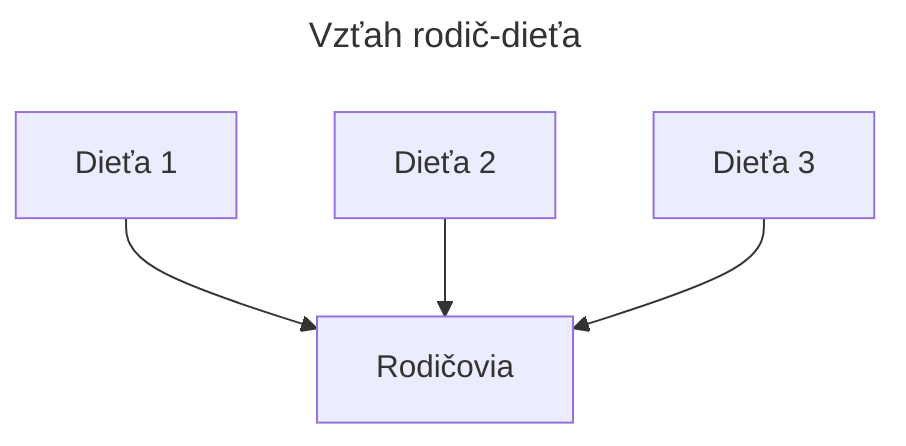
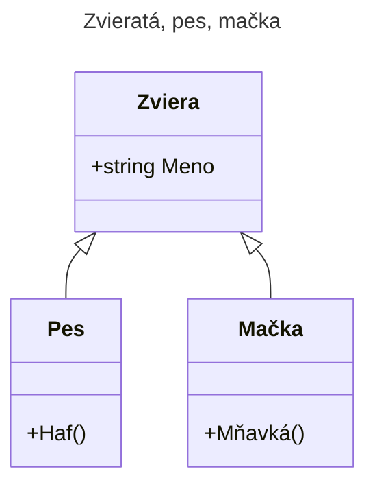
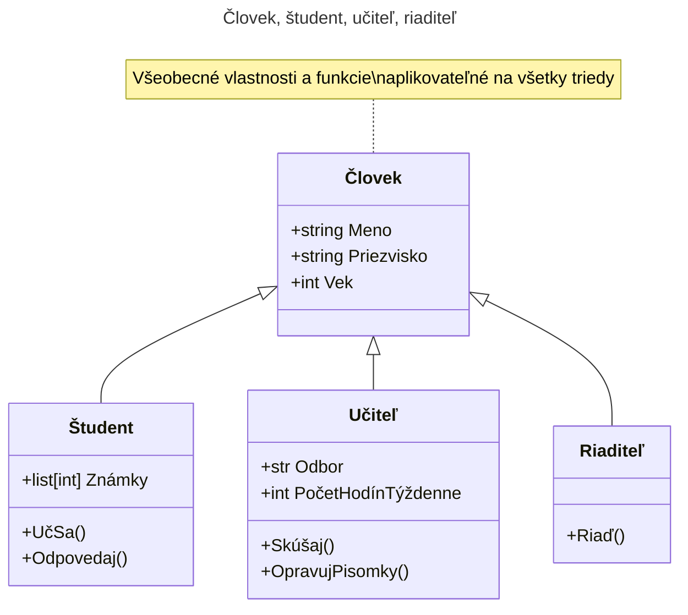
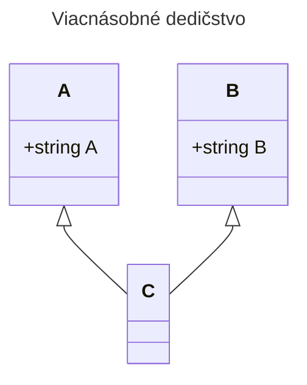
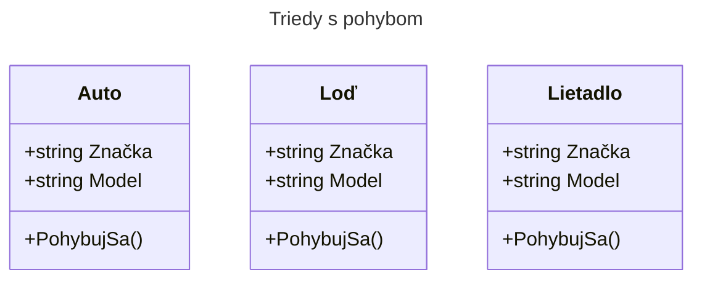
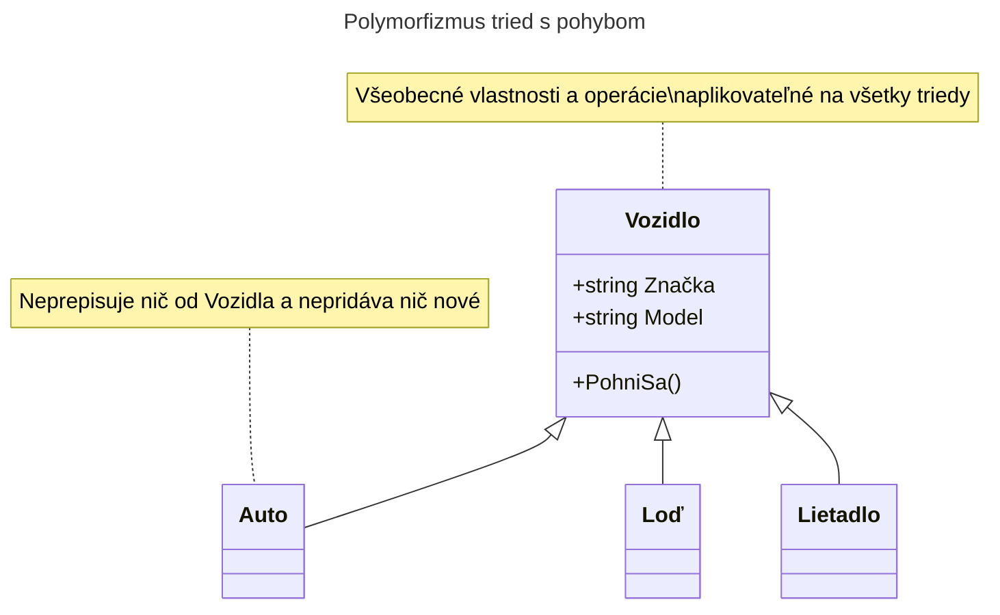

# Dedenie
## Úvod
**Dedenie** je najčastejšie používaný jazykový mechanizmus v objektovo orientovanom programovaní. Dedenie umožňuje definovať nové triedy ako modifikované verzie existujúcich tried, čo nám umožňuje písať menej kódu.
## Základné pojmy
Proces sa nazýva dedenie, pretože nová trieda "dedí" všetky metódy a atribúty existujúcej triedy, môže ich používať. Metafora sa rozširujeme tak, že existujúcu triedu často označujeme ako **rodičovskú**, a novú, dedenú triedu ako **potomok** alebo **podtriedu**.
- **dedenie** (inheritance) _je mechanizmus, ktorý umožňuje definovať triedu ako modifikovanú verziu predtým definovanej triedy._
- **rodičovská trieda** (parent class) _je trieda, z ktorej dedíme potomka._
- **potomok, podtrieda** (child class) _je nová trieda, ktorá je odvodená z existujúcej triedy. Často sa označuje ako podtrieda._

## Teória

Dedenie je efektívny jazykový nástroj, ktorý tiež podporuje opätovné použitie kódu, pretože môžeme upraviť správanie rodičovskej triedy v potomkovi bez modifikácie rodičovskej triedy. V niektorých prípadoch hierarchia dedenia odráža prirodzenú štruktúru problému, čo zjednodušuje pochopenie programu.

Na druhej strane môže použitie dedenia komplikovať čitateľnosť kódu. Pri volaní metód nie je vždy jasné, **kde** hľadať definíciu volanej metódy, hlavná časť kódu môže byť rozptýlená do viacerých modulov. Existuje mnoho problémov, ktoré možno riešiť dedením, ale ktoré by boli rovnako elegantne (alebo ešte elegantnejšie) riešiteľné bez nej. Ak povaha problému nezodpovedá dedenia, tento programovací štýl môže spôsobiť viac škody ako úžitku.

## Syntax
Keď chceme, aby trieda `B` dedila od triedy `A`, za názov triedy `B` dáme v zátvorkách názov triedy `A`, od ktorej dedíme:
```py
class A:
    pass

class B(A):
    pass
```
> Príkaz `pass` je príkaz, ktorý nerobí nič, pretože v jazyku Python musí byť v bloku aspoň jeden príkaz (v tomto prípade `class A`), používame ho ako "náhradu".
## Ilustrácia


## Zvieratá, pes, mačka
[Class diagramy alebo UML diagramy](https://mermaid.js.org/syntax/classDiagram.html)

[01_animal.py](https://github.com/SpsKnSK/api/blob/main/Exercies/14_inheritance_polymorphism/01_animal.py)


## Človek, študent, učiteľ, riaditeľ
[Class diagramy alebo UML diagramy](https://mermaid.js.org/syntax/classDiagram.html)

> Keďže `Študent`, `Učiteľ` a `Riaditeľ` dedia od triedy `Človek`, obsahujú všetky atribúty triedy `Človek`.

> `Študent` rozširuje triedu `Človek` o jeden atribút a dve metódy.

> `Učiteľ` rozširuje triedu `Človek` o dva atribúty a dve metódy.

> `Riaditeľ` rozširuje triedu `Človek` o jednu metódu.

## `super()`
V triede `Student` môžete vidieť použitie `super()`, čo znamená, že získame prístup k metódam rodičovskej triedy. V tomto prípade sme "spokojní" s metódou `__init__` triedy `Man`, opätovne ju používame a zároveň inicializujeme atribút `Notes`: `super().__init__(name, surname, age)`
```py
class Man:
    Name: str
    Surname: str
    Age: int

    def __init__(self, name: str, surname: str, age: int) -> None:
        self.Name, self.Surname, self.Age = name, surname, age

class Student(Man):
    Notes: list[int]

    def __init__(self, name: str, surname: str, age: int) -> None:
        super().__init__(name, surname, age)
        self.Notes = []
```
 - [01_animal2_super.py](https://github.com/SpsKnSK/api/blob/main/Exercies/14_inheritance_polymorphism/01_animal2_super.py) 
 - [02_man_super.py](https://github.com/SpsKnSK/api/blob/main/Exercies/14_inheritance_polymorphism/02_man_super.py)  
## Viacnásobné dedenie
V Pythone je možné, aby trieda dedila od viacerých tried. V praxi je ťažké si predstaviť, že by niečo malo naraz dvoch rôznych rodičov (napríklad lietadlo by dedilo od vozidla aj od zvieraťa). (*Poznámka: Týmto spôsobom sa rieši možnosť použitia rozhraní, interface-ov*)

### Príklad:
```py
class A:
    A: str

class B:
    B: str


class C(A, B):
    def __init__(self, a, b) -> None:
        super().__init__()
        self.A, self.B = a, b

    def __str__(self) -> str:
        return f"A = {self.A}, B = {self.B}"

c = C(10, 11)
print(c)
```
# Polymorfizmus
Slovo pochádza z angličtiny a znamená "mnoho foriem" alebo "mnoho tvarov". V programovaní to znamená, že rovnaká funkcia/metóda/operácia môže byť vykonaná na rôznych typoch objektov alebo tried.

## `len()`
Ak použijeme príkaz `len()` na **reťazci** (`str`), vráti počet znakov.
### Príklad:
```py
x = "Hello World!"
print(len(x))
```

Ak použijeme príkaz `len()` na **zozname** (`list`), vráti počet prvkov v zozname.
### Príklad:
```py
myList = ["apple", "banana", "cherry"]
print(len(myList))
```

Ak použijeme príkaz `len()` na **slovníku** (`dict`), vráti počet kľúč-hodnota párov v slovníku.
### Príklad:
```py
myDictionary = {
  "brand": "Ford",
  "model": "Mustang",
  "year": 1964
}

print(len(myDictionary))
```
>V uvedených príkladoch si všimneme, že rovnaká funkcia s podobnými vstupnými parametrami (reťazec, zoznam, slovník) vracia ich dĺžku.

## Polymorfizmus tried
Polymorfizmus sa často vyskytuje v triedach, keď viacero tried má rovnakú funkciu. Napríklad máme 3 triedy: `Auto`, `Loď` a `Lietadlo`, a všetky majú schopnosť `PohybujSa()`. Všetky tri triedy majú rovnaké atribúty a metódy.




```py
class Car:
  def __init__(self, brand, model):
    self.Brand = brand
    self.Model = model

  def Move(self):
    print("Drive!")

class Boat:
  def __init__(self, brand, model):
    self.Brand = brand
    self.Model = model

  def Move(self):
    print("Sail!")

class Plane:
  def __init__(self, brand, model):
    self.Brand = brand
    self.Model = model

  def Move(self):
    print("Fly!")

car1 = Car("Ford", "Mustang")       #Nová inštancia auta
boat1 = Boat("Ibiza", "Touring 20") #Nová inštancia lode
plane1 = Plane("Boeing", "747")     #Nová inštancia lietadla

for v in (car1, boat1, plane1):
  v.move()
```
V tomto prípade môžeme vytvoriť rodičovskú triedu s názvom `Vozidlo`, ktorá už obsahuje preddefinované atribúty a metódy. Potom dedené triedy "zdedia" metódy od rodičovskej triedy a ak je to potrebné, môžu ich prepísať.


### Príklad:
```py
class Vehicle:
  def __init__(self, brand, model):
    self.Brand = brand
    self.Model = model

  def Move(self):
    print("Move!")

class Car(Vehicle):
  pass

class Boat(Vehicle):
  def Move(self):
    print("Sail!")

class Plane(Vehicle):
  def Move(self):
    print("Fly!")

car1 = Car("Ford", "Mustang")       #Nová inštancia
boat1 = Boat("Ibiza", "Touring 20") #Nová inštancia
plane1 = Plane("Boeing", "747")     #Nová inštancia

for v in (car1, boat1, plane1):
  print(v.Brand)
  print(v.Model)
  v.Move()
```
> Treda `Auto` nerozširuje rodičovskú triedu, ani hodnotu nemeni, trieda je dobrá tak, ako je. 

> Triedy `Loď` a `Lietadlo` prepisujú funkciu `PohybSa` 
# Otázky
1. Ako značíme dedičnosť v pythone, uveďte príklad.
2. Na čo je dobrý polymorfizmus?
3. Z koľkých tried môže odvodená trieda zdediť?
4. Napíšte príklad nasledujúceho: 
   1. Vytvorte atribúty triedy `Policajt` (`Meno`:`str`, `PočetPokút`: `int`) a funkciu `Pokutuj`, ktorá zobrazuje jeho meno a počet pokút
   2. Odvodte triedu `PolicajnýPrezident` od triedy `Policajt`, ktorý bude mať atribút navyše (`PočetPolicajtov`:`int`) a prepíšte funkciu `Pokutuj`, ktorá bude zobrazovať to isté ako pre triedu `Policajt`, plus to, že je prezidentom a koľko policajtov je mu podriadených