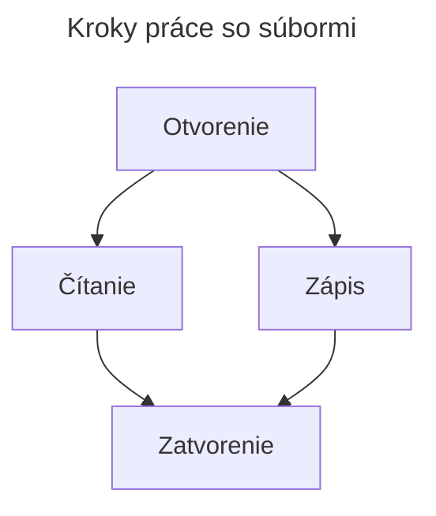

# Súborové operácie
Naše doterajšie programy menežovali len veľmi malé množstvo údajov. Dáta sme získavali dvoma spôsobmi:
- Z klávesnice, pomocou funkcie `input`.
- Náhodne generované pomocou triedy `random`.

Keď chceme pracovať s veľkým množstvom údajov, prichádzajú na rad súbory (alebo databázy).

## Práca so súbormi

## Otvorenie súboru pomocou `open()`
Celý obsah súboru načítame do premennej `f`, až potom môžeme z neho čítať alebo do neho zapisovať.

```py
f = open('subor.txt', 'w')
```

## Spôsoby otvorenia súboru

Mód| Vlastnosť
-|-
`r`|Súbor otvárame iba na čítanie, ak sa pokúsime doň zapisovať, vyvolá chybu.
`w`|Súbor otvárame iba na zápis, ak sa pokúsime z neho čítať, vyvolá chybu.
`a`|Otvárame súbor na pridávanie obsahu.
`r+`|Otvára súbor na čítanie aj zápis súčasne.

Ďalšie možnosti

Mód| Vlastnosť
-|-
`t`|Súbor otvárame ako textový, je to predvolené nastavenie.
`b`|Súbor otvárame binárne.

> Ak chceme otvoriť súbor binárne: `f = open('subor.txt', 'rb')`, použijeme módifikátor **read binary**.

## Čítanie zo súboru
- `f.read(size)`
  - Vráti reťazec dĺžky `size`.
  - Ak vynecháme `size` alebo zadáme negatívnu hodnotu, vráti **celý** obsah súboru.
- `f.readline()`
  - Načíta jeden riadok zo súboru.
  - Koniec riadku je označený znakom nového riadku `\n`.
  - Môžeme špecifikovať, koľko znakov chceme načítať.
- `f.readlines()`
  - Vráti zoznam, ktorý obsahuje **všetky** riadky zo súboru.

### Pohyb kurzora
`f.seek(offset, from_where)`
- Posunie kurzor o `offset` znakov od miesta `from_where`.
- Miesto `from_where` môže byť:
    - `0` – začiatok súboru
    - `1` – aktuálna pozícia
    - `2` – koniec súboru
- Pri jednom parametri nastaví kurzor na aktuálnu pozíciu.

## Zápis do súboru
`f.write("text")` Zapíše text do súboru.
> Do súboru môžeme zapisovať iba hodnoty typu `str`. Ak máme iný typ hodnoty, musíme ju previesť na reťazec: napríklad `str(10)`.

## Zatvorenie súboru
`f.close()` Súbory je potrebné vždy zatvárať po použití.
## Príklad

- Vytvorte súbor `subor.txt`.
- Otvorte ho a napíšte `Toto je testovaci riadok 12345`
- Potom si prečítajte text napísaný v súbore.

```py
f = open("subor.txt", "w")
f.write("Toto je testovaci riadok 12345")
f.close()
f = open("subor.txt", "r")
a = f.read()
f.close()
print(a)
```

## Funkcia `.write()` akceptuje **len** `str` ako vstupný parameter
Ak chcete do súboru zapísať číslo alebo iný typ údajov, musíte ho najprv previesť na `str`: napríklad `str(10)`

## Použite funkciu `os.path`
> Je potrebné dbať, do ktorého adresára uložíme súbor, odporúčam použiť triedu `os.path` na určenie názvu adresára z názvu súboru

```py
from os import path
fileName = "subor.txt"
full_path = f"{path.dirname(__file__)}\\{fileName}"
```
- z knižnice `os` importneme `path` triedu
- `fileName` názov súboru
- `__file__` toto nám vráti celú, absolútnu cestu k súboru `C:\Users\XY\Documents\GitHub\api\Exercies\01\test.py`
- `path.dirname` vráti absolútnu cestu k adresáru `C:\Users\XY\Documents\GitHub\api\Exercies\01`

```py
from os import path

fileName = "subor.txt"
full_path = f"{path.dirname(__file__)}\\{fileName}"

f = open(full_path, "w")
f.write("Toto je testovaci riadok 12345")
f.close()
f = open(full_path, "r")
text = f.read()
f.close()
print(text)
```
Táto funkcia vyhľadáva a vytvára súbory vedľa nášho súboru `*.py`, nie v otvorenom pracovnom hárku (pracovnom priestore)


### Úloha
Zmeňte program tak, aby používateľ mohol do súboru zadať ľubovoľný text. (Či už ide o jednorazový vstup, alebo kým nezadáte určitý znak)

## Čítanie súboru riadok po riadku
```py
from os import path

fileName = "subor.txt"
print(__file__)
full_path = f"{path.dirname(__file__)}\\{fileName}"

subor = open(full_path,"r")
for riadok in subor.readlines():
   print(riadok)
subor.close()
```

## `with` príkaz
Príkaz `with` sa používa na automatické zatvorenie niektorých uzamykateľných objektov (napríklad súborov) po opustení bloku a nie je potrebné volať funkciu `.close()`.

```py
from os import path

fileName = "subor.txt"
print(__file__)
full_path = f"{path.dirname(__file__)}\\{fileName}"

with open(full_path, "r") as f:
   for riadok in f.readlines():
      print(riadok)
```

# Príklady
1. [Uloženie čísel](https://github.com/SpsKnSK/api/tree/main/Exercies/16_files/01_saveNumbers.py)
1. [Uloženie vlastného dátového typu](https://github.com/SpsKnSK/api/tree/main/Exercies/16_files/01_saveClass.py)
# Feladatok
1. [Zapisovanie náhodných čísel](https://github.com/SpsKnSK/api/tree/main/Exercies/16_files/e01_saveRandomNumbers.md)
1. [Usporiadanie náhodných čísel](https://github.com/SpsKnSK/api/tree/main/Exercies/16_files/e02_sortRandomNumbers.md)