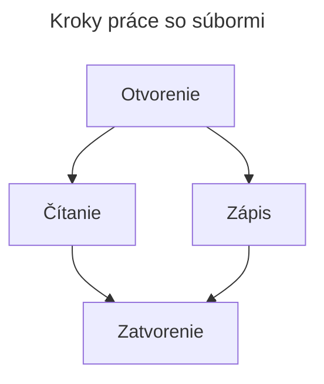

> # ✏️ Práca so súbormi
>
> ```py
> with open("pracovnysubor.txt", "w") as f:
>     f.write("Toto je testovaci riadok 12345")
>
> with open("pracovnysubor.txt", "r") as f:
>     obsah = f.read()
>     print(obsah)
> ```
>
> | Mód | Význam |
> |---|---|
> | `r` | iba čítanie |
> | `w` | iba zápis (prepíše súbor!) |
> | `a` | pridanie na koniec súboru |
> | `r+` | zápis aj čítanie naraz |
>
> - `f.read()` — celý obsah
> - `f.readline()` — jeden riadok
> - `f.readlines()` — zoznam, každý riadok je jeden prvok
> - `f.write(text)` — prijíma iba `str`! (použi `str(cislo)`)
> - `with open(...) as f:` — súbor sa na konci bloku **automaticky zatvorí**, netreba volať `f.close()`
>
> **Metafora:** súbor je ako **spoločný zošit**: keď ho otvoríš (`open`), môžeš doň písať alebo z neho čítať, ale ak ho zabudneš zavrieť (`close`), iný program sa k nemu nemusí dostať. `with` je ako **automatické dvere**: samy sa zatvoria, keď odídeš.
# Súborové operácie
Naše doterajšie programy menežovali len veľmi malé množstvo údajov. Dáta sme získavali dvoma spôsobmi:
- Z klávesnice, pomocou funkcie `input`.
- Náhodne generované pomocou triedy `random`.

Keď chceme pracovať s veľkým množstvom údajov, prichádzajú na rad súbory (alebo databázy).

## Práca so súbormi

```mermaid
---
title: Kroky práce so súbormi
---
flowchart 
	Otvorenie --> Čítanie
	Otvorenie --> Zápis
    Čítanie --> Zatvorenie
    Zápis --> Zatvorenie
```
## Otvorenie súboru pomocou `open()`
Celý obsah súboru načítame do premennej `f`, až potom môžeme z neho čítať alebo do neho zapisovať.

```py
f = open('subor.txt', 'w')
```

## Spôsoby otvorenia súboru

Mód| Vlastnosť
-|-
`r`|Súbor otvárame iba na čítanie, ak sa pokúsime doň zapisovať, vyvolá chybu.
`w`|Súbor otvárame iba na zápis, ak sa pokúsime z neho čítať, vyvolá chybu.
`a`|Otvárame súbor na pridávanie obsahu.
`r+`|Otvára súbor na čítanie aj zápis súčasne.

Ďalšie možnosti

Mód| Vlastnosť
-|-
`t`|Súbor otvárame ako textový, je to predvolené nastavenie.
`b`|Súbor otvárame binárne.

> Ak chceme otvoriť súbor binárne: `f = open('subor.txt', 'rb')`, použijeme módifikátor **read binary**.

## Čítanie zo súboru
- `f.read(size)`
  - Vráti reťazec dĺžky `size`.
  - Ak vynecháme `size` alebo zadáme negatívnu hodnotu, vráti **celý** obsah súboru.
- `f.readline()`
  - Načíta jeden riadok zo súboru.
  - Koniec riadku je označený znakom nového riadku `\n`.
  - Môžeme špecifikovať, koľko znakov chceme načítať.
- `f.readlines()`
  - Vráti zoznam, ktorý obsahuje **všetky** riadky zo súboru.

### Pohyb kurzora
`f.seek(offset, from_where)`
- Posunie kurzor o `offset` znakov od miesta `from_where`.
- Miesto `from_where` môže byť:
    - `0` – začiatok súboru
    - `1` – aktuálna pozícia
    - `2` – koniec súboru
- Pri jednom parametri nastaví kurzor na aktuálnu pozíciu.

## Zápis do súboru
`f.write("text")` Zapíše text do súboru.
> Do súboru môžeme zapisovať iba hodnoty typu `str`. Ak máme iný typ hodnoty, musíme ju previesť na reťazec: napríklad `str(10)`.

## Zatvorenie súboru
`f.close()` Súbory je potrebné vždy zatvárať po použití.
## Príklad

- Vytvorte súbor `pracovnysubor.txt`.
- Otvorte ho a napíšte `Toto je testovaci riadok 12345`
- Potom si prečítajte text napísaný v súbore.

```py
f = open("pracovnysubor.txt", "w")
f.write("Toto je testovaci riadok 12345")
f.close()
f = open("pracovnysubor.txt", "r")
a = f.read()
f.close()
print(a)
```

## Funkcia `.write()` akceptuje **len** `str` ako vstupný parameter
Ak chcete do súboru zapísať číslo alebo iný typ údajov, musíte ho najprv previesť na `str`: napríklad `str(10)`

## Použite funkciu `os.path`
> Je potrebné dbať, do ktorého adresára uložíme súbor, odporúčam použiť triedu `os.path` na určenie názvu adresára z názvu súboru

```py
from os import path
fileName = "pracovnysubor.txt"
full_path = f"{path.dirname(__file__)}\\{fileName}"
```
- z knižnice `os` importneme `path` triedu
- `fileName` názov súboru
- `__file__` toto nám vráti celú, absolútnu cestu k súboru `C:\Users\XY\Documents\GitHub\api\Exercies\01\test.py`
- `path.dirname` vráti absolútnu cestu k adresáru `C:\Users\XY\Documents\GitHub\api\Exercies\01`

```py
from os import path

fileName = "subor.txt"
full_path = f"{path.dirname(__file__)}\\{fileName}"

f = open(full_path, "w")
f.write("Toto je testovaci riadok 12345")
f.close()
f = open(full_path, "r")
text = f.read()
f.close()
print(text)
```
Táto funkcia vyhľadáva a vytvára súbory vedľa nášho súboru `*.py`, nie v otvorenom pracovnom hárku (pracovnom priestore)


### Úloha
Zmeňte program tak, aby používateľ mohol do súboru zadať ľubovoľný text. (Či už ide o jednorazový vstup, alebo kým nezadáte určitý znak)

## Čítanie súboru riadok po riadku
```py
from os import path

fileName = "subor.txt"
print(__file__)
full_path = f"{path.dirname(__file__)}\\{fileName}"

subor = open(full_path,"r")
for riadok in subor.readlines():
   print(riadok)
subor.close()
```

## `with` príkaz
Príkaz `with` sa používa na automatické zatvorenie niektorých uzamykateľných objektov (napríklad súborov) po opustení bloku a nie je potrebné volať funkciu `.close()`.

```py
from os import path

fileName = "subor.txt"
print(__file__)
full_path = f"{path.dirname(__file__)}\\{fileName}"

with open(full_path, "r") as f:
   for riadok in f.readlines():
      print(riadok)
```

> # 💥 Pokazte to!
>
> Aká je chyba v tomto programe?
>
> ```py
> f = open("pracovnysubor.txt", "w")
> f.write(12345)
> f.close()
> ```
>
> Aké chybové hlásenie dostanete? Prečo? Ako to treba opraviť, aby sme aj číslo `12345` vedeli zapísať do súboru?
>
> # 📋 Úlohy
> - [01_saveNumbers.py](../Exercies/16_files/01_saveNumbers.py) — ukážka: ukladanie celých čísel
> - [02_saveClass.py](../Exercies/16_files/02_saveClass.py) — ukážka: ukladanie vlastného dátového typu
> - [e01_saveRandomNumbers.md](../Exercies/16_files/e01_saveRandomNumbers.md)
> - [e02_sortRandomNumbers.md](../Exercies/16_files/e02_sortRandomNumbers.md)
> - [e03_longestLine.md](../Exercies/16_files/e03_longestLine.md)
> - [e04_loadStudents.md](../Exercies/16_files/e04_loadStudents.md)
> - [e05_creditCard.md](../Exercies/16_files/e05_creditCard.md)
> - [e06_longestWordInFile.md](../Exercies/16_files/e06_longestWordInFile.md)
> - [e07_characterCount.md](../Exercies/16_files/e07_characterCount.md)
>
> # ❓ Otázky
>
> 1. Aký je rozdiel medzi módmi otvorenia súboru `r`, `w` a `a`?
> 2. Prečo sa oplatí používať príkaz `with` pri otváraní súborov?
> 3. Aký dátový typ prijíma funkcia `.write()` a čo treba urobiť, ak chceme zapísať číslo?
> 4. Na čo slúži `os.path.dirname(__file__)`?
> 5. Aký je rozdiel medzi funkciami `.read()`, `.readline()` a `.readlines()`?